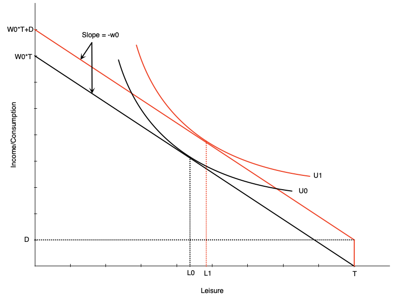
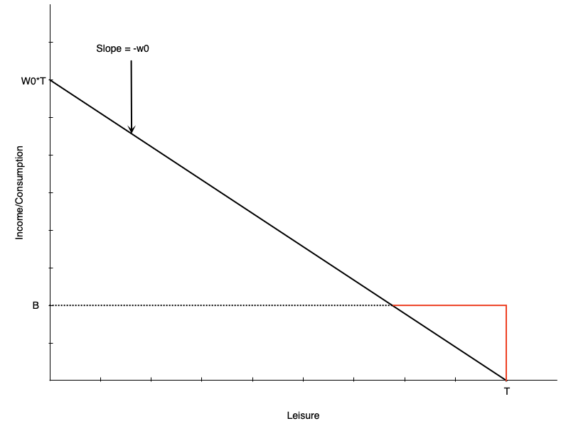
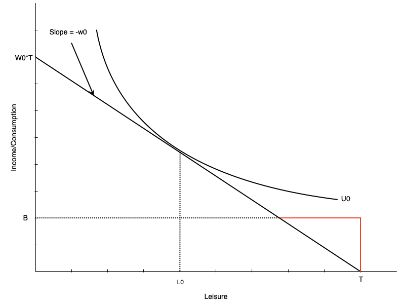
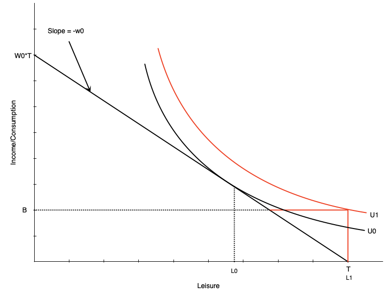

<h1>Labour Supply 2: Labour Supply and Public Policy</h1>

<h2>EC306- Wages and Employment</h2>

<h2>Justin Smith</h2>

<h2>Wilfrid Laurier University</h2>

<h2>Fall 2025</h2>

{.absolute top="300" left="900" width="550"}

# Goals of This Section

## Goals of This Section

-   Discuss various public policies that affect labour supply

    -   Taxes/subsidies

    -   Transfers

    -   Employment Insurance

    -   Worker Compensation

-   Show effect of these policies on work decisions

-   Examine statistical evidence for the model predictions

# Income Maintenance Programs

## Overview of Income Maintenance Programs

-   Represent about 10% of GDP in Canada\

-   Aim to

    -   Raise income of specific groups of people (e.g. parents, elderly)
    -   Supplement low wages

-   Include child benefits, employment insurance, social assistance, pensions\

-   Key challenge is balancing income support with work incentives

## Government Transfers in Canada

-   In 2017, 83% of families received some form of government transfer\
-   Major programs:
    -   Federal Child Benefits (20.2%) – avg. \$6,314\
    -   Employment Insurance (14.0%) – avg. \$8,352\
    -   Social Assistance (11.3%) – avg. \$8,367\
    -   Old Age Security (25.1%) – avg. \$8,566\
    -   Canada/Quebec Pension Plan (32.4%) – avg. \$10,092

## Issues in Program Design

-   Universal vs. Targeted Programs

    -   Universal programs easy to implement, but expensive and flows to people not in need
    -   Targeted programs benefit only those in need, but can be costly to implement

-   Work Disincentives

    -   Some programs that support income reduce the incentive to work
    -   Example: a welfare benefit that increases non-work income
        -   Can encourage people with preference for leisure to drop out of labour force

-   Permanent vs. transitory income loss

    -   Need different design for each situation
    -   Temporary layoff requires short-term support
    -   Long-term disability requires longer support and potentially more costs to reintegrate into workforce

# Demogrants, Welfare, Wage Subsidies

## Introduction

-   We first examine standard income support programs

-   Demogrants

    -   A fixed payment to all individuals regardless of income or employment status

-   Welfare

    -   Lump-sum payment for non-workers, reduced dollar for dollar with earned income

-   Negative Income Tax (NIT)

    -   A welfare payment that decreases at a lower rate than dollar for dollar with earned income

-   Wage Subsidies

    -   An addition to the wage rate

## Demogrant

:::::: columns
:::: {.column width="50%"}
::: {layout="[[-1], [1], [-1]]"}

:::
::::

::: {.column width="50%"}
-   Demogrant is an unconditional lump sum income transfer

-   Shifts the budget line up by the amount $D$

-   Because wage does not change, this is a pure income effect

-   If leisure is a normal good, optimal leisure falls

-   Unambiguously negative work incentive effects

    -   Leads to lower work hours

    -   Can also lead to non-participation
:::
::::::

## Demogrant

-   Universal Child Care Benefit (UCCB) is a Canadian policy similar to a demogrant

    -   Paid to families with children under 18

    -   \$160/month for each child under 6

    -   \$60/month for each child aged 6-17

    -   Canada Child Benefit (CCB) replaced UCCB, Canada Child Tax Benefit (CCTB) and National Child Benefit Supplement (NCBS) in 2016

        -   More targeted to low and middle income families

-   Research (Schirle, 2015) shows that UCCB reduced labour supply of women with children under 6

    -   By about 3.2 percentage points for low-educated married women

## Welfare

-   Welfare is a lump-sum payment to non-workers that is reduced dollar for dollar with earned income

    -   People do not really use the term welfare in Canada
    -   Usually called social assistance or income assistance

-   These programs have been criticized historically for negative work incentives

    -   Creates incentives for some not to work
    -   Important to balance this against the need to provide income support

## Welfare

:::::: columns
:::: {.column width="50%"}
::: {layout="[[-1], [1], [-1]]"}

:::
::::

::: {.column width="50%"}
-   Budget line is initially the black line

    -   Leisure optimized at $L_{0}$ hours

-   With welfare benefit is initially red line, then black line after they intersect

    -   Welfare benefit $B$ at zero hours of work

    -   Benefit reduced by one dollar for each one dollar earned

        -   Like a 100% tax on earned income

    -   Income stays constant at welfare benefit until earned income exactly equals benefit

    -   After that, person earns wage $w_{0}$ for each hour worked
:::
::::::

## Welfare

:::::: columns
:::: {.column width="50%"}
::: {layout="[[-1], [1], [-1]]"}

:::
::::

::: {.column width="50%"}
-   For some people welfare has no effect on work hours

-   In this graph, person is working $H_{0}$ hours prior to benefit

-   After benefit, still maximize utility at $H_{0}$ hours

-   Happens generally with people already working many hours
:::
::::::

## Welfare

:::::: columns
:::: {.column width="50%"}
::: {layout="[[-1], [1], [-1]]"}

:::
::::

::: {.column width="50%"}
-   Others may face work disincentive
-   A person like the left graph would choose to work zero hours after the welfare benefit
-   Would happen because
    -   Welfare benefit is generous
    -   Individual puts high value on leisure
-   This is not an ideal effect of welfare programs
:::
::::::

## Welfare

-   How to combat work disincentive?

    -   Reduce benefit level

        -   But may not provide enough income support

    -   Increase wages

        -   Through minimum wages, subsidies, job training, unions

        -   Can be expensive, which might reduce labour demand

    -   Change preferences

        -   Alter personal feelings towards work/leisure

        -   Hard to do

    -   Negative income tax

        -   Reduce the tax back rate of extra earnings
        - Discussed in detail in a few slides

## Welfare

- Some evidence comes from a policy change in Quebec

- Until 1989 welfare benefits for singles or couples with no kids was based on age

    -   Under 30: \$185/month
    -   30 and over: \$507/month
    
- Turning 30 is associated with a big jump in welfare benefits

- Compared to 29 year olds, 30 year olds were

  - Spending much longer on welfare
  - Less likely to be employed 