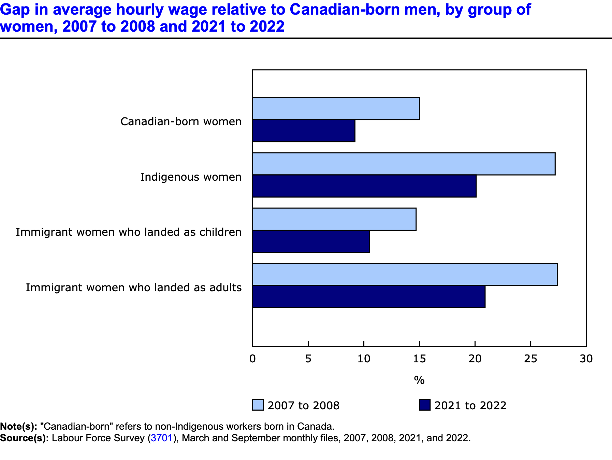
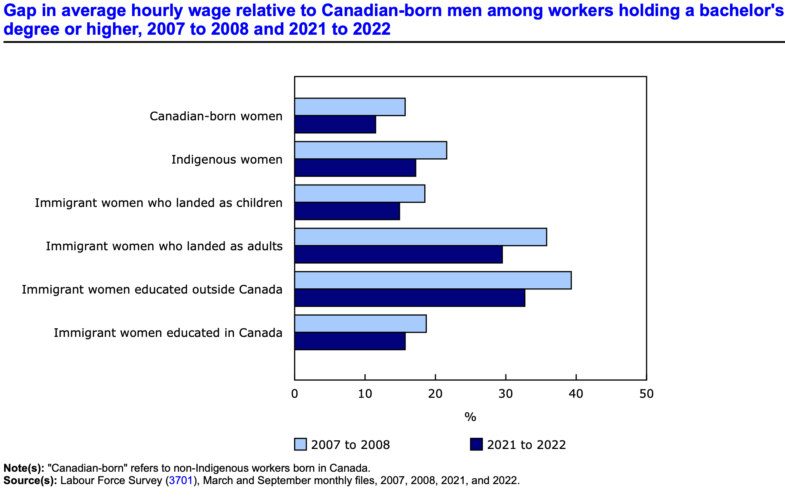
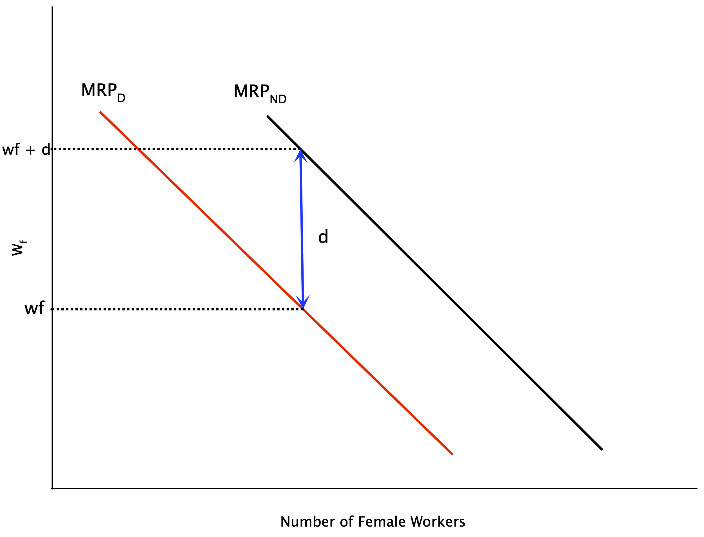
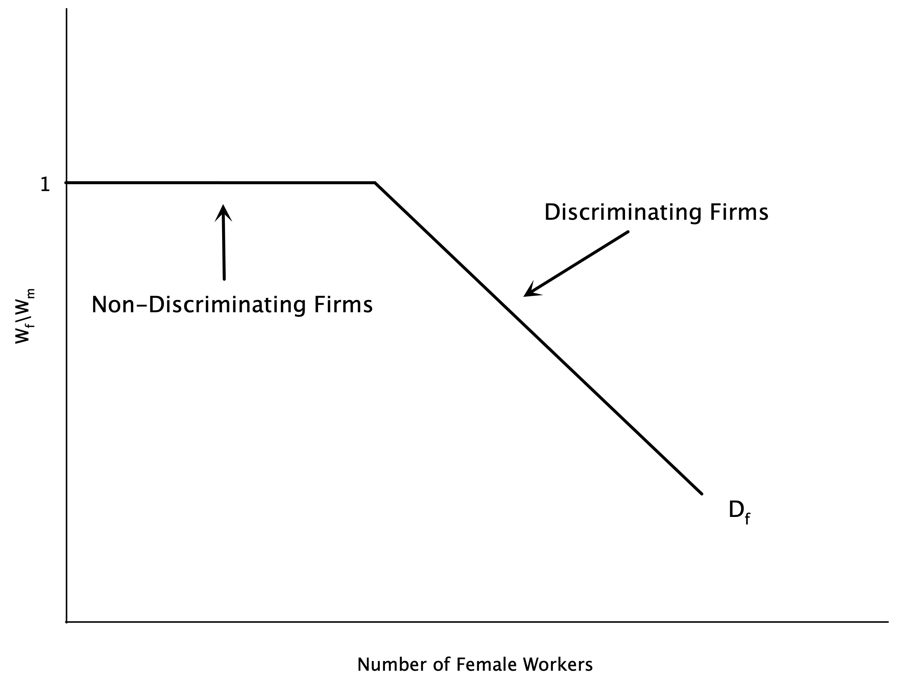
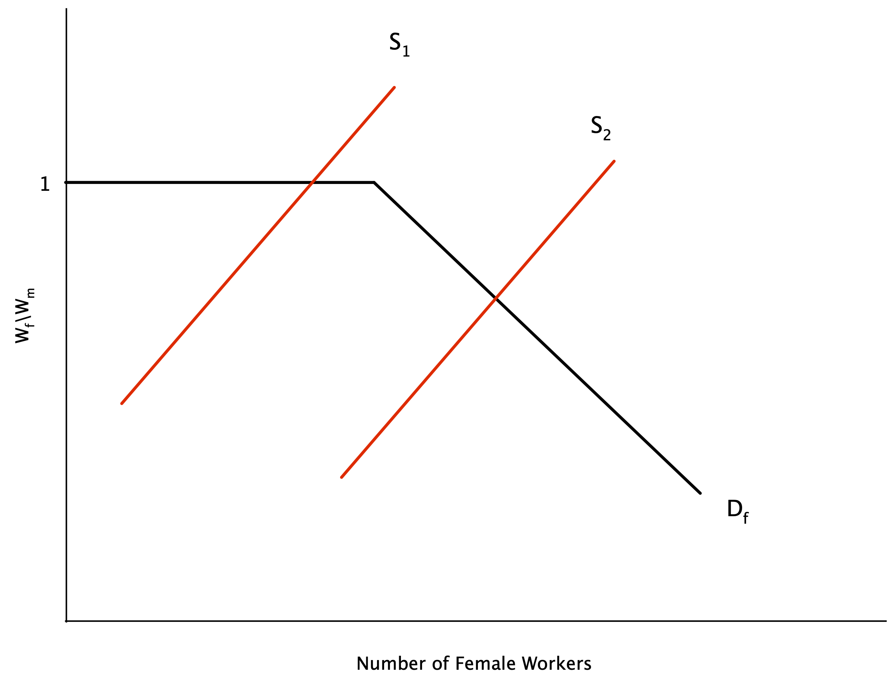
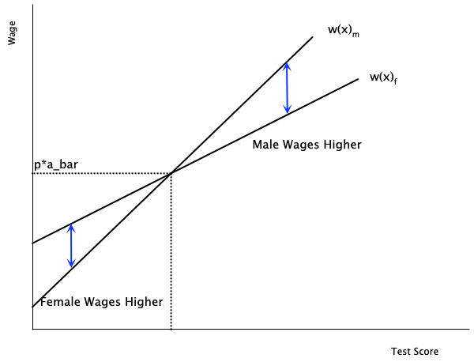
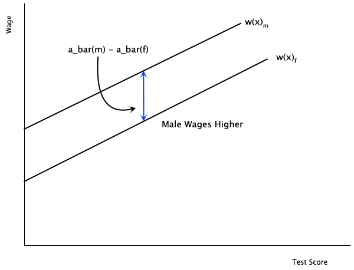
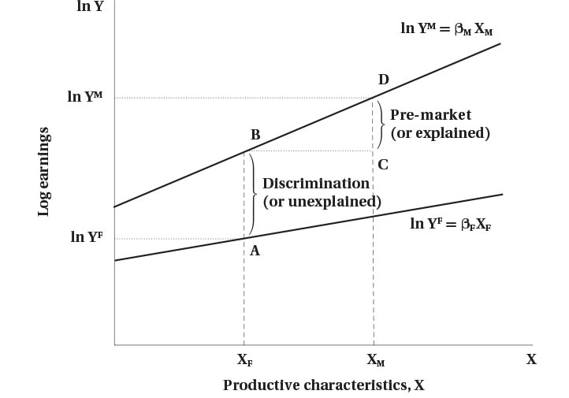

<h1>Discrimination and Male-Female Earnings Differentials</h1>

<h2>EC306- Wages and Employment</h2>

<h2>Justin Smith</h2>

<h2>Wilfrid Laurier University</h2>

<h2>Fall 2025</h2>

{.absolute top="300" left="900" width="550"}

# Goals of This Section

## Goals of This Section

-   Discuss trends in educational attainment in Canada

-   Introduce Human Capital Theory of education investment

-   Introduce Signalling Model of education investment

-   Discuss empirical methods to estimate returns to schooling

-   Review empirical evidence on returns to schooling

-   Discuss job training

# Introduction

## Male and Female Earnings

{fig-align="center"}

## Male and Female Earnings

{fig-align="center"}

## Male and Female Earnings

{fig-align="center"}

## Male and Female Earnings

-   Clearly men and women earn different amounts on average

-   There are two broad explanations for this gap:

    1.  Differences in characteristics (education, experience, occupation, industry, hours worked, etc.)

    2.  Differences in the returns to those characteristics (discrimination)

-   Our models so far have not left room for discrimination

    -   We treated all workers as the same
    -   So there should not be any differences in returns

## Male and Female Earnings

-   In this section, we explore economic theories of discrimination

    -   Can come from employers, customers, co-workers
    -   Can be statistical or taste-based

-   It is difficult empirically to estimate discrimination

    -   Need to control for all relevant characteristics
    -   Need to separate out differences in characteristics from differences in returns

-   There are methods that can help us estimate discrimination

    -   Oaxaca-Blinder decomposition
    -   Audit studies
    -   Experiments

# Demand Theories of Discrimination

## Demand-Side Theories

-   Demand theories focus on the behavior of employers in demanding labor

-   Can happen for various reasons:

    -   Pure prejudice
    -   Customer preference to buy from male workers
    -   Male aversion to working with women

-   These all cause a fall in the demand for women relative to men in the labour market

    -   Reduces wages and employment of female workers

## Taste-Based Discrimination

-   Theory of taste-based discrimination pioneered by Becker (1957)

-   Imagine that firms produce according to the production function:

$$y = f(N_m + N_w)$$

-   With $N_m$ indicating the number of male workers, and $N_f$ indicating the number of female workers

-   So in a competitive market their profits are

$$ \pi = p \cdot f(N_m + N_w) - w_m N_m - w_w N_w $$

-   With $w_m$ indicating the wage of male workers, and $w_f$ indicating the wage of female workers

## Taste-Based Discrimination

-   Firms do not maximize profit strictly, but instead maximize a utility function

$$ U = \pi - d \cdot N_w $$

-   Utility is partly a function of profit

-   But also includes $d$, which measures the degree of discrimination

    -   if $d = 0$, no discrimination and maximizing utility is the same as maximizing profit
    -   if $d=0$ firms get a disutility from hiring women

## Taste-Based Discrimination

-   The first order conditions for utility maximization are: $$ p \cdot MP_{N_m} = w_m $$ $$ p \cdot MP_{N_w} = w_w + d $$

-   For both men and women, firms hire up to the point where the value of the marginal product equals the cost of hiring

    -   But for women, there is an additional cost $d$ due to discrimination

-   If $w_m = w_f$, and men and women are equally productive, this implies the firm hires less women

    -   Discrimination drives a wedge between wages and the MRP

## Taste-Based Discrimination

:::::: columns
:::: {.column width="50%"}
::: {layout="[[-1], [1], [-1]]"}
{fig-align="center"}
:::
::::

::: {.column width="50%"}
-   Graph plots labour demand for women

-   Discrimination shifts demand curve left

-   Without discrimination, firm hires where $w_f = MRP_{ND}$

    -   $ND$ = non-discriminatory

-   With discrimination, firm hires where $w_f + d = MRP_D$

    -   Or equivalently $w_f = MRP_D - d$

-   Implies a lower level of female labour
:::
::::::

## Taste-Based Discrimination

-   Above analysis is for a single employer

-   Employers discriminate along a spectrum

    -   Some have a high $d$, some have a low or no $d$

-   Suppose women are able to seek out the non-discriminating employers

-   If we order the firms from lowest to highest by the amount of discrimination

    -   We can get the market demand curve by summing the individual demand curves horizontally

-   This demand curve is plotted on the next slide

## Taste-Based Discrimination

:::::: columns
:::: {.column width="50%"}
::: {layout="[[-1], [1], [-1]]"}
{fig-align="center"}
:::
::::

::: {.column width="50%"}
-   Graph plots demand for female labour in the market

-   On the vertical axis is the ration of female to male wages

-   For non-discriminating firms, this ratio is 1

    -   A certain set of firms will hire women at this ratio
    -   This is the flat portion of the demand curve

-   As the supply of women grows, they must work at more discriminating firms

    -   These firms will only hire when the wage ratio falls
:::
::::::

## Taste-Based Discrimination

:::::: columns
:::: {.column width="50%"}
::: {layout="[[-1], [1], [-1]]"}
{fig-align="center"}
:::
::::

::: {.column width="50%"}
-   If the supply of female labour is small enough, they can work at non-discriminating firms

    -   Wage ratio is 1

-   With a larger supply, some will have to work at discriminating firms

    -   Wage ratio falls below 1
    -   This is where the demand curve slopes downwards
    -   Wage gap emerges
:::
::::::

## Statistical Discrimination

-   Taste-based discrimination relies on employers having a "taste" for discrimination

    -   Overt prejudice

-   Some discrimination may happen because of imperfect information

    -   Employers do not know the productivity of workers perfectly

-   Instead they use signals to infer worker quality

-   With **statistical discrimination** firms use group characteristics to infer individual productivity

    -   If one group has lower average productivity, firms may pay them less on average

## Statistical Discrimination

## Theory

-   Assume that the abilities of male and female workers are distributed with means $\bar{a}_{m}$ and $\bar{a}_{f}$
-   Suppose the firm has access to a signal of ability $x$ for each person
-   Actual ability is not known with certainty, but expected ability is

$$a(x) = \bar{a} + \alpha (x - \bar{a})$$

-   where $\alpha$ is the reliability of the signal
    -   If $\alpha = 0$, the signal provides no information beyond the average\
    -   If $\alpha = 1$, the signal is perfectly informative
-   Workers are paid a wage equal to their marginal revenue product

## Statistical Discrimination

-   Paying workers their marginal revenue product implies

$$w(x) = p a(x) = p \bar{a} + p \alpha (x - \bar{a})$$

-   To analyze discrimination, assume $\bar{a}_{m} = \bar{a}_{f}$
    -   Men and women are equally productive on average
-   Assume the signal is more reliable for men than for women
    -   If $\alpha_m > \alpha_f$
-   Differences arise between workers who score the same on the signal
    -   If a man and woman score above average $(x - \bar{a} > 0)$, then $w(x)_m > w(x)_f$
    -   If a man and woman score below average $(x - \bar{a} < 0)$, then $w(x)_m < w(x)_f$

## Statistical Discrimination

:::::: columns
:::: {.column width="50%"}
::: {layout="[[-1], [1], [-1]]"}

:::
::::

::: {.column width="50%"}
-   In this graph we have wages as a function of the signal

-   The male line is steeper because the signal is more reliable ($\alpha_m > \alpha_f$)

-   For test scores above average, men are paid more

-   For test scores below average, women are paid more

-   At the average, they are paid the same
:::
::::::

## Statistical Discrimination

-   There are no underlying differences between males and females

    -   Differences in wages arise because of differences in the quality of the signal
    -   Firms place more weight on average ability for female workers
    -   Firms place more weight on the actual signal for male workers

-   At low levels of the signal, women are paid more than men

-   But where does the assumption $\alpha_m > \alpha_f$ come from

    -   Possibly related to prejudicial attitudes of firms
    -   Some believe standardized tests favour males

## Statistical Discrimination

-   There may also be differences in $\bar{a}_m$ and $\bar{a}_f$

    -   Possibly due to pre-market discrimination leading to lower human capital among women

-   In this case, males are paid more at every signal level

-   Wage differences do not necessarily arise from overt discrimination

    -   They may originate in differences in information signals
    -   But it is difficult to explain why such differences in signal quality exist

## Statistical Discrimination

:::::: columns
:::: {.column width="50%"}
::: {layout="[[-1], [1], [-1]]"}

:::
::::

::: {.column width="50%"}
-   In this graph the quality of the signal is the same

-   Slopes of the lines are the same

-   But there are differences in average productivity

    -   Male line lies above female line

-   Men will be paid more because of the average difference
:::
::::::

# Supply Theories of Discrimination

## Supply-Side Theories

-   We discussed demand-side theories of discrimination

    -   Focused on employer behaviour

-   Discrimination may also arise on the labour supply side

    -   Factors that affect where women choose or are able to work

## Crowding Hypothesis

-   Older theory emphasizing that women are overrepresented in certain occupations

-   This pushes up their labour supply in those occupations

    -   Which depresses wages relative to men

-   Discrimination comes from the supply side

    -   Women are paid their marginal product
    -   But are corralled into a small set of jobs, which depresses wages

## Dual Labour Market Theory

-   Similar in spirit to the crowding hypothesis

-   Theory says there are two labour markets

    -   Primary market

        -   High wages, good working conditions, opportunities for advancement
        -   Unionized, stable, expanding

    -   Secondary market

        -   Low wages, poor working conditions, little opportunity for advancement
        -   Non-unionized, highly competitive, declining

-   Theory posits that women are concentrated in the secondary market

-   Prejudice prevents women from entering primary market

## Lower Reservation Wages

-   One theory is that female reservation wages are lower because

    -   Costly to search for non-discriminating employers
    -   Job search is limited by strong household ties
    -   Ability to negotiate higher pay limited by lower threat of leaving

-   With a lower reservation wage, women are more likely to be paid less

    -   Contributes to pay gap

-   Some evidence of this in empirical studies

## Risk Aversion

-   Large literature documenting that women are less aggressive/competitive in bargaining

-   Also less confident in their abilities

-   Evidence of this in many studies in economics and psychology

-   Might mean women are less likely to compete for higher paying jobs

## Differences in Preferences

-   May be differences in preferences for

    -   Education
    -   Training
    -   Hours
    -   Work conditions
    -   Occupation

-   All of these are correlated with pay

-   Issue is that these choices are sometimes a product of discrimination

    -   STEM fields are an example
    -   History of discrimination in this field may lead women not to choose it

-   Hard to separate out preferences from discrimination effects

    We will cover this in more detail in a few slides

# Non-Competitive Theories of Discrimination

## Non-Competitive Theories

-   One issue with the above theories is that they assume competitive markets

-   Men and women are assumed to have equal productivity

-   Discriminating firms hire less women because of prejudice

-   But non-discriminating firms can hire more women at lower wages

    -   Would increase their profits

-   Non-discriminating firms would bid up the wages of women

    -   Should close the gap

## Non-Competitive Theories

-   But the gap continues to exist

-   Non-competitive theories of discrimination try to explain this

-   The unifying theme is that markets are not perfectly competitive

    -   May be monopsony power, imperfect information, search frictions, etc.

-   This can lead to persistent wage gaps

## Imperfect Information

-   Even if firms know that they can increase profits by hiring more women, they might not be able to immediately change workforce

-   Hiring and recruiting are costly

    -   There are search frictions
    -   Quasi-fixed costs

-   Firms may be slow to adjust to profit opportunities

-   This can lead to persistent wage gaps

-   But does not explain why the gaps have persisted for so long

## Queueing Theory

-   Some firms pay **efficiency wages**

    -   Wages above the market clearing level to increase productivity

-   This results in a queue of workers wanting to work at the firm

    -   Due to the higher wages

-   While rationing jobs, firms may discriminate

## Political Pressure

-   It is sometimes the case that markets decisions are overriden by political pressures

-   A male-centric government or union may

    -   Hire more men in government jobs
    -   Be discriminatory with education and training

-   The political pressure could come from interest groups

    -   May have a lot of money to lobby the government

## Monopsony Power

-   Monopsony gives firms power to set wages

-   Monopsonies may take advantage of relative immobility of women to lower their wages

    -   Recall they may have stronger ties to household

-   They may also try to pit men and women against each other

    -   Create competition between the groups to lower wages

## Systemic Discrimination

-   Idea is that discrimination is embedded in social and economic systems

-   Has been going on for so long, that it is now self-perpetuating

-   Could come from

    -   Existence of "old boys" mentality
    -   Old job requirements that implicitly discriminate but continue to exist

# Productivity Differences

## Productivity Differences

-   It may be the case that men and women have productivity differences

    -   This could determine pay differences even in competitive markets

-   Note: not *innate* productivity differences

-   Differences coming from acquisision of human capital over time

    -   Education
    -   Training
    -   Work experience

-   If human capital investments are a choice, then pay differences are not discrimination

-   But it could be that choices are influenced by discrimination

## Dual Role

-   Traditionally women have more of a dual role than men

    -   Balance household and market work

-   If this continues to be true, then women

    -   Have less continuity in work (mainly from interruptions for children)
    -   Are more likely to have periods of paid work and labour force withdrawals

-   This leads to lower accumulation of human capital

    -   Because there is less time to recoup the costs

-   In some sense this is a rational choice

    -   But is rooted in a society that does not accommodate enough for working mothers

## Pre-Market Discrimination

-   Discrimination may influence choices in

    -   Education
    -   Training
    -   Career path

-   Thus what looks like a rational choice is itself affected by discrimination

    -   In the literature this is called **pre-market discrimination**

-   Example: STEM jobs

    -   Pay well, but are male dominated
    -   Women are discouraged from entering these fields
    -   Thus do not have access to the higher pay that comes with these jobs

# Measuring Discrimination

## Introduction

-   Now that we have discussed theories of discrimination, how do we measure it?

-   Difficult because in most cases discrimination is not directly observable

    -   There is not a "discrimination" variable in datasets

-   Can design experiments to measure discrimination

    -   Audit studies
    -   Field experiments

-   But in most cases we have to rely on observational data

## Introduction

-   Measuring discrimination involves comparing people of equal productivity

    -   So that any left over wage differences could be due to discrimination

-   But we do not observe productivity directly

-   Instead, hold constant variables related to productivity

    -   Education
    -   Experience
    -   Occupation
    -   Industry
    -   Hours worked

-   Then decompose wage difference into part due to characteristics and part due to other factors

## Blinder-Oaxaca Decomposition

-   Method to decompose differences in average earnings between any two groups into

    -   Part due to differences in characteristics (explained)
    -   Part due to differences in returns to those characteristics (unexplained)

-   Suppose we estimate a regression of log earnings on observed characteristics for men and women

-   The predicted value (which is also equal to the mean of log earnings) is

$$ \ln(Y_m) =\hat\beta_m  \bar{X}_m $$

$$ \ln(Y_f) =\hat\beta_f  \bar{X}_f $$

## Blinder-Oaxaca Decomposition

-   The difference in average log earnings is

$$ \ln(Y_m) - \ln(Y_f) = \hat\beta_m  \bar{X}_m - \hat\beta_f  \bar{X}_f $$

-   We can add and subtract $\hat\beta_m  \bar{X}_f$ to get

$$ \ln(Y_m) - \ln(Y_f) = \hat\beta_m  (\bar{X}_m - \bar{X}_f) + \bar{X}_f (\hat\beta_m - \hat\beta_f) $$

-   Doing this allows us to separate the difference into two parts

-   The first part is the explained part

    -   Due to differences in characteristics
    -   Holds the slope constant at $\hat\beta_m$ and looks at differences in average $X$

## Blinder-Oaxaca Decomposition

-   The second part is the unexplained part

    -   Due to differences in returns to characteristics
    -   Holds the average characteristics constant at $\bar{X}_f$ and looks at differences in slopes
    -   The slopes are the returns to characteristics

-   Traditionally, the unexplained part is interpreted as discrimination

    -   But could also be due to unobserved productivity differences

## Blinder-Oaxaca Decomposition

{fig-align="center"}

## Blinder-Oaxaca Decomposition

- Here is an example of how this works

- Suppose we have run the following regression separately for men and women

$$
\ln Y  = \beta_0 + \beta_1 \text{Educ} + \beta_2 \text{Experience}
$$

- The estimated coefficients are:

- Men: $\beta^M = (\beta_0^M, \beta_1^M, \beta_2^M) = (2.0,\; 0.10,\; 0.02)$  
- Women: $\beta^F = (\beta_0^F, \beta_1^F, \beta_2^F) = (1.8,\; 0.08,\; 0.015)$

## Blinder-Oaxaca Decomposition

- The mean of the observed characteristics are

- Men: $\bar{\text{Educ}}_M = 14$, $\bar{\text{Exp}}_M = 15$  
- Women: $\bar{\text{Educ}}_F = 13$, $\bar{\text{Exp}}_F = 12$

- The average predicted log wage for men

$$
\bar{ln Y}_M
= 2.0 + 0.10 \cdot 14 + 0.02 \cdot 15
= 2.0 + 1.4 + 0.3
= 3.7
$$

## Blinder-Oaxaca Decomposition

- The average predicted log wage for women

$$
\bar{ln Y}_F
= 1.8 + 0.08 \cdot 13 + 0.015 \cdot 12
= 1.8 + 1.04 + 0.18
= 3.02
$$

- The wage gap us therefore

$$
\bar{ln Y}_M - \bar{ln Y}_F = 3.70 - 3.02 = 0.68
$$

- This says that the wage gap is about $0.68$ log points

  - Roughly a 68% higher wage for men

## Blinder-Oaxaca Decomposition

We decompose:

$$
\bar{\ln Y}_M - \bar{\ln Y}_F = \text{Explained} + \text{Unexplained}
$$

- Explained (due to characteristics) component is

$$
\text{Explained} 
= (\bar{X}_M - \bar{X}_F)\beta^M
$$

- Compute differences in means:

- Education: $14 - 13 = 1$  
- Experience: $15 - 12 = 3$

## Blinder-Oaxaca Decomposition

- Then:

$$
\text{Explained}
= 1 \cdot 0.10 + 3 \cdot 0.02
= 0.10 + 0.06
= 0.16
$$

-About $0.16$ log points of the gap are due to men having more education and experience.

-Unexplained (slopes) component is

$$
\text{Unexplained (slopes)}
= \bar{X}_F \left(\beta_M - \beta_F\right)
$$

- Coefficient differences:

- Education: $0.10 - 0.08 = 0.02$  
- Experience: $0.02 - 0.015 = 0.005$

## Blinder-Oaxaca Decomposition

- Then:

$$
\text{Unexplained (slopes)}
= 13 \cdot 0.02 + 12 \cdot 0.005
= 0.26 + 0.06
= 0.32
$$

- Intercept difference:

$$
\beta_{0M} - \beta_{0F} = 2.0 - 1.8 = 0.20
$$

- This is also part of the unexplained component (baseline difference not due to $X$).

- Total unexplained:

$$
\text{Unexplained (total)} 
= 0.32 + 0.20 = 0.52
$$

## Blinder-Oaxaca Decomposition

- The decomposition is therefore:

$$
0.68 = \underbrace{0.16}_{\text{explained}} + \underbrace{0.52}_{\text{unexplained}}
$$

- Interpretation:

- Explained: $0.16$ (about $24\%$ of the gap)  
  - Due to men having higher average education and experience.  
- Unexplained: $0.52$ (about $76\%$ of the gap)  
  - Due to different returns to characteristics and intercept differences  
