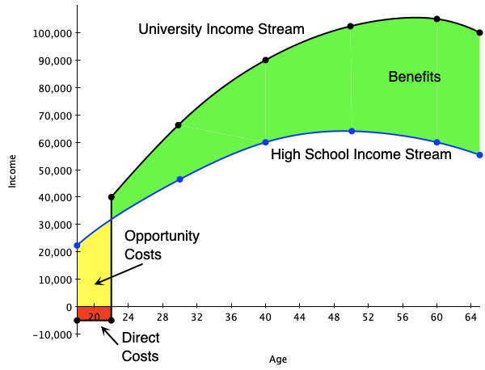
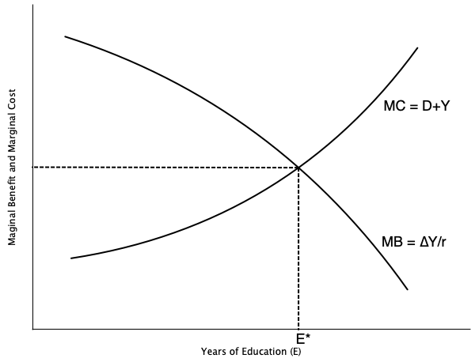
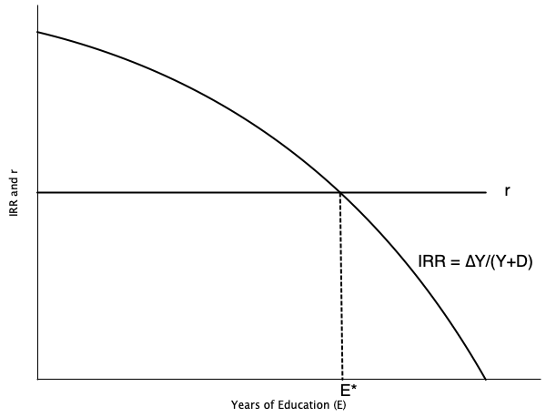
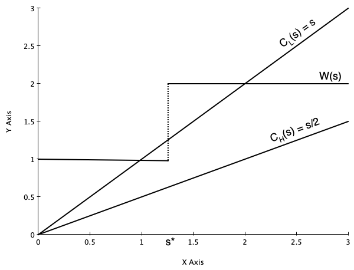
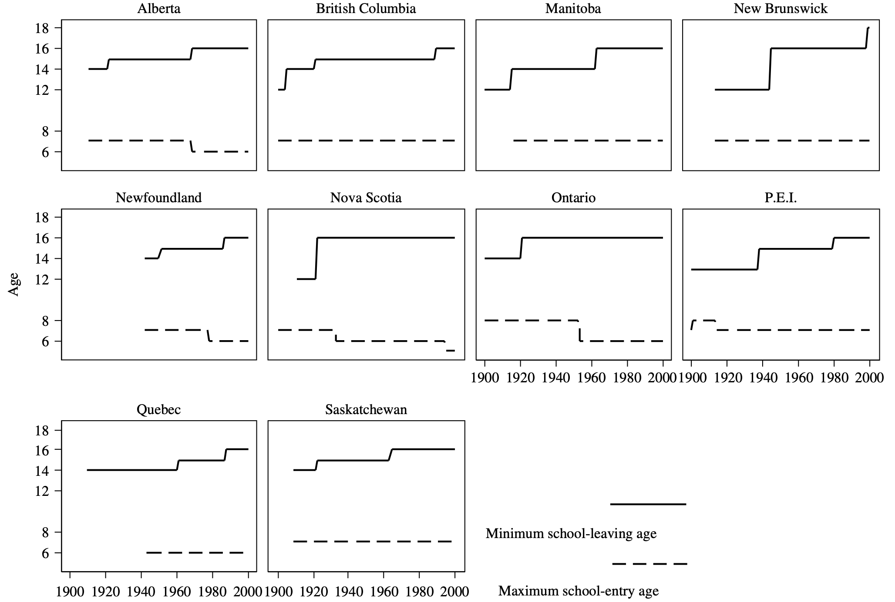
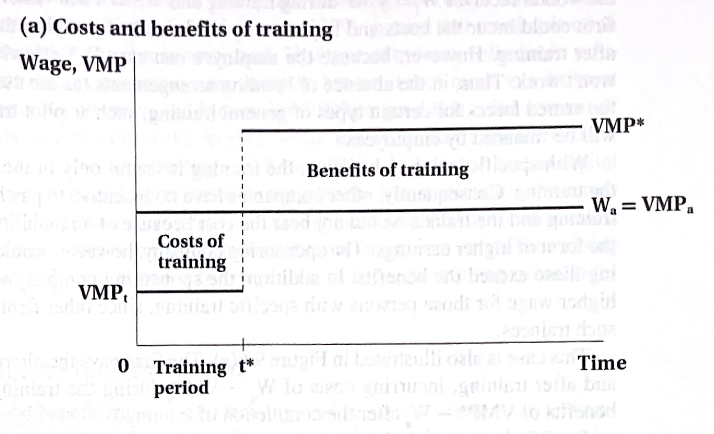
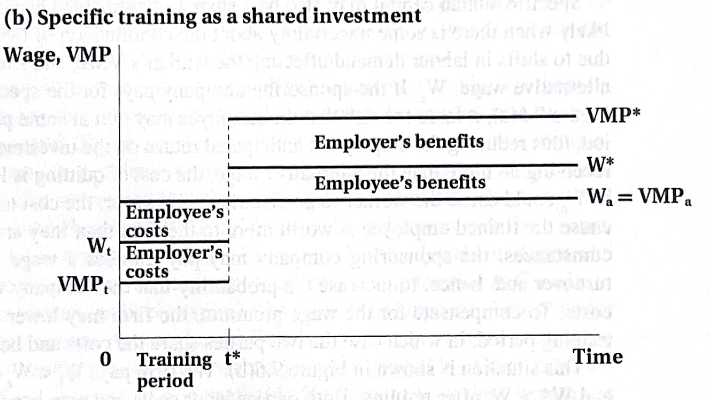
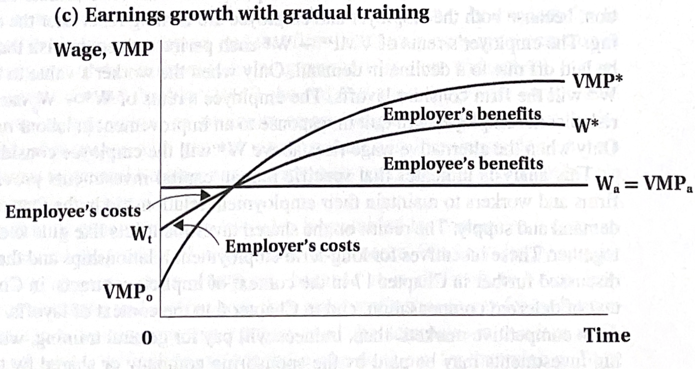

<h1>Human Capital Theory</h1>

<hr>

<h2>EC306- Wages and Employment</h2>

<h2>Justin Smith</h2>

<h2>Wilfrid Laurier University</h2>

<h2>Fall 2025</h2>

{.absolute top="300" left="900" width="550"}

# Goals of This Section

## Goals of This Section

-   Discuss trends in educational attainment in Canada

-   Introduce Human Capital Theory of education investment

-   Introduce Signalling Model of education investment

- Discuss empirical methods to estimate returns to schooling

- Review empirical evidence on returns to schooling

- Discuss job training

# Introduction

## Educational Attainment

```{r}
library(tidyverse)
library(cansim)
library(janitor)


#attain <- get_cansim("14100020") %>% clean_names() %>%
#  filter(geo == "Canada",
#         age_group == "25 to 44 years",
#         educational_attainment %in% c("Total, all education levels",
#                                       "0 to 8  years",
#                                       "Some high school",
#                                       "High school graduate",
#                                       "University degree"),
#         gender == "Total - Gender") %>%
#  group_by(ref_date, labour_force_characteristics) %>%
#  mutate(total = value[educational_attainment == "Total, all education levels"],
#         percent = 100*value/total) %>%
#  filter(educational_attainment != "Total, all education levels") 

attain <- read_csv("attain.csv")


ggplot(filter(attain, labour_force_characteristics == "Population"), aes(x = ref_date, y = percent, group = educational_attainment, color = educational_attainment)) +
  geom_line(size = 1.2) +
  labs(
    title = "Educational Attainment of Canadians Aged 25 to 44",
    x = "Year",
    y = "Percentage of Population",
    color = "Educational Attainment",
    caption = "Data Source: Statistics Canada Table 141-00020"
  ) +
  theme_minimal() +
  theme(
    plot.title = element_text(size = 16, face = "bold"),
    plot.subtitle = element_text(size = 12),
    axis.title = element_text(size = 12),
    legend.title = element_text(size = 12),
    legend.text = element_text(size = 10),
    legend.position = c(0.05, 0.95),        # top-left corner (x, y)
    legend.justification = c("left", "top"),# aligns legend box corner to position
    legend.background = element_rect(fill = alpha("white", 0.6), color = NA) # optional semi-transparent box
  )

```

## Unemployment Rate

```{r}
ggplot(filter(attain, labour_force_characteristics == "Unemployment rate"), aes(x = ref_date, y = value, group = educational_attainment, color = educational_attainment)) +
  geom_line(size = 1.2) +
  labs(
    title = "Unemployment Rate by Educational Attainment of Canadians Aged 25 to 44",
    x = "Year",
    y = "Unemployment Rate (%)",
    color = "Educational Attainment",
    caption = "Data Source: Statistics Canada Table 141-00020"
  ) +
  theme_minimal() +
  theme(
    plot.title = element_text(size = 16, face = "bold"),
    plot.subtitle = element_text(size = 12),
    axis.title = element_text(size = 12),
    legend.title = element_text(size = 12),
    legend.text = element_text(size = 10),
    legend.position = c(0.75, 0.95),        # top-left corner (x, y)
    legend.justification = c("left", "top"),# aligns legend box corner to position
    legend.background = element_rect(fill = alpha("white", 0.6), color = NA) # optional semi-transparent box
  )
```

## Participation Rate

```{r}
ggplot(filter(attain, labour_force_characteristics == "Participation rate"), aes(x = ref_date, y = value, group = educational_attainment, color = educational_attainment)) +
  geom_line(size = 1.2) +
  labs(
    title = "Participation Rate by Educational Attainment of Canadians Aged 25 to 44",
    x = "Year",
    y = "Participation Rate (%)",
    color = "Educational Attainment",
    caption = "Data Source: Statistics Canada Table 141-00020"
  ) +
  theme_minimal() +
  theme(
    plot.title = element_text(size = 16, face = "bold"),
    plot.subtitle = element_text(size = 12),
    axis.title = element_text(size = 12),
    legend.title = element_text(size = 12),
    legend.text = element_text(size = 10),
    legend.position = c(0.05, 0.18),        # top-left corner (x, y)
    legend.justification = c("left", "top"),# aligns legend box corner to position
    legend.background = element_rect(fill = alpha("white", 0.6), color = NA) # optional semi-transparent box
  )
```

# Human Capital Theory

## Human Capital Theory

-   Firms often invest in physical capital (e.g., machines, tools, buildings)
    -   Incur some cost today to invest in capital\
    -   Boosts the productive ability of workers\
    -   Increases the output flow in the future
-   Decision to invest is made by comparing costs to benefits
    -   Invest if benefits outweigh costs\
    -   Costs are usually upfront, while benefits occur slowly over time

## Human Capital Theory

-   Individuals make similar investments in *human* capital
    -   **Human Capital:** An individual's stock of productive skills, knowledge, and abilities\
    -   People incur upfront costs for education, training, etc.\
    -   Training improves productivity, and therefore income\
    -   Individuals earn higher income streams in the future
-   We will study investments in human capital in a similar way to physical capital

## Human Capital Theory

-   Human capital investments involve some special considerations

    -   Non-wage benefits
        -   Consumption value
        -   Differences in risk of unemployment in downturns
    -   It is more difficult to finance education investments
        -   No collateral

-   Social versus private costs/benefits

    -   Private costs and benefits are specific to the individual
    -   But there may be social costs and benefits as well
        -   E.g., positive externalities from education

# Private Investments In Education

## Introduction

-   The human capital investment decision boils down to comparing lifetime income streams

    -   Different streams of income are associated with different levels of schooling\
    -   Higher levels of schooling usually lead to higher income streams

-   We will outline a process to decide which stream to choose

To make the model tractable, we assume:

1.  No direct utility or disutility from schooling\
2.  Hours of work are held fixed\
3.  Certainty of income streams\
4.  Individuals can borrow and lend at interest rate $r$

## Attending University

-   Suppose we want to analyze whether it is financially worthwhile to attend university

    -   Start from the perspective of an 18-year-old high school graduate\
    -   This student is deciding whether or not to attend university\
    -   Students who do not attend university move immediately into the workforce

-   The graph on next slide depicts two income streams:

    -   **Black line:** university path\
    -   **Blue line:** high school path\
    -   **Red and yellow:** costs of attending university\
    -   **Green:** benefits of university education

## Attending University

:::::: columns
:::: {.column width="50%"}
::: {layout="[[-1], [1], [-1]]"}

:::
::::

::: {.column width="50%"}
-   Direct costs are in red
    -   Books, fees, tuition
-   Foregone wages are in yellow
    -   Income not earned during the time in university
-   Net gains in wages are in green
    -   Earnings of university grad above a high school grad
-   Beneficial to attend if present value of green exceeds present value of yellow plus red
:::
::::::

## Attending University

-   People will choose the level of schooling that maximizes the net present value of lifetime earnings

-   We illustrated that graphically above

-   Mathematically, express the present value of earnings for a high school graduate as

$$PV = \frac{Y}{(1+r)^0} + \frac{Y}{(1+r)^1} + \ldots + \frac{Y}{(1+r)^{T-18}}$$

-   In this equation

    -   $Y$ = annual earnings of high school graduate
    -   $r$ = interest rate
    -   $T$ = expected retirement age

## Attending University

-   We can approximate the present value of earnings for a high school graduate as

$$PV \approx Y + \frac{Y}{r} $$

-   Approximation works if $T$ is long enough

-   Now consider a person who attends one year of university

-   They incur direct costs $D$ in the first year and earn no income in that year

-   Every year they work, they gain an amount $\Delta Y$ above the high school graduate

## Attending University

-   Their income stream is

$$PV^* = \frac{-D}{(1+r)^0} + \frac{Y + \Delta Y}{(1+r)^1} + \ldots + \frac{Y + \Delta Y}{(1+r)^{T-18}}$$

-   This can be approximated as

$$PV^* \approx -D + \frac{Y + \Delta Y}{r} $$

-   The net present value of attending this additional year of university is

$$NPV = PV^* - PV \approx -(D + Y) + \frac{\Delta Y}{r} $$

## Attending University

-   The term $D + Y$ is the marginal cost of attending university for one year

-   The term $\frac{\Delta Y}{r}$ is the marginal benefit of attending university for one year

-   Attending university for one year is worthwhile if

$$NPV > 0 \implies \frac{\Delta Y}{r} > D + Y $$

-   A person will continue to attend more years of schooling until $MB = MC$, or

$$ \frac{\Delta Y}{r} = D + Y $$

## Attending University

:::::: columns
:::: {.column width="50%"}
::: {layout="[[-1], [1], [-1]]"}

:::
::::

::: {.column width="50%"}
-   Graph on left illustrates optimal schooling decision

-   Marginal benefit curve is downward sloping

    -   Each additional year of schooling yields a smaller increase in wages

-   Marginal cost curve is upward sloping

    -   Each additional year of schooling incurs higher direct costs, foregone wages, psychic costs

-   Optimum is where MB = MC
:::
::::::

## Attending University

-   Another way to look at the schooling decision is through the rate of return to schooling

-   This method uses the concept of the internal rate of return (IRR)

-   The IRR is the interest rate that makes the NPV of an investment equal to zero

-   In our setup, the IRR is the interest rate that satisfies

$$ 0 = -(D + Y) + \frac{\Delta Y}{IRR} $$

-   Rearranging gives

$$ IRR = \frac{\Delta Y}{D + Y} $$

-   The IRR is the percentage return on the investment in schooling

## Attending University

-   The alternative to attending university is to invest the money $D + Y$ at the market interest rate $r$

    -   Opportunity cost of investing in schooling is $r$

-   If the IRR exceeds $r$, then investing in schooling is worthwhile

-   A person would continue to attend more years of schooling until

$$ IRR = r \implies \frac{\Delta Y}{D + Y} = r $$

## Attending University

:::::: columns
:::: {.column width="50%"}
::: {layout="[[-1], [1], [-1]]"}

:::
::::

::: {.column width="50%"}
-   Graph on left illustrates alternative optimal schooling decision

-   Market interest rate is $r$

-   Internal rate of return IRR is decreasing in schooling

    -   Each additional year of schooling yields a smaller increase in wages

-   Optimum is where IRR = r

-   Yields same optimal schooling level as previous method
:::
::::::

## Comparative Statics

-   We can use this framework to see how changes in parameters and policies affect schooling decisions

-   Suppose the direct costs $D$ of attending university decrease

    -   E.g., government introduces tuition subsidies
    -   This decreases the marginal cost of schooling
    -   Leads to an increase in optimal schooling level

-   Suppose the market interest rate $r$ decreases

    -   E.g., due to monetary policy
    -   This increases the present value of future earnings
    -   Leads to an increase in optimal schooling level

## Comparative Statics

-   What if the income tax system becomes more progressive?

    -   Higher taxes on high income earners
    -   Decreases the after-tax increase in earnings $\Delta Y$
    -   Leads to a decrease in optimal schooling level

-   Suppose the pay for jobs in the oil sector increases substantially

    -   E.g., due to a boom in oil prices
    -   Increases the earnings of high school graduates $Y$
    -   Leads to a decrease in optimal schooling level

## Complications

-   Information asymmetries

    -   Students may not know the true costs and benefits of schooling
    -   May lead to under- or over-investment in schooling

-   Disutility of schooling

    -   Students may dislike attending school
    -   This adds to the marginal cost of schooling

-   Different degrees have different returns

    -   Some fields of study lead to higher earnings than others
    -   Students must choose not only how much schooling, but what type

## Complications

-   A major complication is financing/credit constraints

    -   Many students cannot afford the upfront costs of schooling
    -   May not be able to borrow against future earnings
    -   Leads to under-investment in schooling compared to optimal level

# Signalling

## Introduction

-   In the Human Capital model, there are key assumptions that make the model work:
    -   Education increases productivity\
    -   Productivity is perfectly observed by employers\
    -   Wages are paid according to productivity
-   The **signalling model** emphasizes an alternative view:
    -   Education may not increase productivity
    -   Instead, it reveals productivity to employers
    -   It acts as a signal of worker ability
    -   People only invest in education to signal their ability to employers

## Model

-   The basics of the model are

    -   Employers do not observe productivity until after a worker is hired\
    -   Employees know their own ability but find it difficult to credibly reveal it to employers\
    -   Without knowing productivity, firms pay employees according to *average* productivity in the population\
    -   Under certain conditions, obtaining education can serve as a *signal* of productivity, allowing workers to be paid accordingly

## Model

-   For education to actually be informative about ability:
    -   It must be costly to acquire\
    -   It must be **sufficiently more costly** for low-ability individuals than for high-ability individuals
        -   Otherwise, low-ability workers might find it profitable to *fake* high ability by acquiring education\
    -   Employers’ beliefs must be confirmed in the future
        -   Otherwise, they will update their wage offers
-   Given the conditions above, education helps solve an information problem:
    -   It correctly reveals ability through educational attainment\
    -   High- and low-ability workers are then correctly paid according to their productivity

## Model

-   Below we do a more formal treatment of the model

-   Assume that:

    -   There are two types of workers: low ability (L) and high ability (H)\

    -   A fraction $q$ are Type L, and $(1 - q)$ are Type H

    -   For Type L workers:

        -   Cost of education: $c_L(s) = s$\
        -   Marginal Product (MP): $1$

    -   For Type H workers:

        -   Cost of education: $c_H(s) = \frac{s}{2}$\
        -   Marginal Product (MP): $2$

## Model

-   Employees know their own ability, but employers do not\

-   Employers instead form *beliefs* about employee ability based on observed education levels

-   What would happen if there were no way to signal ability?\

-   Firms would have no way of knowing who is high or low ability

    -   So they offer everyone the same wage.

-   The wage equals the **average productivity**:

$$\bar{w} = 1 \cdot q + 2 \cdot (1 - q) = 2 - q$$

## Model

-   Example: 50% Low-Ability Workers

    -   If 50% of the population are low ability $( q = 0.5)$:

$$\bar{w} = 2 - q = 1.5$$

-   Recall that

    -   Type L workers produce $MP = 1$\
    -   Type H workers produce $MP = 2$

-   Therefore:

    -   Type L is paid **more** than they produce\
    -   Type H is paid **less** than they produce\
    -   On average, total pay equals total production

## Model

-   Suppose employers observe education

-   They form beliefs about how it relates to ability, and pay according to those beliefs.

-   One possible set of employer beliefs:

    -   Workers with education $s > s^*$ are Type H\
    -   Workers with education $s \le s^*$ are Type L\
    -   $s^$ is some cutoff level of education

-   Firms pay wages according to the believed type:

$$w =
\begin{cases}
2, & \text{if } s > s^* \\
1, & \text{if } s \le s^*
\end{cases}$$

## Model

-   In this model, workers decide how much education to acquire.\
-   A worker of type ( t ) maximizes utility:

$$
U_t(s) = w(s) - c_t(s)
$$

-   All workers can obtain $U_t(s) = 1$ by acquiring **no education**.
    -   Therefore, the payoff to acquiring any education must satisfy $U_t(s) \ge 1$
-   Workers will never find it useful to obtain **more than** $s^*$ years of education.
    -   Doing so increases costs without increasing payoffs.\
-   Thus, the decision is binary: either **0** or $s^*$ years of education.

## Model

-   Type H Workers

$$
U_H(0) = w(0) - c_H(0) = 1 - 0 = 1
$$

$$
U_H(s^*) = w(s^*) - c_H(s^*) = 2 - \frac{s^*}{2}
$$

-   A Type H worker will acquire $s^*$ years of education if:

$$
U_H(s^*) > U_H(0)
$$

$$
2 - \frac{s^*}{2} > 1
$$

$$
 s^* < 2
$$

## Model

-   For Type L Workers

$$
U_L(0) = w(0) - c_L(0) = 1 - 0 = 1
$$

$$
U_L(s^*) = w(s^*) - c_L(s^*) = 2 - s^*
$$

-   A Type L worker will acquire $s^*$ years of education if:

$$
U_L(s^*) > U_L(0)
$$

$$
2 - s^* > 1
$$

$$
s^* < 1
$$

## Model

-   If $s^* < 1$:
    -   Both Type L and Type H acquire education $s^*$
    -   The signal is **not informative**
-   If $s^* > 2$:
    -   Both Type L and Type H acquire **no education**\
    -   The signal is **not informative**
-   If $1 < s^* < 2$:
    -   Type H obtains education $s^*$\
    -   Type L obtains no education\
    -   Education **reveals worker type**

## Model

-   Equilibrium

-   Occurs when $s^*$ lies **between 1 and 2**.

    -   This is an equilibrium because the beliefs based on this strategy are **correct**\
    -   A firm can only maintain beliefs if they are **validated** by observed behaviour

-   Any $s^*$ between **1 and 2** will satisfy equilibrium conditions

    -   The equilibrium with the **highest welfare** is the one closer to $s^* = 1$

-   This is called a **separating equilibrium**.

    -   When everyone gets the same level of education, it is a **pooling equilibrium**.\
    -   The case where there is **no education signal** is one example of a pooling equilibrium.

## Model



## Model

-   Sometimes everyone is worse off under the separating equilibrium:

-   Recall inn the pooling equilibrium, nobody gets education.

    -   Everyone is paid $\bar{w} = 2 - q$

-   Under the separating equilibrium:

    -   Type L are paid \$1 — they are worse off unless $q = 1$\
    -   Type H are paid $2 - \frac{s^*}{2}$ — they are worse off unless $2 - q > 2 - \frac{s^*}{2} \rightarrow s^* > 2q$

-   In our previous example where $q = 0.5$

    -   Type H individuals are worse off for any $s^* > 1$

## Model

-   Key Ideas of the Signalling Model

-   Depending on firm beliefs about the relationship between education and ability, it may be worthwhile to acquire education.\

-   There must be a difference in the cost of acquiring education for high- and low-ability workers.\

-   If firms’ beliefs are not confirmed, they are not sustainable in equilibrium.

# Estimating Returns to Schooling

## Introduction

-   We studied two theories of private education investment

    -   These theories explain why individuals might invest in education

-   Empirical economists estimate the size of the return using data

-   We will study how empirical economists approach estimation

    -   Mostly based on the **Human Capital Earnings Function**

-   We then discuss results from existing research

    -   Rates of return to additional education are large\
    -   Some evidence they are rising over time
    -   Returns are mostly attributed to human capital, but there is some evidence of signalling effects

## The Human Capital Earnings Function

-   Most estimates of the return to education are based on variations of the Human Capital Earnings Function (also known as the Mincer Equation)

$$\ln Y = \beta_0 + \beta_1\,schl + \beta_2\,exp + \beta_3\,exp^{2} + \epsilon$$

-   The variables are
    -   $Y$ is some measure of earnings, income, or wages\
    -   $schl$ is years of schooling\
    -   $exp$ is potential experience
        -   $exp = age - schl - 5$\
        -   Used because actual experience is not always observed

## The Human Capital Earnings Function

-   The Mincer equation uses the natural logarithm of $Y$ as the dependent variable

-   When we use the natural log of the dependent variable, coefficients measure the percent change in the dependent variable per unit change in the independent variable

$$\beta_{1} = \frac{\partial \ln Y}{\partial schl}$$

$$= \frac{\partial \ln Y}{\partial Y} \cdot \frac{\partial Y}{\partial schl}$$

$$= \frac{1}{Y} \cdot \frac{\partial Y}{\partial schl}$$

-   This is the percent change in $Y$ per additional year of schooling

-   $\beta_{1}$ is interpreted as the IRR

    -   The percent change in yearly earnings per additional year of schooling

## The Human Capital Earnings Function

-   One way to estimate this equation is to use Ordinary Least Squares (OLS) regression

-   There are two main data sources in Canada for this

    -   The Canadian Census
        -   Large sample sizes\
        -   Detailed information on education and income\
        -   Only conducted every 5 years\
    -   The Labour Force Survey (LFS)
        -   Monthly survey\
        -   Smaller sample sizes\
        -   Less detailed information on education and income

## The Human Capital Earnings Function

```{r}
lfs <- read_csv("pub0925.csv") %>% clean_names() %>%
  mutate(educyrs = case_when(
    educ == 0 ~ 8,
    educ == 1 ~ 11,
    educ == 2 ~ 12,
    educ == 3 ~ 13,
    educ == 4 ~ 14,
    educ == 5 ~ 16,
    educ == 6 ~ 18,
    TRUE ~ NA_real_
  ),
  hrlyearn = hrlyearn/100) %>%
  filter(hrlyearn > 0) %>%
  mutate(
    educ_f = factor(
      educ,
      labels = c(
        "0–8 years",
        "Some high school",
        "High school graduate",
        "Some postsecondary",
        "Postsecondary certificate",
        "Bachelor’s degree",
        "Graduate degree"
      )
    ),
    educ_f = relevel(educ_f, ref = "High school graduate")
  )


library(broom)

# Run the regression
mod <- lm(log(hrlyearn) ~ educyrs, data = lfs)

# Extract coefficients
b <- coef(mod)

# Build equation label
eq_label <- paste0(
  "ln(Y) = ",
  round(b[1], 3), " + ",
  round(b[2], 3), " * S"
)

ggplot(filter(lfs, age_12 == "05"), aes(x = educyrs, y = log(hrlyearn))) +
  geom_point(alpha = 0.3) +
  geom_smooth(method = "lm", color = "blue", size = 1.2) +
  annotate("text",
           x = min(lfs$educyrs, na.rm = TRUE),
           y = max(log(lfs$hrlyearn), na.rm = TRUE),
           label = eq_label,
           hjust = 0, vjust = 1,
           size = 5
  ) +
  labs(
    title = "Hourly Earnings by Years of Education for Canadians Aged 25 to 44",
    x = "Years of Education",
    y = "Log Hourly Earnings",
    caption = "Data Source: Statistics Canada Labour Force Survey"
  ) +
  theme_minimal() +
  theme(
    plot.title = element_text(size = 16, face = "bold"),
    plot.subtitle = element_text(size = 12),
    axis.title = element_text(size = 12)
  )

  
```

## The Human Capital Earnings Function

-   Graph above shows data on schooling and hourly earnings from the LFS in September 2025 (black dots)

-   Also shows the fitted OLS regression line (blue line)

-   There is a clear positive relationship between schooling and earnings

-   Issues with this graph

    -   Does not control for experience

    -   Education data not actually stored in years of schooling

        -   Actually stored in categories (e.g., high school graduate, some university, university degree)
        -   I converted categories to approximate years

## The Human Capital Earnings Function

-   The more accurate way is to

    -   Run the full Mincer equation regression

        -   Control for experience or age

    -   Use categorical education variables instead of years of schooling

        -   Need to omit one group
        -   This forms the "reference category"
        -   Coefficients on the education categories measure the percent difference in earnings relative to the reference category

-   Slide below shows results from a Mincer equation regression using September LFS data

## The Human Capital Earnings Function

```{r}
library(modelsummary)


mod_men <- lm(log(hrlyearn) ~ educ_f + factor(age_12), data = filter(lfs, gender== 1))
mod_women <- lm(log(hrlyearn) ~ educ_f + factor(age_12), data = filter(lfs, gender == 2))


modelsummary(
  list(
    "Men"   = mod_men,
    "Women" = mod_women
  ),
  estimate    = "{estimate} ({std.error})",
  statistic   = NULL,
  coef_omit   = "factor\\(age_12\\)|\\(Intercept\\)",
  coef_rename = function(x) gsub("^educ_f", "", x),
  gof_omit    = "IC|Log|Adj|AIC|BIC|F"
)

```

## Ability Bias

-   Major problem with estimating returns to schooling is **ability bias**

    -   Higher ability people choose more schooling but would earn higher wages even without schooling\
    -   So OLS estimate reflects both the return to schooling and the return to ability

-   Ability bias is thought to be positive

    -   Higher ability people choose more schooling on average\
    -   This leads to overestimating the return to schooling

-   We can illustrate this with a model

## Ability Bias

-   Suppose the true earnings equation is

$$
\ln Y = \beta_{0} + \beta_1 schl + \beta_2 abil + \epsilon
$$

-   $s$: schooling\

-   $a$: ability\

-   $\epsilon$: other factors with $E[\epsilon \mid s, a] = 0$

-   Assume schooling increases with ability through a linear relationship

$$
abil = \alpha_0 + \alpha_1 schl + v
$$

with $v$ uncorrelated with $a$

## Ability Bias

-   If we estimate a regression omitting ability

$$
\ln Y = \tilde{\beta}_1 schl + e
$$

-   The OLS coefficient on schooling equals

$$
\tilde{\beta}_s
= \frac{Cov(lnY, s)}{Var(s)}
$$

## Ability Bias

-   Plug $\ln Y = \beta_1 schl + \beta_2 abil + \epsilon$ into formula for $\tilde{\beta}_s$

$$
\tilde{\beta}_s
= \frac{Cov(lnY, schl)}{Var(schl)} = \frac{Cov(\beta_{0} + \beta_1 schl + \beta_2 abil + \epsilon, schl)}{Var(schl)}
$$

-   Because $\beta_0$ is constant and $\epsilon$ is uncorrelated with $schl$

$$
\tilde{\beta}_s = \frac{\beta_1 Var(schl) + \beta_2 Cov(abil, schl)}{Var(schl)} = \beta_1 + \beta_2 \alpha_1
$$

## Ability Bias

-   The term $\beta_2 \alpha_1$ is the ability bias

-   It depends on

    -   $\beta_2$: the earnings return to ability
    -   $\alpha_1$: the relationship between ability and schooling

-   If both terms are positive, then ability bias is positive

-   This means that OLS overestimates the return to schooling

    -   Estimates partly reflect the return to ability, partly the return to schooling

## Addressing Ability Bias

-   Economists have developed methods to address ability bias

    -   **Twin Studies:** Compare earnings of identical twins with different schooling levels

        -   Presumably, twins have same level of ability
        -   Comparing them avoids ability bias

    -   **Instrumental Variables (IV):** Method that isolates variation in schooling unrelated to ability

        -   E.g., changes in compulsory schooling laws, proximity to university
        -   These changes affect schooling but are unrelated to ability

## Twin Studies

-   Twin studies compare earnings of identical twins with different schooling levels

-   Ashenfelter and Rouse (1998) use data on identical twins in the US

    -   Attended Twins festival and collected data on schooling and earnings
    -   Verified it with outside data

-   Using OLS, they estimate a biased return to schooling of about 11% per year

-   Using twin differences, they estimate a return of about 7% per year

    -   Suggests ability bias of about 4 percentage points

## Compulsory Schooling

-   Another method is to use changes in compulsory schooling laws as an instrument for schooling

-   Several US states have a minimum school leaving age

    -   Generally around 16 years old

-   Means that students born earlier in the year can leave school earlier

    -   Someone born in January can leave earlier than someone born in December of the same year
    -   Means that on average people born later in the year have more schooling

-   Angrist and Krueger (1991) use this variation to estimate returns to schooling

    -   Estimate a return of about 7-10% per year of schooling

## Compulsory Schooling

-   Can use compulsory schooling laws in a different way

-   Canada has maximum school entry laws and minimum school leaving laws

    -   Over time, students mandated to enter school earlier and leave later
    -   This increases average schooling levels, unrelated to ability

-   Oreopoulos (2006) uses this variation to estimate returns to schooling in Canada

    -   Finds that an additional year of compulsory schooling increases earnings by about 7-12%

## Compulsory Schooling

{fig-align="center"}

## Signalling

-   All studies cited so far have attributed the returns to schooling to human capital accumulation

-   Some studies have attempted to separate human capital from signalling effects

-   Ferrer and Riddell (2002) use Canadian data to estimate credential effects

    -   Look at people with same years of schooling, but different credentials
    -   E.g., Someone with a high school diploma versus someone with same years but did not graduate

-   Find that obtaining the credential does matter

# Social Returns to Education

## Social Returns to Education

-   Most of the discussion so far has focused on private returns to education

    -   Returns to individuals of obtaining more schooling

-   We know there are spillovers to society as a whole

    -   Positive externalities from education

-   Studies show that

    -   States with higher average education levels have higher earnings in excess of the private return
    -   The number of highly educated immiggrants in STEM has a positive effect on productivity of other workers
    -   More highly educated populations have lower crime rates, better health outcomes, more civic participation

# Education and Inequality

## Education and Inequality

-   Earnings inequality has increased in many countries over the past few decades

-   In Canada

    -   Rose over the 80s, 90s
    -   Has been stable since

-   A couple of different sources for this

    -   Returns to schooling
    -   Growth in inequality among people with the same level of schooling

-   In Canada, much of it is related to inequality within education groups

    -   But still partly related to returns to schooling

## Education and Inequality

{fig-align="center"}

## Education and Inequality

{fig-align="center"}

## Education and Inequality

-   Why has the return to education increased?

    -   **Skill Biased Technological Change**: New technologies increase demand for skilled workers
        -   Increases wage premium for higher education
    -   **Globalization**: Increased trade and outsourcing
        -   Reduces demand for lower-skilled workers locally
    -   **Institutional Changes**: Decline in unionization, changes in labor market policies
        -   Negatively affects bargaining power of lower-skilled workers

-   Skill biased technical change is thought to be major driver in the 80s

# Training

## Introduction

-   Formal schooling is one way to develop human capital

-   Another important way is through job training

    -   \*\* General Training\*\*: Skills that are useful at many firms
    -   \*\* Specific Training\*\*: Skills that are only useful at a specific firm

-   Training helps develop skills that increase human capital

-   In this section we evaluate the economics of job training

## Who Pays for Job Training

-   It is not uncommon for firms to pay for job training

    -   Some companies provide training to all employees
    -   Other will fund things like MBA

-   Under what circumstance would the firm pay versus the individual?

-   Differs for general versus specific training

## Who Pays for Job Training

-   General training increases productivity at many firms

    -   Employees can take skills to other firms

-   Firms will offer higher wages to employees with general training

    -   Very similar to schooling

-   But employees fund then training themselves

    -   Pay for it as long as the lifetime wage increase exceeds the cost of training

## Who Pays for Job Training

:::::: columns
:::: {.column width="50%"}
::: {layout="[[-1], [1], [-1]]"}
{fig-align="center"}
:::
::::

::: {.column width="50%"}
-   General training illustrated to left

-   Without training, employee earns wage $W_a$

-   Equals VMP without training

-   Employee who gets training

    -   Earns lower wage equal to $VMP_t$ during training period
    -   After training, earns higher wage equal to $VMP^*$
    -   Training raises the productivity of the worker

-   Worth it for employee to get training if present value of wage increase exceeds cost of training
:::
::::::

## Who Pays for Job Training

-   Different for specific training

-   Specific training only increases productivity at one firm

    -   Skills not transferable to other firms

-   Company would pay if benefits exceed costs

    -   Benefits are higher productivity of employee
    -   Costs are wages paid during training period

-   Would not have to pay higher wages

    -   There is no competition for workers

## Who Pays for Job Training

:::::: columns
:::: {.column width="50%"}
::: {layout="[[-1], [1], [-1]]"}
{fig-align="center"}
:::
::::

::: {.column width="50%"}
-   Specific training illustrated to left

-   Before and after training, employee earns wage $W_a$

-   Firm costs are $W_a - VMP_t$ during training period

-   Firm benefits are $VMP^* - W_a$ after training period

-   Worth it if the present value of benefits exceeds present value of costs
:::
::::::

## Who Pays for Job Training

-   Individuals and firms may also share the investment

    -   Happens when there is a risk of individual leaving after training

-   Firms pay below $W_a$ during the training period

    -   But still above the VMP during the training period

-   Pay above $W_a$ after training

    -   But below the employee's VMP

-   In this way the employee and employer share the costs

## Who Pays for Job Training

:::::: columns
:::: {.column width="50%"}
::: {layout="[[-1], [1], [-1]]"}
{fig-align="center"}
:::
::::

::: {.column width="50%"}
-   Shared specific training is depicted to the left

-   During the training period, employers pay a premium above VMP but below $W_a$

    -   Costs are shared between employer and employee
    -   Employee cost: earning less than $W_a$ during training
    -   Employer cost: pay above VMP during training

-   After training, employers pay a premium above $W_a$ but below VMP

    -   Benefits are shared between employer and employee
    -   Employee benefit: earning more than $W_a$ after training
    -   Employer benefit: pay below VMP after training
:::
::::::

## Who Pays for Job Training

-   For illustrative purposes, we have depicted training as a one-time event

    -   In reality, training is often ongoing throughout a worker's career
    -   Workers may receive multiple types of training at different times
    -   Firms may have formal training programs or informal on-the-job training

-   A more gradual training leads to smoother curves

    -   But lesson is still the same

## Who Pays for Job Training

:::::: columns
:::: {.column width="50%"}
::: {layout="[[-1], [1], [-1]]"}
{fig-align="center"}
:::
::::

::: {.column width="50%"}
-   Figure depicts gradual shared training

-   Lesson is still the same, except

    -   Costs gradually fall over time during training

    -   Benefits gradually get larger

-   Worth it for employer and employee if benefits exceed costs
:::
::::::


## Training and Government

-   Governments often subsidize job training programs

    -   Provide funding to firms to encourage them to train workers
    -   Provide funding directly to individuals to help pay for training
    
- Several rationales for public funding of training

  -  Positive externalities 
  - Individuals may underinvest in training due to credit constraints
  - Imperfect information about training benefits
  
- Some current government funding initiatives

    -   Canada-Ontario Job Grant funds businesses to train employees 
    -   NPower Canada: registered charity providing tech training, funded by government
    
    
## Training and Government

- An active area of labour economics is evaluating the effectiveness of government training programs

  - Called **Program Evaluation**
  
- In some cases, people are randomly allocated to training programs

  - Can compare outcomes of those who received training to those who did not
  - Identifies the causal effect of training
  
- In most cases, people self-select into training programs

  - People in training and comparison groups differ in many ways besides training
  - Makes it difficult to isolate the effect of training itself
  
## Training and Government

- Program evaluation uses econometric techniques to address selection issues

  - **Difference-in-Differences (DiD)**: Compare changes in outcomes over time between treatment and control groups
  - **Propensity Score Matching (PSM)**: Match individuals in treatment and control groups based on observable characteristics
  - **Instrumental Variables (IV)**: Use external factors that affect training participation but not outcomes directly
  
- Program evaluation literature shows

  - U.S. training programs have positive results for young women from poorer backgrounds
  - But no effect for men
  - The more successful programs emphasize human capital investment over job search assistance
  
# Summary

## Summary

-   Education is an investment in human capital

    -   Increases productivity and earnings potential
    
-   The Human Capital model explains schooling decisions based on costs and benefits

    -   People invest in schooling until marginal benefit equals marginal cost
    
-   The Signalling model emphasizes education as a signal of ability

    -   Education reveals productivity to employers
    
-   Empirical estimates of returns to schooling are around 7-10% per year

    -   Ability bias may lead to overestimation
    
-   Job training is another important way to develop human capital