<h1>Labour Demand 1: Competitive Labour Markets</h1>

<h2>EC306- Wages and Employment</h2>

<h2>Justin Smith</h2>

<h2>Wilfrid Laurier University</h2>

<h2>Fall 2025</h2>

{.absolute top="300" left="900" width="550"}

# Goals of This Section

## Goals of This Section

-   Understand how firms decide how much labour to employ to produce

-   Compare short-run vs. long-run labour demand decisions

-   Explain why labour demand is downward sloping

-   Learn factors that affect the elasticity of labour demand

-   Understand the impact of free trade and international competition on the Canadian labour market

# Background

## Background

-   Labour demand refers to the number of workers that firms want to hire at a given wage rate

-   It is a **derived demand**

    -   Linked to demand for the goods/services produced
    -   It is an input into that production

-   Several factors will influence labour demand

    -   Firm's objectives and constraints
    -   Demand conditions in product markets
    -   State of technology
    -   Time horizon
        -   **Short run:** one or more inputs fixed (usually capital)
        -   **Long run:** all inputs variable

## Structure of Product Markets

-   We noted that labour demand is driven by the firm's output

    -   Labour is used as a input

-   The structure of the product market will influence the demand for labour

    -   Ranges from perfect competition (many sellers) to monopoly (one seller)

-   By contrast, the structure of the labour market will influence the supply the firm faces

    -   Ranges from perfect competition (many workers) to monopsony (one buyer)

-   In this section we examine the case of perfect competition in both product and labour markets

# Demand in the Short Run

## Model

-   As labour demand is derived from production, the model starts with a production function

    -   Relates inputs to outputs

$$ Q = f(K, N)$$

-   Where
    -   $Q$ is quantity of output
    -   $K$ is capital (fixed in short run at $K_{0}$)
    -   $N$ is labour (variable in short run)
-   Firms objective is to maximize profit
-   In the short run this means choosing $N$ given fixed $K_0$
-   Optimality is where the marginal revenue product of labour equals its price

## Model

-   To see this mathematically, take output prices are taken as given (perfect competition).

-   Profit $$\pi(N)= pQ - wN - rK_{0}$$ $$= pF(K,N) - wN - rK_{0} $$

-   Differentiate $\pi(N)$ w.r.t. $N$:

$$\frac{d\pi}{dN}
= p\frac{\partial F}{\partial N}(K_{0},N) - w$$

$$= p MP_N - w$$

## Model

-   Optimal $N^\ast$ satisfies

$$pMP_N \;=\; w$$

-   Where

    -   $MP_N$ is the marginal product of labour
    -   $pMP_N$ is the marginal revenue product of labour ($MRP$)
        -   When firm is in perfectly competitive product market and $MR = p$ it is called value of marginal product ($VMP$)
    -   $w$ is the wage rate (marginal cost of labour, $MC_N$)

-   Optimality requires that the value of the last unit of labour hired equals its cost

## Model

-   Other key metrics include

    -   Total Revenue Product($TRP$): Total revenue associated with labour employed $$TRP = p \times Q$$
    -   Average Revenue Product($ARP$): Average revenue per unit of labour employed $$ARP = \frac{TRP}{N} = \frac{p \times Q}{N}$$

-   As noted, the firm's optimal choice of labour is where $MRP_N = w$

    -   This defines its labour demand curve in the short run
    -   As $w$ varies, the firm will adjust $N$ to maintain equality

## Labour Demand Curve in Short Run

:::::: columns
:::: {.column width="50%"}
::: {layout="[[-1], [1], [-1]]"}
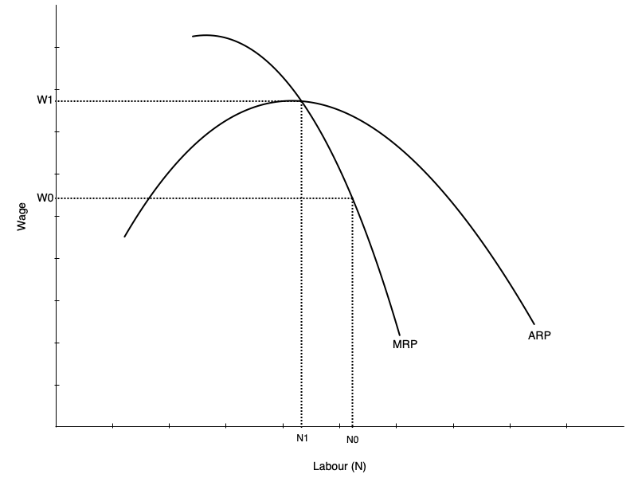
:::
::::

::: {.column width="50%"}
-   The short run labour demand curve is the MRP curve below ARP

    -   Says the amount of labour demanded at every wage

-   Slopes down because of diminishing marginal product of labour

    -   As more labour is employed, extra amount produced falls

    -   Not because of inferior labour, but because more labour is using fixed capital

-   As wage falls, firm is willing to use more labour
:::
::::::

## Demand Curve and Competition in Product Market

-   The demand for labour depends on the demand for the product being produced

-   It therefore also depends on the structure of the product market

-   Firm will always maximize profit by choosing labour where $MRP_N = w$

-   But marginal revenue in perfectly competitive market and monopolistic market differ

    -   In perfect competition $MR = p$, but in monopoly $MR < p$
    -   In perfect competition $MR$ does not fall with more $N$, but in monopoly $MR$ falls as $N$ increases

-   So with less competition in product market

    -   Labour demand is lower
    -   It falls faster with more $N$ because $MR$ falls as $N$ increases

# Demand in the Long Run

## Introduction

-   The long run differs from the short run because all inputs are variable

    -   Firms can adjust capital as well as labour

-   This makes the decision more complicated

    -   We now have to consider subsitution between labour and capital
    -   We also have to consider economies of scale

-   Approach to find optimum occurs in two steps

    -   Minimize cost holding output constant
    -   Choose output to maximize profit given cost function

## Cost Minimization

-   First step is to minimize cost of producing given output $Q_0$

-   This occurs when an isoquant is tangent to an isocost line

    -   **Isoquant** shows combinations of $K$ and $N$ that produce $Q_0$
    -   **Isocost** line shows combinations of $K$ and $N$ that cost the same amount
    -   Analogous to utility maximization with indifference curves and budget constraints

-   Assume the cost of capital is $r$ and cost of labour is $w$

    -   Total cost is $C = rK + wN$

-   The prouction function is $Q = F(K,N)$

    -   We want to minimize $C$ subject to $Q = Q_0$

## Cost Minimization

:::::: columns
:::: {.column width="50%"}
::: {layout="[[-1], [1], [-1]]"}
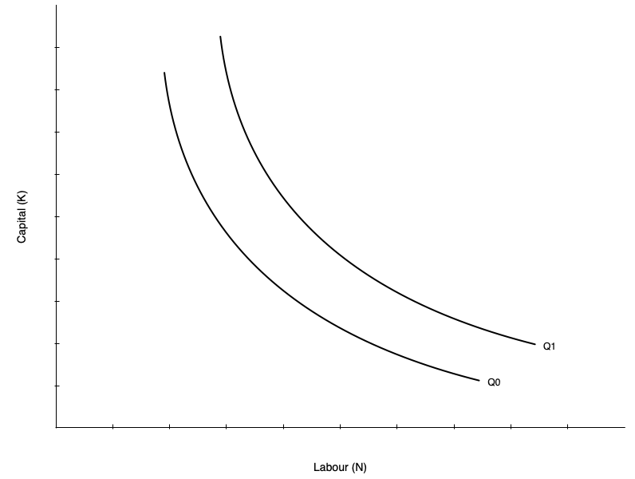
:::
::::

::: {.column width="50%"}
-   Graph on left shows two isoquants

    -   Combinations of capital and labour that produce the same quantity

-   Shape of isoquant is given by the production function

    -   Shown as convex, but could be different shapes
    -   A linear isoquant would imply perfect substitutes
    -   An L-shaped isoquant would imply perfect complements

-   Slope of isoquant is the marginal rate of technical substitution (MRTS)

    -   MRTS is the rate at which you can substitute labour for capital holding output constant
:::
::::::

## Cost Minimization

-   The slope of the isoquant is given by the MRTS

$$MRTS = \frac{MP_N}{MP_K}$$

-   Tells you amount of capital you can give up for one more unit of labour holding output constant

-   Isoquants are typically display diminishing MRTS

    -   When a lot of capital is used, you can give up a lot of capital for one more unit of labour
    -   When a lot of labour is used, you can give up only a little capital for one more unit of labour

## Cost Minimization

-   The other part of cost minimization is the isocost line

    -   Gives combinations of $K$ and $N$ that cost the same amount

-   Total cost is given by $$C = rK + wN$$

-   Rearranging gives the isocost line equation:

$$K = \frac{C}{r} - \frac{w}{r}N$$

-   Slope of isocost line is given by the ratio of input prices

    -   As $w$ increases, isocost line becomes steeper
    -   As $r$ increases, isocost line becomes flatter

## Cost Minimization

:::::: columns
:::: {.column width="50%"}
::: {layout="[[-1], [1], [-1]]"}
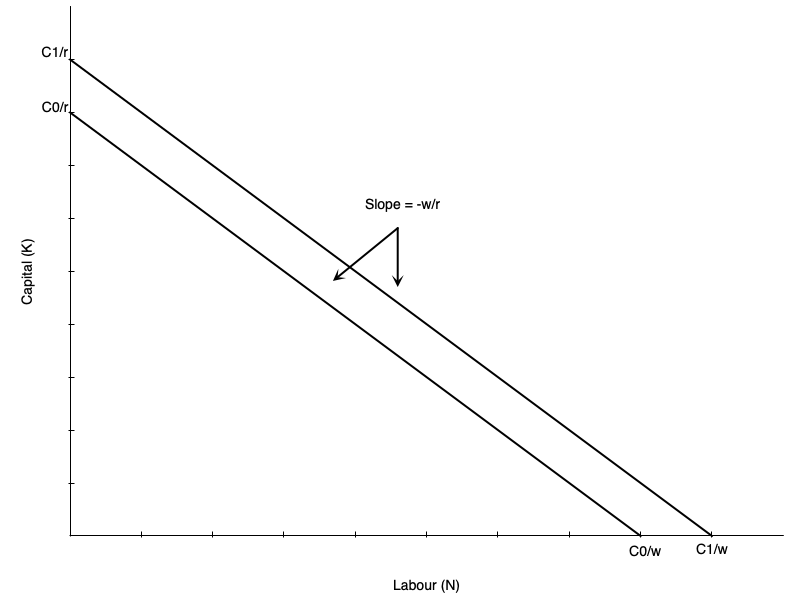
:::
::::

::: {.column width="50%"}
-   Graph shows an example isocost

    -   Slope is given by ratio of input prices $-w/r$

-   If a firm uses only labour, it is equal to $C/w$

-   If a firm uses only capital, it is equal to $C/r$

-   As labour falls by one unit, capital must rise by $w/r$ units to keep cost constant

-   Higher cost line shifts isocost line outward (e.g. when $C$ increases to $C'$)
:::
::::::

## Cost Minimization

:::::: columns
:::: {.column width="50%"}
::: {layout="[[-1], [1], [-1]]"}
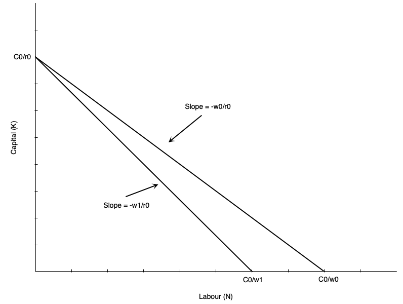
:::
::::

::: {.column width="50%"}
-   Suppose the wage rises from $w_0$ to $w_1$

-   Imagine first that we hold cost constant at $C_0$

-   Isocost line would pivot inward

    -   Steeper slope as $w/r$ increases
    -   If firm uses only capital, vertical intercept remains the same at $C_0/r$
    -   If firm uses only labour, horizontal intercept falls to $C_0/w_1$

-   All combinations of new isocost line lie below old isocost line
:::
::::::

## Cost Minimization

:::::: columns
:::: {.column width="50%"}
::: {layout="[[-1], [1], [-1]]"}
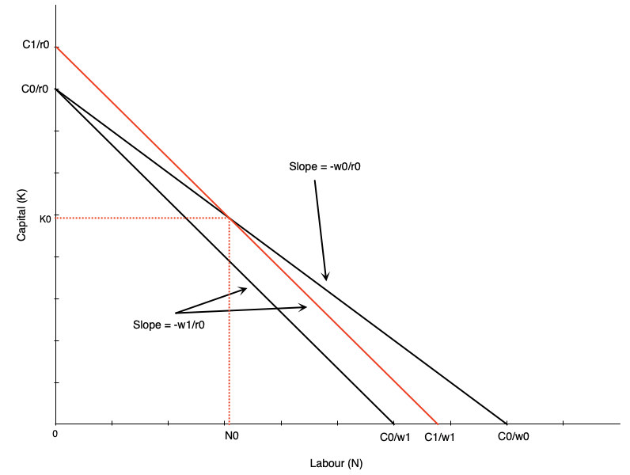
:::
::::

::: {.column width="50%"}
-   To use any of the old combinations of $K$ and $N$, the firm must increase cost

    -   Shifts isocost outward to $C_1$
    -   Magnitude of shift depends on which combination is chosen

-   One example depicted to the left

-   To use combination $(N_{0}, K_{0})$ at new prices the cost curve shifts out
:::
::::::

## Cost Minimization

-   The cost minimizing bundle is where the isoquant is tangent to the isocost line

-   In mathematical terms this means

$$\frac{MP_N}{MP_K} = \frac{w}{r}$$

-   Says that MRTS is equal to the ratio of input prices

-   Alternatively, says that

$$\frac{MP_N}{w} = \frac{MP_K}{r}$$

-   The last dollar spent on each input must yield the same marginal product

## Cost Minimization

:::::: columns
:::: {.column width="50%"}
::: {layout="[[-1], [1], [-1]]"}
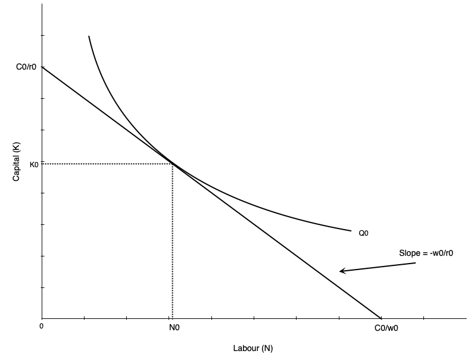
:::
::::

::: {.column width="50%"}
-   Cost minimization depicted to the left

-   If we hold output constant at $Q_0$, find the optimal combination of $K$ and $N$

-   Happens at the tangency point between isoquant and isocost line
:::
::::::

## Cost Minimization

-   Note that we have only done cost minimization here

    -   Lowest cost given output level $Q_0$

-   Profit maximization involves choosing output level as well

    -   Choose $Q$ to maximize profit given cost function

-   The second step of choosing output is not depicted here

-   If the wage rate goes up, the firm will re-optimize

    -   Firm marginal and average cost curves shift up
    -   Each firm reduces output
    -   Market price rises

-   The isoquants at the profit max will shift inward

## Cost Minimization – Math

-   Suppose production exhibits **decreasing returns to scale**:

    $$y = F(K,N) = K^{\alpha} N^{\beta}, \quad \alpha>0,\;\beta>0,\;\alpha+\beta<1$$

-   Input prices: $r$ (capital), $w$ (labour)

-   The cost-minimization problem:

    $$\min_{K,N} \; C = rK + wN \quad \text{s.t.} \quad K^{\alpha} N^{\beta} \ge y$$

-   Lagrangian:

    $$\mathcal{L} = rK + wN + \lambda\big(y - K^{\alpha} N^{\beta}\big)$$

## Cost Minimization – Math

-   First-order conditions:

    $$\frac{\partial \mathcal{L}}{\partial K} = r - \lambda\,\alpha\, K^{\alpha-1} N^{\beta} = 0$$ $$\frac{\partial \mathcal{L}}{\partial N} = w - \lambda\,\beta\, K^{\alpha} N^{\beta-1} = 0$$ $$y = K^{\alpha} N^{\beta}$$

-   Divide the first two conditions to eliminate $\lambda$:

    $$\frac{\beta}{\alpha} \frac{K}{N}=\frac{w}{r}$$

-   This is the familiar result:

    $$\frac{MP_N}{MP_K} = \frac{w}{r}$$

------------------------------------------------------------------------

## Cost Minimization – Math

-   From production $y = K^{\alpha} N^{\beta}$:

$$N = \left(\frac{y}{K^{\alpha}}\right)^{\frac{1}{\beta}}$$

-   Then:

$$\frac{K}{N} = K \left( \frac{K^\alpha}{y} \right)^{1/\beta} 
    = K^{\frac{\alpha + \beta}{\beta}}\, y^{-1/\beta}$$

------------------------------------------------------------------------

## Cost Minimization – Math

-   Plug into $\frac{\beta}{\alpha} \frac{K}{N}=\frac{w}{r}$

$$\frac{\beta}{\alpha}K^{\frac{\alpha + \beta}{\beta}}\, y^{-1/\beta} = \frac{w}{r}$$

$$K^{\frac{\alpha+\beta}{\beta}}=\frac{\alpha}{\beta}\frac{w}{r}\,y^{1/\beta}$$

-   Solving for the optimal $K$ gives

$$K^*(y;w,r)=y^{\frac{1}{\alpha+\beta}}\left(\frac{\alpha\,w}{\beta\,r}\right)^{\frac{\beta}{\alpha+\beta}}$$

------------------------------------------------------------------------

## Cost Minimization – Math

-   Use $\dfrac{K}{N}=\dfrac{\alpha w}{\beta r}$ to get $N^*$: 

$$N^*(y;w,r)=\frac{\beta r}{\alpha w}\,K^* =y^{\frac{1}{\alpha+\beta}}\left(\frac{\alpha\,w}{\beta\,r}\right)^{-\frac{\alpha}{\alpha+\beta}}$$ 

-   The cost function is:

$$C(w,r,y)= r K^*(y;w,r) + w N^*(y;w,r)$$

$$ = \phi(w,r)\, y^{\frac{1}{\alpha+\beta}}$$

-   Where 

$$\phi(w,r) = r \left( \frac{\alpha w}{\beta r} \right)^{\frac{\beta}{\alpha+\beta}} + w \left( \frac{\alpha w}{\beta r} \right)^{-\frac{\alpha}{\alpha+\beta}}$$

------------------------------------------------------------------------

## Cost Minimization – Math

-   Stage 2 is choosing the output level to maximize profit

-   Suppose the firm is a price taker in the product market with price $p$

-   Profit:

$$\pi(y)= py - C(y;w,r) = py - \phi(w,r)\, y^{\frac{1}{\alpha+\beta}}$$

-   Optimize profit with respect to $y$

$$\frac{d\pi}{dy}=p-
\phi(w,r) \cdot \frac{1}{\alpha+\beta} 
\cdot y^{\frac{1}{\alpha+\beta} - 1}$$

-   The optimal output level is found by setting $\frac{d\pi}{dy}=0$

$$y^*(w,r,p)=\left(\frac{(\alpha+\beta)\,p}{\phi(w,r)}\right)^{\!\frac{\alpha+\beta}{1-(\alpha+\beta)}}$$

## Cost Minimization – Math

-   You can then plug in to get the optimal inputs

$$K^*(w,r,p)=\left(\frac{(\alpha+\beta)\,p}{\phi(w,r)}\right)^{\!\frac{1}{1-(\alpha+\beta)}}\left(\frac{\alpha\,w}{\beta\,r}\right)^{\frac{\beta}{\alpha+\beta}}$$ $$N^*(w,r,p)=\left(\frac{(\alpha+\beta)\,p}{\phi(w,r)}\right)^{\!\frac{1}{1-(\alpha+\beta)}}\left(\frac{\alpha\,w}{\beta\,r}\right)^{-\frac{\alpha}{\alpha+\beta}}$$

## Cost Minimization – Math

-   Do not get too bogged down in the math

    -   I will not ask you to recreate this derivation on exams

-   The key points are

    -   First minimize cost, which gives optimal inputs as function of output and input prices

        -   So as you vary any of those three things, the inputs change

    -   But given cost function, choose output to maximize profit

        -   Output depends on product price and input prices
        -   So changes in input prices change both optimal inputs and output level

# Deriving Labour Demand in Long Run

## Deriving Labour Demand

-   The labour demand curve plots combinations of $w$ and $N$ such that the firm is maximizing profit

-   To derive it, we consider changing wage from $w_0$ to $w_1$

    -   Isocosts get steeper as $w/r$ increases
    -   Firm finds cost minimizing combination of $K$ and $N$ at new wage for each level of output
    -   Because cost increases, firm reduces output (optimal isoquant is to the left of original one)

-   At new optimum we have

    -   Lower quantity of labour demanded
    -   Higher wage

## Deriving Labour Demand

:::::: columns
:::: {.column width="50%"}
::: {layout="[[-1], [1], [-1]]"}
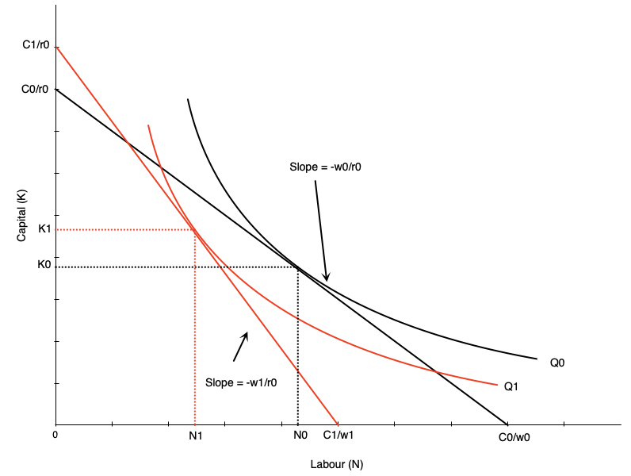
:::
::::

::: {.column width="50%"}
-   Effect of wage increase on labour depicted to the left

-   Wage goes up, which steepens isocost line

-   Firm scales down production to lower isoquant

-   The tangency between new isoquant and new isocost line shows new optimal labour and capital

-   This involves less labour employed

-   Effect on capital depends on substitutability between labour and capital

    -   The shape of the isoquant
:::
::::::

## Deriving Labour Demand

::::::: columns
:::: {.column width="50%"}
::: {layout="[[-1], [1], [-1]]"}

:::
::::

:::: {.column width="50%"}
::: {layout="[[-1], [1], [-1]]"}
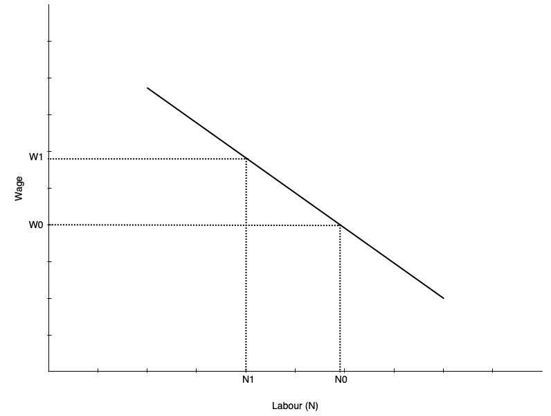
:::
::::
:::::::

## Deriving Labour Demand

-   The labour demand curve summarizes the optimal choices of labour at different wage rates

-   Graph in previous slide shows to two points on the labour demand curve

    -   $(w_0, N_0)$ and $(w_1, N_1)$

-   To derive the full demand curve you can vary the wage rate to other levels

-   Recall that the demand curve shows the amount of labour demanded at every wage *all else equal*

    -   Other determinants of demand will shift the curve

## Scale and Substitution Effects

-   When the wage changes, two effects occur that influence labour demand

    -   **Substitution effect:** change in input mix due to change in relative input prices
    -   **Scale effect:** change in output due to change in cost of production

-   The substitution effect makes firms want to substitute capital in place of labour

    -   Leads to less labour demanded when wage rises
    -   More capital demanded

-   The scale effect comes from reduction in output, and leads to less labour demanded when wage rises

    -   As production becomes more expensive, firms produce less
    -   Use less labour and capital

-   For labour demand, scale and substitution effect work in the same direction

    -   But opposite directions for capital

## Scale and Substitution Effects

:::::: columns
:::: {.column width="50%"}
::: {layout="[[-1], [1], [-1]]"}
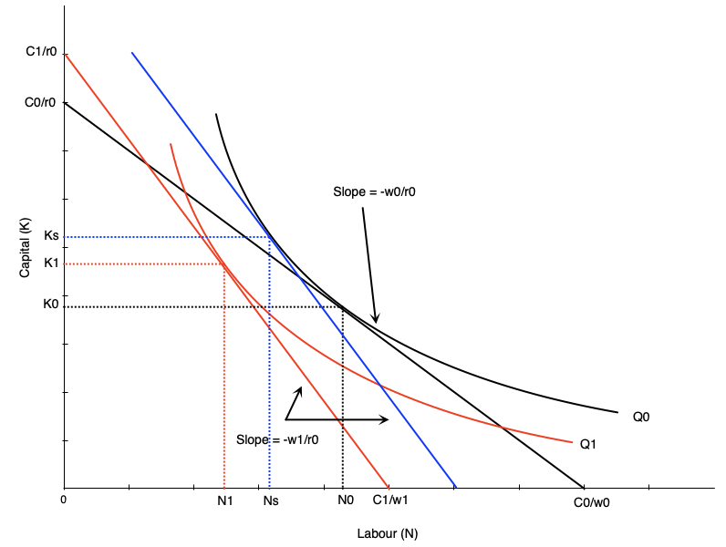
:::
::::

::: {.column width="50%"}
-   To find substitution effect, find cost minimizing bundle at new wage and old output

    -   Blue line in the graph
    -   Scale effect is $N_{0} \rightarrow N_{s}$

-   Scale effect is the change from optimum at new wage and old output to new wage and new output

    -   Shift from blue to red line in graph
    -   Scale effect is $N_{s} \rightarrow N_{1}$
:::
::::::

## Scale and Substitution Effects

-   Notice that the scale and substitution effects of a wage change have opposing effects on capital

-   When wage rises, substitution effect leads to more capital being used

    -   Firms substitute capital for labour

-   But scale effect leads to less capital being used

    -   Firms reduce output, so use less of all inputs

-   Effect on capital is ambiguous

## Relationship to Short-Run Demand

-   In the short run, capital is fixed

    -   So there is no substitution effect

-   In the long run, both substitution and scale effects occur

-   Therefore, long-run labour demand is more elastic than short-run labour demand

    -   Firms can adjust all inputs in the long run
    -   More responsive to wage changes

## Relationship to Short-Run Demand

:::::: columns
:::: {.column width="50%"}
::: {layout="[[-1], [1], [-1]]"}
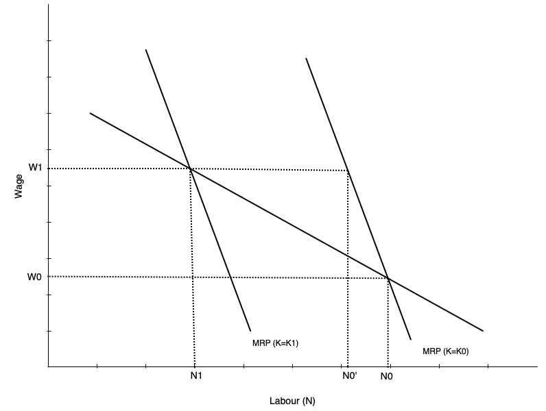
:::
::::

::: {.column width="50%"}
-   Graph shows short-run and long-run labour demand curves

-   Start with capital fixed at $K_0$

-   Wage goes from $w_0$ to $w_1$

-   In short run move along SR demand curve from $N_0$ to $N_{'}$

-   In long run firm substitutes capital for labour

-   Short run curve shifts to the left

-   Equilibrium is at intersection of wage and new short run demand
:::
::::::

# Elasticity of Demand for Labour

## Elasticity of Demand

-   Recall that elasticity of demand measures responsiveness of quantity demanded to changes in price

-   In this case, responsiveness of labour demanded to changes in wage rate

-   An elastic labour demand curve means a proportionately larger change in quantity of labour demanded than change in wage

    -   Curve is flatter

-   An inelastic labour demand curve means a proportionately smaller change in quantity of labour demanded than change in wage

    -   Curve is steeper

## Factors Affecting Elasticity

-   Several factors affect the elasticity of labour demand

    -   Ease of substitution between labour and other inputs

        -   More or easier substitutes means more elastic demand

    -   Elasticity of supply of other inputs

        -   Inelastic supply of othe inputs makes it harder to substitute, means less elastic labour demand
        -   Happens because other inputs become more expensive when firm tries to substitute

    -   Elasticity of demand for the final product

        -   Output responding more to price changes means more elastic labour demand

    -   Labour share in total costs

        -   Higher labour cost share means more elastic labour demand
        -   Operates via scale effect

## Evidence on Elasticity

-   In the USA, evidence suggests elasticity is between -0.15 and -0.75

    -   So relatively inelastic

    -   Elasticities have increased over time

    -   In the long run elasticities are larger

-   In Canada, evidence says elasticity is between -0.1 and -0.6

    -   Depends on geography and industry

-   Key result is that studies confirm that labour demand does slope down

# Globalization and Offshoring

## Introduction

-   Over time Canadian firms have faced increasingly globalized

-   Has lead to concerns over what happens to Canadian workers

    -   People worry firms will move their operations to other countries with lower wages
    -   And that this will destroy Canadian jobs
    -   This is a clear concern in the USA right now

-   The effect of globalization on jobs is always a concern when trade agreements are reached

    -   Manufacturing is especially prominent
    -   Currently the automotive industry is a focus of concern

## Effect of Trade on Single Market

-   Consider first global competition with a specific product

-   Increased global competition lowers the price a product can sell for globally

-   In a competitive market, this reduces the value of the marginal product

    -   Recall that $VMP = p \times MP_N$

-   Shifts the demand for Canadian labour inward

## Effect of Trade on Single Market

-   Another approach is to consider Canadian and foreign labour as two inputs to production

    -   Just like we did with capital and labour before

-   The optimal choice of Canadian and foreign labour occurs where

$$\frac{MP_{N_C}}{MP_{N_F}} = \frac{w_C}{w_F}$$

-   The marginal product per dollar spent on a foreign and Canadian worker are the same

## Effect of Trade on Single Market

-   What effect does a fall in foreign wages have on Canadian labour demand?

-   Two effects occur

    -   Substitution effect: firms substitute foreign workers for Canadian workers

        -   Reduces demand for Canadian workers

    -   Scale effect: lower costs lead to more production

        -   Increases demand for Canadian workers

-   So overall effect is ambigiuous

    -   If they are close subsitutes, substitution effect dominates and less Canadian labour is demanded
    -   If scale effect dominates, there could be more Canadian labour demanded

## Effect of Trade on Single Market

-   Cost is not the only factor

-   Productivity is also important

    -   If Canadian workers are more productive, will still want to hire them

-   How productive are Canadian workers compared to foreign workers?

-   Table on next slide shows international comparisons for OECD countries

    -   Also changes over time in productivity, compensation, unit labour costs

## Effect of Trade on Single Market

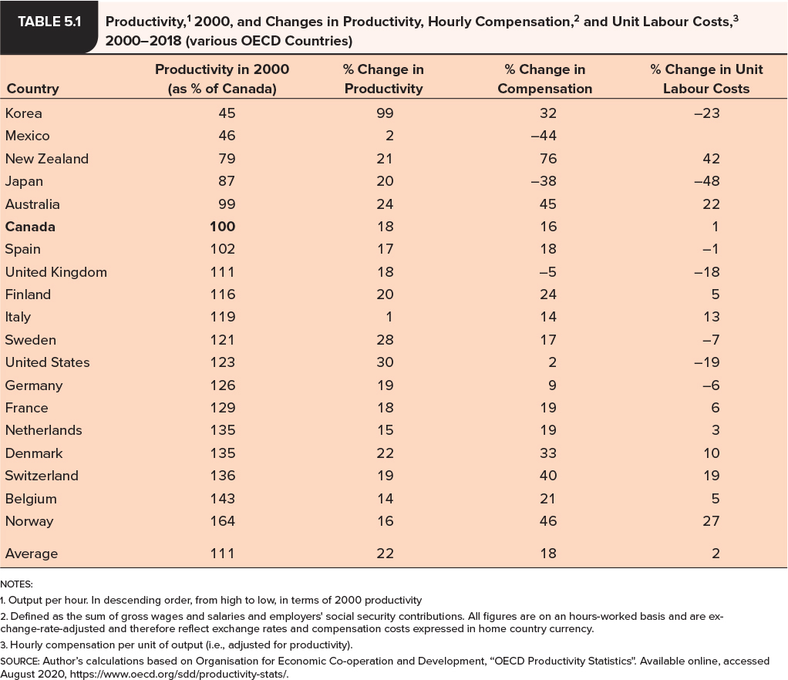{fig-align="center"}

## Effect of Trade on Single Market

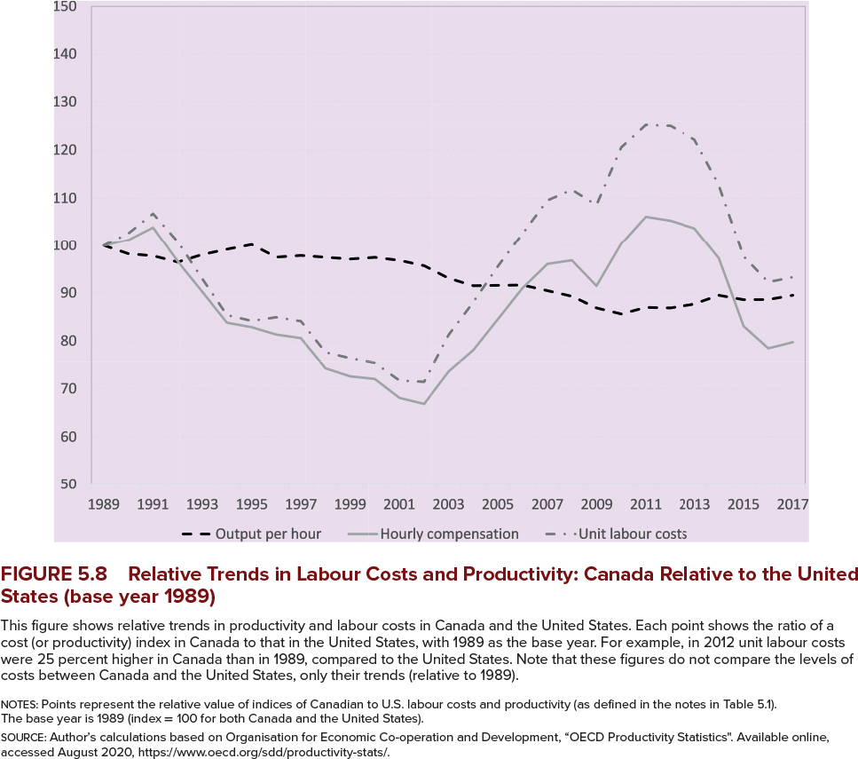{fig-align="center"}

## Effect of Trade Across Sectors

- Focusing on a single sector misses key points

    - Trade openness affects the entire economy
    - There are adjustments across sectors due to trade
    
- Recall from EC120 that countries specialize in production of goods where they have a comparative advantage

    - Expands the consumption possibilities of countries
    
- In a globalized market, countries will allocate more resources towards their comparative advantage sectors

    - Labour will move from non-comparative advantage sectors to comparative advantage sectors
    
    
## Evidence on Trade and Labour Demand

- There are many trade agreements with other countries

- Most prominent in Canada are NAFTA and more recently CUSMA

- These present opportunities to study the effects of trade on labour demand

- Evidence shows that

    - About 10% of Canadian jobs lost in early 90s were due to free trade
    - Productivity grew faster in manufacturing industries affected by trade
    
    
## Non-Trade Demand Factors

- At the same time trade is changing, the Canadian labour market is changing

- Over the long term, jobs have shifted away from manufacturing

- Professional, managerial, and administrative service jobs hae been increasing

- Flex or "gig" jobs have been increasing

- All changing for various reasons

    - Technology
    - Consumer preferences
    - Demographics

