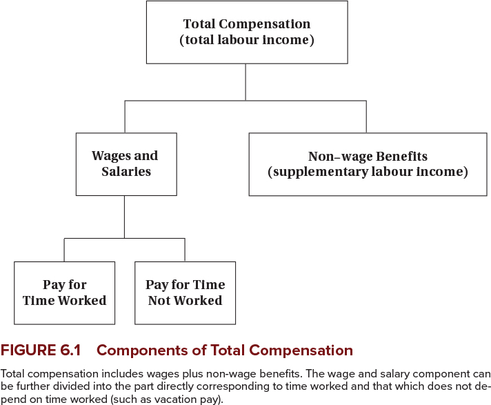
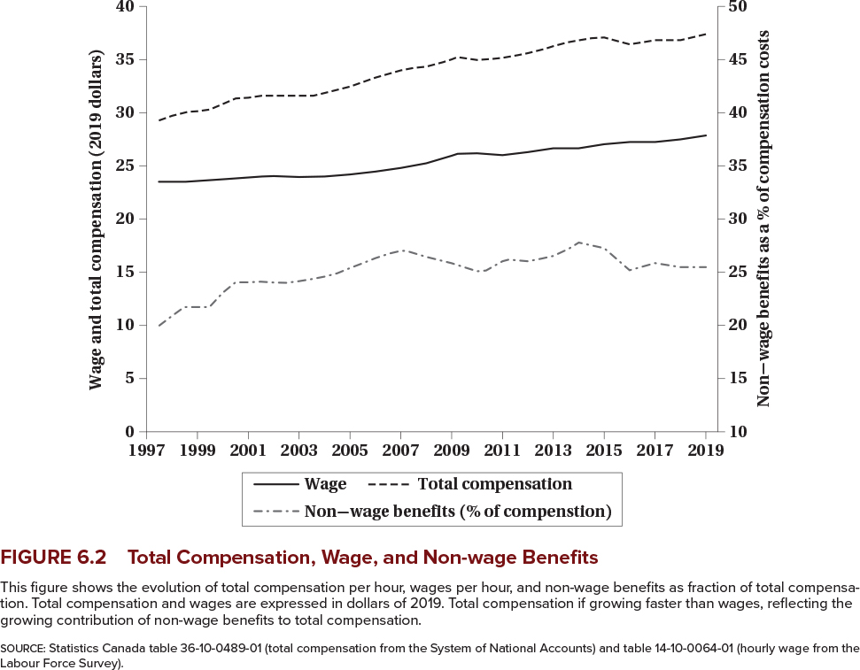
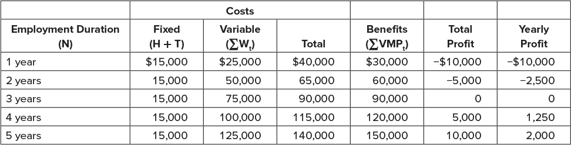
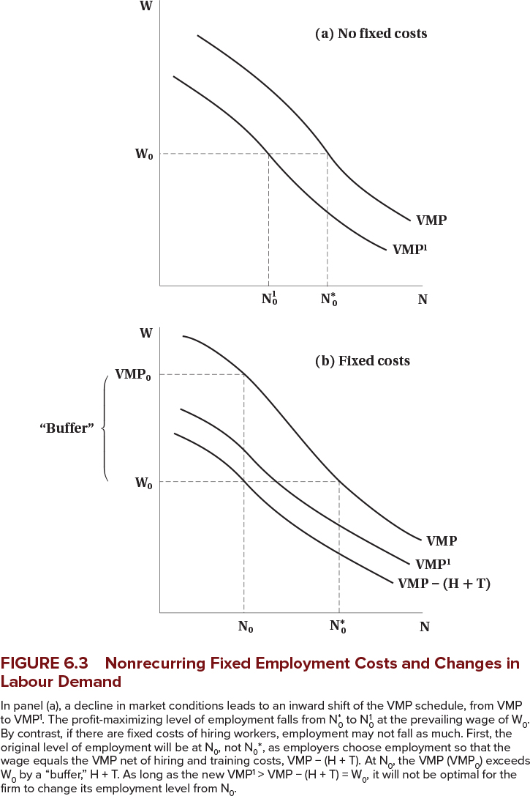

<h1>Labour Demand 2: Non-wage Benefits and Quasi-Fixed Costs</h1>

<h2>EC306- Wages and Employment</h2>

<h2>Justin Smith</h2>

<h2>Wilfrid Laurier University</h2>

<h2>Fall 2025</h2>

{.absolute top="300" left="900" width="550"}

# Goals of This Section

## Goals of This Section

-   Distinguish between workers and hours as an input into production

-   Incorporate non-wage benefits into the labour demand model

-   Also add costs that are independent of hours worked (quasi-fixed costs)

-   Discuss the implications of quasi-fixed costs for labour demand

# Background

## Background

-   So far we have discussed labour as a purely variable input paid a wage per hour worked

-   In reality it is not so simple

    -   Workers are sometimes paid other benefits besides wages

        -   CPP, EI, , retirement benefits, paid vacation, sick leave, etc.

    -   There are costs beyond the hourly wage

        -   Hiring and training costs
        -   Costs of dismissal
        -   Non-wage benefits described above

-   These benefits and costs complicate the labour demand decision

# Non-Wage Benefits

## Non-wage Benefits

-   As discussed above, compensation typically includes more than just wages

-   Common non-wage benefits include

    -   Health insurance (beyond public health care)
    -   Retirement benefits
    -   Paid vacation and sick leave
    -   Other perks (e.g. gym memberships, childcare, etc.)

-   These benefits have value to workers

-   They increased as a share of total compensation through the 90s and early 2000s

## Non-wage Benefits

{fig-align="center"}

## Non-wage Benefits

{fig-align="center"}

## Non-wage Benefits

-   Why do firms pay these benefits instead of wages?

    -   Sometimes they are not taxed
    -   Economies of scale in providing benefits
        -   Things like pensions and insurance are cheaper when provided to a group
        -   Because it avoids adverse selection problems
    -   Worker preferences
        -   Some workers may prefer benefits to wages
        -   E.g. risk-averse workers may prefer health insurance
    -   Legal requirements

## Non-wage Benefits

-   Continued...

    -   Better firm planning
        -   Some benefits can reduce absenteeism
        -   Contingency plans for worker illness or accidents through sick leave
    -   Better for productivity
        -   Subsidized meals keep people working
    -   Deferred compensation
        -   Retirement benefits can help retain workers
        -   Workers may accept lower wages in exchange for future benefits
        -   Acts as a screen for good workers

## Non-wage Benefits

-   Governments sometimes prefer (and mandate) them also

    -   Firm pensions reduce need for public pensions
    -   Better health outcomes reduce public health care costs
    -   Improve the social safety net through sick leave and unemployment insurance

-   With all these reasons, it is not surprising that non-wage benefits are common

# Quasi-fixed Costs

## Introduction

-   We have been agnostic about whether labour is measured in workers or hours worked

-   But there is an important distinction

    -   Some costs are incurred per worker regardless of hours worked
    -   Other costs are incurred per hour worked

-   Costs that occur per worker but are relatively independent of hours worked are **quasi-fixed costs**

    -   Pure quasi-fixed costs do not vary with hours worked at all
    -   In practice, many costs are partially quasi-fixed
    -   Some of these costs may be recurring (e.g. monthly EI premiums) and others one-time (e.g. hiring and training costs)

## Examples of Quasi-fixed Costs

-   Hiring costs

    -   Recruiting, interviewing, and training are costly
    -   Incurred when a worker is hired regardless of hours worked
    -   Firms generally try to minimize hiring costs by retaining workers

-   Termination costs

    -   Severance pay, legal fees, and administrative costs
    -   Initially depend on time with company, but have a maximum so they become fixed
    -   Firms may be reluctant to lay off workers because of these costs

## Examples of Quasi-fixed Costs

-   Employer contributions to payroll taxes

    -   EI and CPP are initially related to work hours
    -   But they have a ceiling so they become quasi-fixed for high hours worked

-   Other non-wage benefits

    -   Employer contributions to life insurance, medical, dental plans
    -   Often have a fixed component regardless of hours worked

-   Note that if a cost always varies with hours worked it is not quasi-fixed

    -   E.g. hourly wage, overtime premiums, per-hour health and safety costs, etc.

## Effects of Quasi-fixed Costs

-   Previously we saw that labour demand is determined by equating $MRP_L$ to the wage rate

-   The decision is similar with quasi-fixed costs, but now the cost of hiring a worker is higher

-   There is also a dynamic component where firms amortize the costs over time

    -   Firms may pay high training costs now
    -   But expect the worker to remain with the firm to recoup those costs

## Effects of Quasi-fixed Costs

-   A profit maximizing firm will hire workers up to the point where

$$H + T + \sum_{t=1}^{N} \frac{w_t}{(1 + r)^t} = \sum_{t=1}^{N} \frac{VMP_t}{(1 + r)^t}$$

-   Where

    -   $H$ = hiring cost
    -   $T$ = training cost
    -   $w_t$ = wage in period $t$
    -   $VMP_t$ = value of marginal product in period $t$
    -   $r$ = discount rate
    -   $N$ = expected tenure of worker

## Effects of Quasi-fixed Costs

-   This equation has several implications

    -   Firms will be reluctant to hire workers for short periods if hiring costs are high
    -   The wage does not have to equal the marginal product of labour in each period
    -   Future productivity matters, but is discounted
    -   Firms may be willing to pay more than the current marginal product if they expect future productivity to be high

-   Related to the last point, when hiring costs are a factor future productivity must exceed the total wage

$$\sum_{t=1}^{N} \frac{VMP_t}{(1 + r)^t} > \sum_{t=1}^{N} \frac{w_t}{(1 + r)^t}$$

## Effects of Quasi-fixed Costs

-   This is similar to any other investment decision

    -   Firms invest in workers when the present value of future returns exceeds the present value of costs
    -   Hiring and training costs are like "upfront" costs of investment
    -   Wages are like "ongoing" costs of investment
    -   Future productivity is like the "returns" on that investment
    -   You only make the investment if you expect to earn at least as much as you spend

-   The next slide presents an example

## Effects of Quasi-fixed Costs

{fig-align="center"}

# Things Explained by Quasi-Fixed Costs

## Overtime

-   Firms sometimes work employees longer despite higher overtime wages

-   Can be explained by high quasi-fixed costs of hiring additional workers

    -   May be cheaper paying these higher wages to incurring hiring and training costs
    -   Especially the case for high skill workers who require a lot of training

## Temp and Gig Workers

-   Firms do not always hire part- or full-time employees directly

-   They sometimes use temp agencies, or "gig" workers

    -   Laurier hires a cleaning firm and does not employ many janitors directly
    -   Uber classifies drivers as independent contractors

-   By doing this firms do not pay quasi-fixed costs

## Layoffs

-   During downturns in the economy firms sometimes keep workers around

-   This can be explained by quasi-fixed costs of hiring and termination

    -   Paying severance and incurring legal fees may be costly
    -   Firms may prefer to keep workers on payroll if they expect a quick recovery
    -   Firms may also be reluctant to lay off skilled workers due to high training costs

-   This can lead to **labour hoarding** during downturns

-   Also explains why highly educated workers tend to suffer less unemployment during recessions

## Layoffs

:::::: columns
:::: {.column width="50%"}
::: {layout="[[-1], [1], [-1]]"}
{width="500"}
:::
::::

::: {.column width="50%"}
-   Graph to left illustrates labour hoarding

-   Top panel is without quasi-fixed costs

-   Firm hires to point where $VMP = w$

-   In economic downturn, $VMP$ shifts down

    -   Because of lower demand for output, and therefore price

-   With the same wage, firms hire fewer workers
:::
::::::

## Layoffs

:::::: columns
:::: {.column width="50%"}
::: {layout="[[-1], [1], [-1]]"}
{width="500"}
:::
::::

::: {.column width="50%"}
-   Bottom panel is with quasi-fixed costs

-   Quasi-fixed costs shift VMP curve down prior to downturn

    -   Firm hires to point where $VMP - (H + T) = w$
    -   Fewer workers are hired initially because of these costs

-   Creates wedge between VMP and wage

    -   VMP is now higher than wage

-   After downturn, VMP shifts down

    -   But because of wedge, firm may not change employment
:::
::::::

## Segmentation

-   Hiring costs mean trained and untrained employees are different

    -   Firms may be reluctant to hire untrained workers because of high training costs

-   When quasi-fixed costs are high, firms to prefer to retain or hire trained workers

-   Leads to a segmentation into protected and unprotected workers in labour market

-   Also leads firms to work employees more intensively than hire new workers

    -   Example: big law firms that work associates long hours instead of hiring new associates

## Work Sharing

-   Some individuals would embrace work sharing

    -   Two or more people share a job
    -   Hiring more people to each work less hours for the same total hours

-   Quasi-fixed costs explain why firms do not engage more in this activity

    -   Hiring costs make it costly to bring on additional workers
    -   Firms prefer to have fewer workers working more hours each
    -   Even if total hours worked is the same

# Work Sharing

## Introduction

-   In this section we expand on work sharing

-   In Canada work sharing is a government program that subsidizes employee wages during downturns

    -   Administered through Employment Insurance
    -   Allows firms to reduce hours of employees instead of laying them off
    -   Employees form a "work sharing group" and agree to reduce hours
    -   Maximum duration of 26 weeks, with possible extensions

-   The key idea is to avoid layoffs and employ more people

    -   This is why the government is involved

## Introduction

-   There are other possible work sharing schemes

    -   Delayed entry into the labour force
    -   Early retirement
    -   Short work weeks
    -   Reduced overtime
    -   Increased vacation time

-   Do any of these schemes increase the number of jobs?

## Overtime Restrictions

-   As noted above, one way to share work is to restrict overtime

    -   Firms do not like this because as noted it could increase costs

-   Some governments have enacted legislation to prevent excessive overtime

-   It is not clear that these laws increase employment

    -   Firms may not hire more workers
    -   The increased costs reduce overall demand for labour
    -   New workers may not be as productive as existing workers, so firms may not want to hire them
    -   There may not be enough employable workers available

## Overtime Restrictions

-   Also the possibility that part of reason for work sharing is based on a fallacy

    -   **Lump of Labour Fallacy** is that there is a fixed number of jobs in the economy
    -   Leads people to believe that employees working longer hours are taking jobs away from others
    -   But in reality the number of jobs is not fixed
    -   As people become employed, the economy grows, and more jobs are created
    -   Fallacy is commonly used to argue against immigration

-   Studies show that restricting work hours does not lead to increased employment

-   But may still be useful in the short term in economic downturns

## Subsidized Work Sharing

-   As noted, Canada subsidizes work sharing programs for economic downturns

-   Main goal is to keep people employed during recessions

-   But would be good if it also protect jobs longer term

-   Evidence suggests that

    -   Many firms use the program

    -   It does help keep people employed during downturns

    -   But there is little evidence that it increases employment longer term

        -   Employees were laid off when subsidy ran out

## Employee Demand for Work Sharing

-   We have been discussing work sharing from persepective of employer

-   Employees need to also buy in for it to be successful

-   It is not clear that they do in many cases

-   Example: union jobs

    -   Unions often resist work sharing programs
    -   Prefer to keep full-time jobs with benefits
    -   May see work sharing as a threat to job security
    -   May also see it as a way for employers to reduce wages and benefits

# Summary

## Summary

-   In this section we expanded the labour demand model
-   We incorporated non-wage benefits and quasi-fixed costs
-   Non-wage benefits are common and have many justifications
-   Quasi-fixed costs complicate the labour demand decision
-   These costs can explain many labour market phenomena
-   Work sharing is one possible response to quasi-fixed costs
-   But it is not clear that work sharing increases employment longer term
