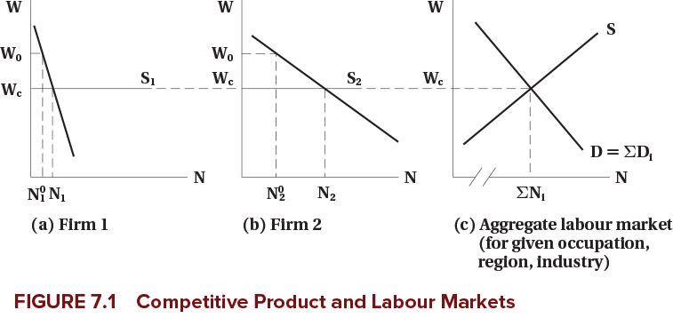
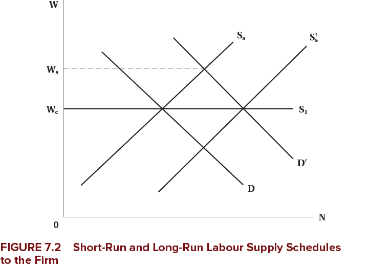
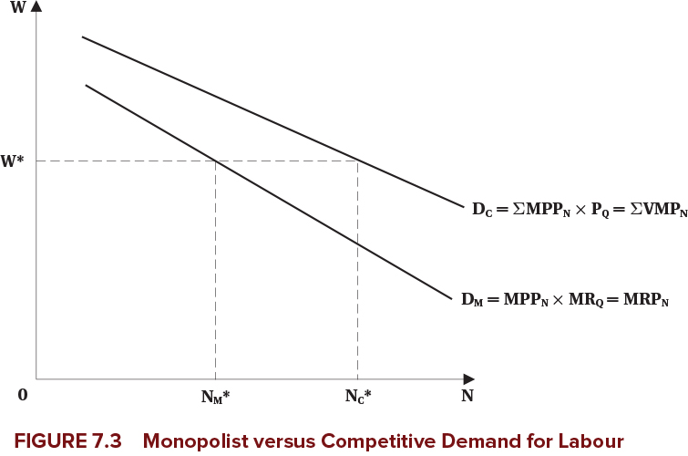
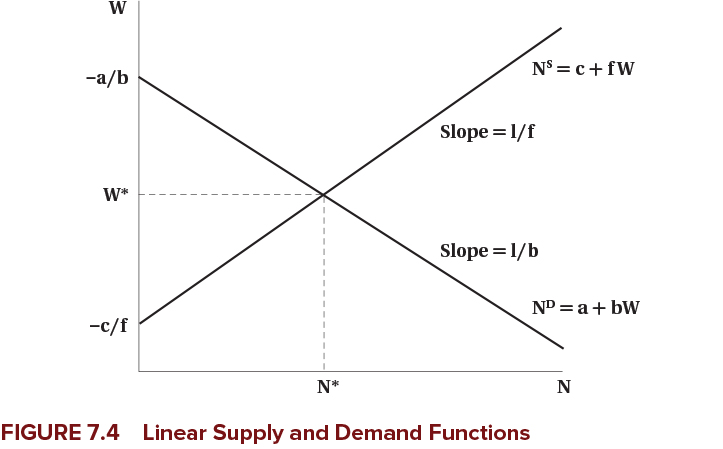
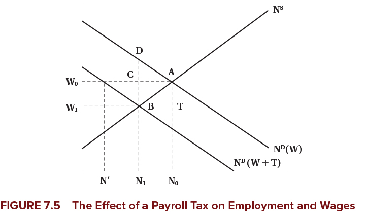

<h1>Wages and Employment in a Single Labour Market</h1>

<h2>EC306- Wages and Employment</h2>

<h2>Justin Smith</h2>

<h2>Wilfrid Laurier University</h2>

<h2>Fall 2025</h2>

{.absolute top="300" left="900" width="550"}

# Goals of This Section

## Goals of This Section

-   Bring together demand and supply to determine wages and employment

-   Discuss the effect of market power in goods market on equilibrium wages and employment

-   Discuss the effect of market power in the labour market on equilibrium wages and employment

-   Analyze minimum wages

# Introduction

## Introduction

-   We have analyzed labour demand and supply separately in detail

-   The equilibrium wage and employment is determined by the interaction of the two

-   Market power plays an important role

    -   In both goods markets and labour markets

-   With a full understanding on how wages and employment are determined, we can analyze policies

-   The minimum wage is one of the most prominent labour market policies

    -   In theory, it leads to unemployment
    -   The evidence is more mixed

# Competitive Firms

# Introduction

-   We start with firms that are competitive in the goods and labour markets

-   Perfect competition in both implies that

    -   Firms take the market wage as given
    -   They take the market price as given
    -   Competition means they are too small to influence either

-   We analyze the equilibrium wage and employment for a homogeneous type of labour

    -   All workers are the same

## Market Demand and Supply

-   The market demand and supply are the sum of the individual firms' demand and supply at each wage

-   Here we determine the demand and supply curve for a single labour market

    -   Could be an specific occupation in a specific region
    -   Example: electricians in Ontario, professors in Canada, etc.
    -   How the market is defined depends on context
    -   But it is for a single type of labour

## Market Demand and Supply

-   Example is two firms with different elasticities of demand

    -   Each firm demand curve is their value of marginal product
    -   Firms may face different product prices if they sell different things (but hire the same labour)

-   Each firm faces the same wage in the labour market

    -   They perceive the supply curve as horizontal in the long run
    -   They take the wage as given and can get as much laour as they want at that wage
    -   Market supply is upward sloping

-   Market demand is horizontal sum of individual demands

    -   Add up the quantities demanded at each wage for each firm
    -   Repeat for all wages

## Market Demand and Supply

{fig-align="center"}

## Firm Demand and Supply in the Short Run

-   Above we analyzed the longer run

    -   Firms can get as much labour as they want at the going wage

-   In the short run, firms may face an upward sloping supply curve

    -   They have to pay higher wages to attract more workers
    -   This could be because of contracts, or other frictions

-   If demand rises, they would pay higher wages to attract workers

-   But because wages are high, over the long term more workers enter the market

    -   Short run supply shifts out
    -   Wage falls back down to long run level

## Firm Demand and Supply in the Short Run

{fig-align="center"}

# Imperfect Competition in the Product Market

## Monopoly

-   In competitive markets there are many sellers of a product

-   In a monopoly, there is only one

-   This gives the firm market power

    -   The ability to set prices above marginal cost

-   For a monopolist, the demand curve is where wage equals marginal revenue product

    $$w = MR \times MPP_N$$

-   For a monopolist, marginal revenue is less than price

    -   Because to sell more, they have to lower price on all units sold
    -   So marginal revenue product is less than value of marginal product ($VMP$)

## Monopoly

{fig-align="center"}

## Monopoly

-   Because monopolists have market power

    -   They can raise the price of their product above competitive level
    -   This will decrease output
    -   They demand less labour

-   Monopolists therefore will hire fewer workers

    -   Compared to a competitive firm in the same market

-   Note that power in the product market does not mean power in the labour market

    -   The firm is still one of many hiring workers in a particular labour market

## Monopolistic Competition and Oligopoly

-   Many markets are neither perfectly competitive nor pure monopoly

-   Monopolistic competition

    -   Many firms selling differentiated products
    -   Each firm has some market power because of product differentiation
    -   Can set prices above marginal cost

-   Oligopoly

    -   A few firms dominate the market
    -   Each firm has significant market power
    -   But must consider reactions of competitors when setting prices

-   Demand for labour is still based on marginal revenue product

    -   Which is less than value of marginal product
    -   So firms hire fewer workers than in competitive markets

## Additional Details

-   All of the previous analysis assumes that labour markets are perfectly competitive

    -   Firms can hire all labour they want at the given wage

-   That is not always the case in reality when firms have power in the product market

    -   Employees may unionize
    -   Firms may hire a large number of the market's workers

-   In these cases, firms may not face a perfectly elastic supply curve for labour

-   Later we will analyze imperfect competition in the labour market

# Math of Labour Market Equilibrium

## Introduction

-   We know that market equilibrium is where demand and supply are equal

-   You can do that graphically or mathematically

-   In this section we cover both

-   To make the math easier, we use linear demand and supply curves

    -   This is just for simplicity
    -   The same principles apply with non-linear curves

## Demand and Supply Functions

-   The demand and supply for labour are functions of wages and other factors

    -   Demand: $N^D = f(w, Z)$

        -   $Z$ is a list of other factors affecting demand

    -   Supply: $N^S = g(w, X)$

        -   $X$ is a list of other factors affecting supply

-   $Z$ and $X$ are things that shift the curves

    -   For example, technology, prices of other inputs, preferences, demographics, etc.

    -   We call these **exogenous** variables

        -   Determined outside the model

-   $N^D$, $N^S$, and $w$ are **endogenous**

    -   Determined within the model

## Demand and Supply Functions

-   Assume the demand and supply functions are linear

    -   Demand: $N^D = a + b w$

        -   $a$, $b$ are constants

    -   Supply: $N^S = c + f w$

        -   $c$, $f$ are constants

-   To find equilibrium, set demand equal to supply

$$a + b w^* = c + f w^*$$

## Demand and Supply Functions

-   Rearranging to solve for equilibrium wage:

$$w^* = \frac{c - a}{b - f}$$

-   Rearranging to solve for equilibrium employment:

$$N^* = \frac{b c - a f }{b - f}$$

-   Use these equations to analyze how changes in exogenous variables 

    -   Changing $a$ would shift the demand curve

        -   Example: increase in product price

    -   Changing $c$ would shift the supply curve

        -   Example: increase in population

## Demand and Supply Functions

-   To draw the demand and supply curves, we need $w$ on the left side

-   Rearranging the demand function:

$$w = \frac{N^D - a}{b}$$

-   Rearranging the supply function:

$$w = \frac{N^S - c}{f}$$

-   Next slide plots these functions

## Demand and Supply Functions

{fig-align="center"}

## Payroll Tax

-   We can use this model to analyze various policies

-   One common policy is a payroll tax on employers

    -   Examples: Canada Pension Plan (CPP), Employment Insurance (EI)

-   These are typically a percentage of wages paid by employers

-   But we will analyze a fixed amount per hour for simplicity

    -   Suppose the tax is $T$ per hour

-   This drives a "wedge" between the wage paid by employers and the wage received by workers in equilibrium

$$w_r = w_e - T$$

## Payroll Tax

-   The demand function is:

$$w_e = \frac{N^D - a}{b} $$

-   The supply function is:

$$w_r = \frac{N^S - c}{f}$$

## Payroll Tax

-   Substitute into the equilibrium price equation and set quantity demanded equal to quantity supplied:

$$\frac{N^* - c}{f} = \frac{N^* - a}{b} - T $$

-   Rearranging to solve for equilibrium employment:

$$N^* = \frac{b c - a f - b f T}{b - f} $$

## Payroll Tax

-   The equilibrium wage received by workers is

$$w_r^* = \frac{c-a}{b-f} - \frac{b}{b-f} T $$

-   The equilibrium wage paid by employers is

$$w_e^* = \frac{c-a}{b-f} - \frac{f}{b-f} T $$

## Payroll Tax

{fig-align="center"}

## Payroll Tax

-   The previous slide highlights the difference between the statutory and economic incdidence of a tax

    -   Statutory incidence: who is legally responsible for paying the tax

        -   In this case, firms

    -   Economic incidence: who actually bears the burden of the tax

        -   Shared between firms and workers
        -   Workers receive a lower wage than before
        -   Firms pay a higher one

-   Economic incidence depends on elasticities of supply and demand

    -   More elastic supply means workers bear less of the tax burden
    -   More elastic demand means firms bear less of the tax burden

## Evidence

-   Theory predicts lower employment from a payroll tax

-   Also predicts economic incidence may be shared between firms and workers

-   Evidence based on empirical studies is

    -   In the long run, workers bear most of the burden of the tax through lower wages
    -   Employment effects are small
