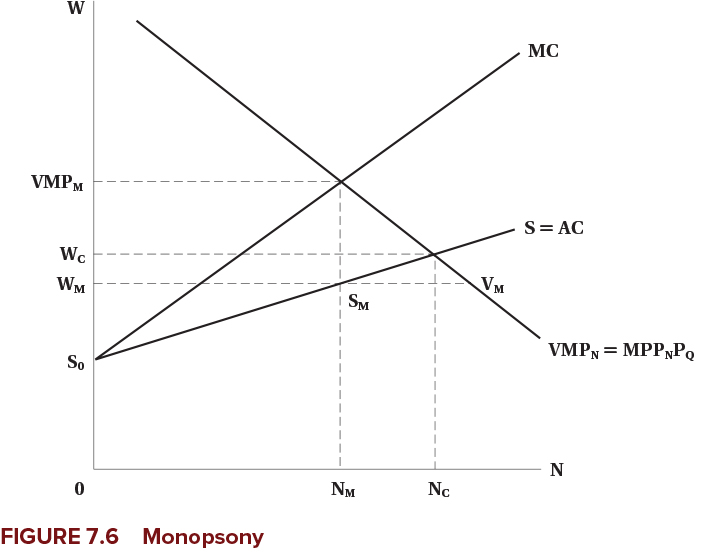
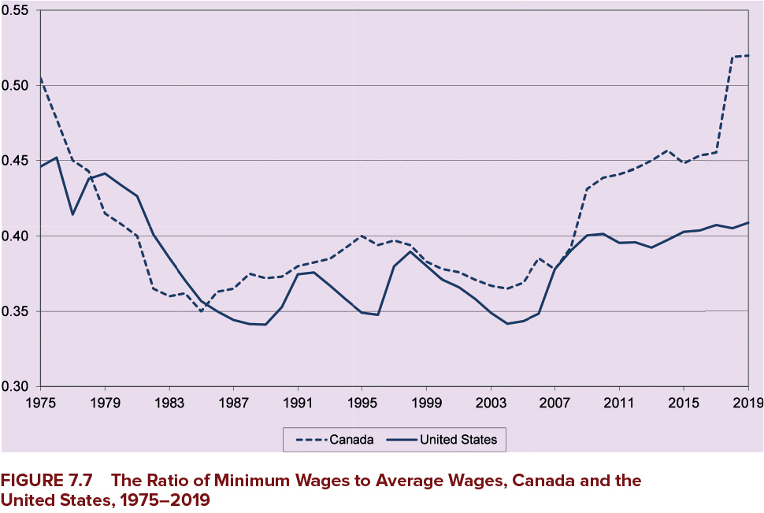
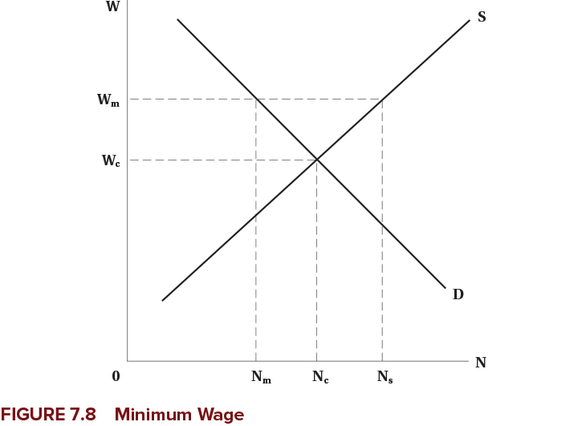
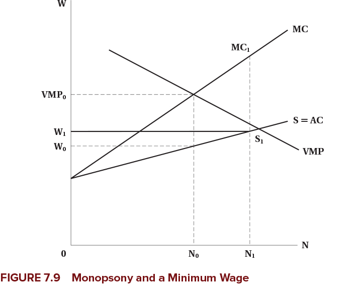
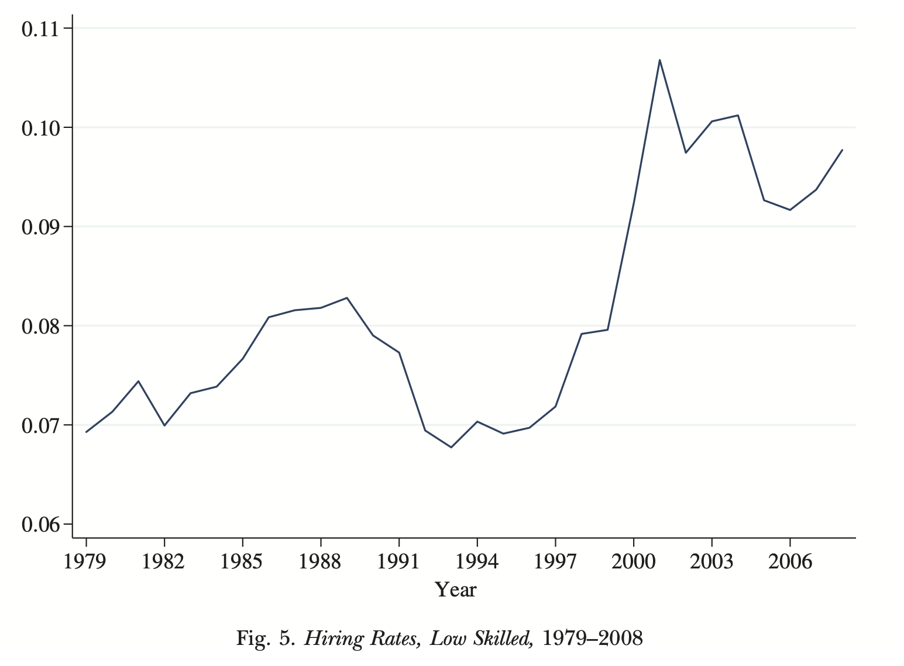

<h1>Wages and Employment in a Single Labour Market</h1>

<hr>

<h2>EC306- Wages and Employment</h2>

<h2>Justin Smith</h2>

<h2>Wilfrid Laurier University</h2>

<h2>Fall 2025</h2>

{.absolute top="300" left="900" width="550"}

# Goals of This Section

## Goals of This Section

-   Bring together demand and supply to determine wages and employment

-   Discuss the effect of market power in goods market on equilibrium wages and employment

-   Discuss the effect of market power in the labour market on equilibrium wages and employment

-   Analyze minimum wages

# Introduction

## Introduction

-   We have analyzed labour demand and supply separately in detail

-   The equilibrium wage and employment is determined by the interaction of the two

-   Market power plays an important role

    -   In both goods markets and labour markets

-   With a full understanding on how wages and employment are determined, we can analyze policies

-   The minimum wage is one of the most prominent labour market policies

    -   In theory, it leads to unemployment
    -   The evidence is more mixed

# Competitive Firms

# Introduction

-   We start with firms that are competitive in the goods and labour markets

-   Perfect competition in both implies that

    -   Firms take the market wage as given
    -   They take the market price as given
    -   Competition means they are too small to influence either

-   We analyze the equilibrium wage and employment for a homogeneous type of labour

    -   All workers are the same

## Market Demand and Supply

-   The market demand and supply are the sum of the individual firms' demand and supply at each wage

-   Here we determine the demand and supply curve for a single labour market

    -   Could be an specific occupation in a specific region
    -   Example: electricians in Ontario, professors in Canada, etc.
    -   How the market is defined depends on context
    -   But it is for a single type of labour

## Market Demand and Supply

-   Example is two firms with different elasticities of demand

    -   Each firm demand curve is their value of marginal product
    -   Firms may face different product prices if they sell different things (but hire the same labour)

-   Each firm faces the same wage in the labour market

    -   They perceive the supply curve as horizontal in the long run
    -   They take the wage as given and can get as much laour as they want at that wage
    -   Market supply is upward sloping

-   Market demand is horizontal sum of individual demands

    -   Add up the quantities demanded at each wage for each firm
    -   Repeat for all wages

## Market Demand and Supply

{fig-align="center"}

## Firm Demand and Supply in the Short Run

-   Above we analyzed the longer run

    -   Firms can get as much labour as they want at the going wage

-   In the short run, firms may face an upward sloping supply curve

    -   They have to pay higher wages to attract more workers
    -   This could be because of contracts, or other frictions

-   If demand rises, they would pay higher wages to attract workers

-   But because wages are high, over the long term more workers enter the market

    -   Short run supply shifts out
    -   Wage falls back down to long run level

## Firm Demand and Supply in the Short Run

{fig-align="center"}

# Imperfect Competition in the Product Market

## Monopoly

-   In competitive markets there are many sellers of a product

-   In a monopoly, there is only one

-   This gives the firm market power

    -   The ability to set prices above marginal cost

-   For a monopolist, the demand curve is where wage equals marginal revenue product

    $$w = MR \times MPP_N$$

-   For a monopolist, marginal revenue is less than price

    -   Because to sell more, they have to lower price on all units sold
    -   So marginal revenue product is less than value of marginal product ($VMP$)

## Monopoly

{fig-align="center"}

## Monopoly

-   Because monopolists have market power

    -   They can raise the price of their product above competitive level
    -   This will decrease output
    -   They demand less labour

-   Monopolists therefore will hire fewer workers

    -   Compared to a competitive firm in the same market

-   Note that power in the product market does not mean power in the labour market

    -   The firm is still one of many hiring workers in a particular labour market

## Monopolistic Competition and Oligopoly

-   Many markets are neither perfectly competitive nor pure monopoly

-   Monopolistic competition

    -   Many firms selling differentiated products
    -   Each firm has some market power because of product differentiation
    -   Can set prices above marginal cost

-   Oligopoly

    -   A few firms dominate the market
    -   Each firm has significant market power
    -   But must consider reactions of competitors when setting prices

-   Demand for labour is still based on marginal revenue product

    -   Which is less than value of marginal product
    -   So firms hire fewer workers than in competitive markets

## Additional Details

-   All of the previous analysis assumes that labour markets are perfectly competitive

    -   Firms can hire all labour they want at the given wage

-   That is not always the case in reality when firms have power in the product market

    -   Employees may unionize
    -   Firms may hire a large number of the market's workers

-   In these cases, firms may not face a perfectly elastic supply curve for labour

-   Later we will analyze imperfect competition in the labour market

# Math of Labour Market Equilibrium

## Introduction

-   We know that market equilibrium is where demand and supply are equal

-   You can do that graphically or mathematically

-   In this section we cover both

-   To make the math easier, we use linear demand and supply curves

    -   This is just for simplicity
    -   The same principles apply with non-linear curves

## Demand and Supply Functions

-   The demand and supply for labour are functions of wages and other factors

    -   Demand: $N^D = f(w, Z)$

        -   $Z$ is a list of other factors affecting demand

    -   Supply: $N^S = g(w, X)$

        -   $X$ is a list of other factors affecting supply

-   $Z$ and $X$ are things that shift the curves

    -   For example, technology, prices of other inputs, preferences, demographics, etc.

    -   We call these **exogenous** variables

        -   Determined outside the model

-   $N^D$, $N^S$, and $w$ are **endogenous**

    -   Determined within the model

## Demand and Supply Functions

-   Assume the demand and supply functions are linear

    -   Demand: $N^D = a + b w$

        -   $a$, $b$ are constants

    -   Supply: $N^S = c + f w$

        -   $c$, $f$ are constants

-   To find equilibrium, set demand equal to supply

$$a + b w^* = c + f w^*$$

## Demand and Supply Functions

-   Rearranging to solve for equilibrium wage:

$$w^* = \frac{c - a}{b - f}$$

-   Rearranging to solve for equilibrium employment:

$$N^* = \frac{b c - a f }{b - f}$$

-   Use these equations to analyze how changes in exogenous variables

    -   Changing $a$ would shift the demand curve

        -   Example: increase in product price

    -   Changing $c$ would shift the supply curve

        -   Example: increase in population

## Demand and Supply Functions

-   To draw the demand and supply curves, we need $w$ on the left side

-   Rearranging the demand function:

$$w = \frac{N^D - a}{b}$$

-   Rearranging the supply function:

$$w = \frac{N^S - c}{f}$$

-   Next slide plots these functions

## Demand and Supply Functions

{fig-align="center"}

## Payroll Tax

-   We can use this model to analyze various policies

-   One common policy is a payroll tax on employers

    -   Examples: Canada Pension Plan (CPP), Employment Insurance (EI)

-   These are typically a percentage of wages paid by employers

-   But we will analyze a fixed amount per hour for simplicity

    -   Suppose the tax is $T$ per hour

-   This drives a "wedge" between the wage paid by employers and the wage received by workers in equilibrium

$$w_r = w_e - T$$

## Payroll Tax

-   The demand function is:

$$w_e = \frac{N^D - a}{b} $$

-   The supply function is:

$$w_r = \frac{N^S - c}{f}$$

## Payroll Tax

-   Substitute into the equilibrium price equation and set quantity demanded equal to quantity supplied:

$$\frac{N^* - c}{f} = \frac{N^* - a}{b} - T $$

-   Rearranging to solve for equilibrium employment:

$$N^* = \frac{b c - a f - b f T}{b - f} $$

## Payroll Tax

-   The equilibrium wage received by workers is

$$w_r^* = \frac{c-a}{b-f} - \frac{b}{b-f} T $$

-   The equilibrium wage paid by employers is

$$w_e^* = \frac{c-a}{b-f} - \frac{f}{b-f} T $$

## Payroll Tax

{fig-align="center"}

## Payroll Tax

-   The previous slide highlights the difference between the statutory and economic incdidence of a tax

    -   Statutory incidence: who is legally responsible for paying the tax

        -   In this case, firms

    -   Economic incidence: who actually bears the burden of the tax

        -   Shared between firms and workers
        -   Workers receive a lower wage than before
        -   Firms pay a higher one

-   Economic incidence depends on elasticities of supply and demand

    -   More elastic supply means workers bear less of the tax burden
    -   More elastic demand means firms bear less of the tax burden

## Evidence

-   Theory predicts lower employment from a payroll tax

-   Also predicts economic incidence may be shared between firms and workers

-   Evidence based on empirical studies is

    -   In the long run, workers bear most of the burden of the tax through lower wages
    -   Employment effects are small

# Monopsony in the Labour Market

## Introduction

-   Market power can be a feature on both the buying and selling side of markets

    -   Monopoly: single seller with market power
    -   Monopsony: single buyer with market power

-   Typically we discuss monopoly in the goods market, but monopsony in the labour market

    -   But you can have power in both buying and selling in both markets

-   In this section we will consider monopsony in the labour market

## Introduction

-   Some examples of monopsony in the labour market

    -   Company/factory towns
    -   Hospital labour markets
    -   University professor labour markets
    -   Public sector in small areas

-   In all case there is a large buyer of labour

-   This gives the buyer power to set wages

-   Affects both wages and employment

    -   To attract labour, it must raise wages

## Simple Monopsony

-   In a monopsony, the firm faces the market supply curve for labour

    -   Supply is upward sloping
    -   Contrast to perfect competition where supply is horizontal
    -   To hire more workers, the firm must pay a higher wage

-   The firms marginal cost of labour is above the supply curve

    -   Because to hire an additional worker, the firm must raise the wage for all workers
    -   So MC is equal to cost of additional worker plus the increase in wage paid to existing workers
    -   Analogous to how monopolists face MR below demand

## Simple Monopsony

:::::: columns
:::: {.column width="50%"}
::: {layout="[[-1], [1], [-1]]"}
{fig-align="center"}
:::
::::

::: {.column width="50%"}
-   Monopsony depicted to the left
-   Firm demand is its value of marginal product
-   Faces upward sloping supply curve
-   MC is above supply
-   Optimal labour is where MC = VMP
-   Wage comes from supply curve at that quantity of labour
:::
::::::

## Simple Monopsony

:::::: columns
:::: {.column width="50%"}
::: {layout="[[-1], [1], [-1]]"}
{fig-align="center"}
:::
::::

::: {.column width="50%"}
-   For monopsony

    -   Wage is below VMP
    -   Wage is below competitive wage
    -   Employment is below competitive employment

-   Monopsony profit is rectangle $(VMP_m - W_m) \times N_m$

    -   Wage bill is $W_m \times N_m$
    -   Revenue contributed by workers is $VMP_m \times N_m$
:::
::::::

## Simple Monopsony

:::::: columns
:::: {.column width="50%"}
::: {layout="[[-1], [1], [-1]]"}
{fig-align="center"}
:::
::::

::: {.column width="50%"}
-   Monopsonies also leave jobs vacant

    -   Because they restrict employment to raise wages
    -   This creates inefficiency in the labour market

-   Vacancies are $V_m - S_m$

-   At wage $W_m$

    -   VMP is above wage
    -   Firms would like to hire more -But to hire it must raise wages, so it is optimal to not hire more
:::
::::::

## Characteristics of Monopsonies

-   More prevalent in the short run

    -   In the long run, workers can move to find other jobs
    -   In the short run, frictions may prevent this

-   Large relative to the labour market

    -   Does not have to be a big firm, just large relative to the market
    -   If the market is small, the firm does not have to be large to have power
    -   Example: a restaurant in a seasonal tourist town

-   Workers have specialized skills

    -   May naturally be few employers for specialized labour
    -   Like academia, sports teams

## Characteristics of Monopsonies

-   Wages are lower than competitive equilibrium, but not necessarily low in an absolute sense

    -   Example: sports players
    -   Not paid low wages, but market power makes them lower than they would be otherwise

## Wage Differentiation

-   In previous analysis, we assumed all workers are the same

    -   Single supply curve for labour

-   This leaves some surplus for workers

    -   There are workers willing to work for less than the equilibrium wage

-   Firm can capture that surplus by differentiating wages

    -   Paying different workers different wages based on their reservation wage

## Wage Differentiation

:::::: columns
:::: {.column width="50%"}
::: {layout="[[-1], [1], [-1]]"}
{fig-align="center"}
:::
::::

::: {.column width="50%"}
-   If the firm can pay different wages

    -   It can pay each worker their reservation wage
    -   MC curve and supply curve become equal to supply curve

-   Firm will hire up to competitive level

    -   Because it does not have to increase wage for all workers to hire more

-   To do this, firms would try to make wages secret

    -   Prevent workers from knowing what others are paid
    -   Could do this with non-wage benefits for specific workers
:::
::::::

## Evidence of Monopsonies

-   Pro sports

    -   Baseball: free agency increased wages significantly
        -   Increases competition among teams
    -   Hockey: not much evidence of monopsony power

-   Academia and nursing

    -   Some evidence of monopsony power
    -   In Canada, a bargaining model may be more appropriate given these labour markets are unionized

-   Some academics argue that monopsonies are relatively common

    -   Firms can set wages only if they have some market power
    -   Evidence that this is widespread

# Minimum Wages

## Introduction

-   Minimum wages are a common policy tool

    -   Set a legal minimum wage that employers must pay workers

-   Intended to raise wages of low-wage workers

    -   Reduce poverty
    -   Increase standard of living

-   Standard economic theory predicts that minimum wages lead to unemployment

    -   Because they set a wage above the equilibrium wage
    -   Quantity of labour supplied exceeds quantity demanded

-   But statistical evidence is much more mixed

## Minimum Wages by Province

```{r}
library(tidyverse)
library(readr)
library(janitor)

minwage <- read_csv("canada_minimum_wage_2000_2025.csv") %>%
  clean_names() %>%
  group_by(province) %>%
  left_join(read_csv("cpi.csv") %>%
              clean_names(),
            by = "year") %>%
  mutate(cpi2025 = 100*cpi / 160.9,
         rminimum_wage = 100*minimum_wage / cpi2025) 

ggplot(minwage, aes(x = year, y = minimum_wage, color = province)) +
  geom_line(size = 1) +
  labs(
    title = "Nominal Minimum Wage by Province (2000-2025)",
    x = "Year",
    y = "Minimum Wage (CAD)",
    color = "Province"
  ) +
  theme_minimal() +
  theme(
    plot.title = element_text(hjust = 0.5, size = 16, face = "bold"),
    axis.title = element_text(size = 14),
    legend.title = element_text(size = 12),
    legend.text = element_text(size = 10)
  )


```

## Minimum Wages by Province

```{r}
ggplot(minwage, aes(x = year, y = rminimum_wage, color = province)) +
  geom_line(size = 1) +
  labs(
    title = "Real Minimum Wage by Province (2000-2025)",
    x = "Year",
    y = "Minimum Wage (CAD)",
    color = "Province"
  ) +
  theme_minimal() +
  theme(
    plot.title = element_text(hjust = 0.5, size = 16, face = "bold"),
    axis.title = element_text(size = 14),
    legend.title = element_text(size = 12),
    legend.text = element_text(size = 10)
  )
```

## Minimum Wages in Canada and USA

{fig-align="center"}

## Minimum Wages in Competitive Labour Market

-   Suppose the labour market is competitive

-   The market demand is downward sloping

-   The market supply is upward sloping

-   Minimum wages are introduced as a wage floor

    -   Above the competitive equilibrium wage

-   Creates excess supply of labour

    -   Leads to unemployment

## Minimum Wages in Competitive Labour Market

:::::: columns
:::: {.column width="50%"}
::: {layout="[[-1], [1], [-1]]"}
{fig-align="center"}
:::
::::

::: {.column width="50%"}
-   Impact of minimum wage illustrated to the left

-   Minimum wage is $W_m$ above competitive level $W_c$

-   Creates excess supply of labour

-   Leads to unemployment $N_s - N_m$

    -   People who would have been employed at competitive equilibrium $N_c - N_m$
    -   Others drawn into market by higher wage $N_s - N_c$

-   
:::
::::::

## Minimum Wages in Competitive Labour Market

-   Employment effects depend on elasticity of demand

    -   More elastic demand means larger employment effects

-   In real world, industries with minimum wage tend to have elastic demands

    -   Lots of substitutes for low-wage labour
    -   Labour costs are a large share of total costs

-   Nevertheless, we will see that minimum wages may not affect employment much in practice

## Minimum Wages in Monopsony

-   Effects of minimum wages are different in monopsonistic labour markets

-   It is possible that minimum wages increase both wages and employment

    -   Depending on where the minimum wage is set

-   Graph on next slide illustrates this

## Minimum Wages in Monopsony

:::::: columns
:::: {.column width="50%"}
::: {layout="[[-1], [1], [-1]]"}
{fig-align="center"}
:::
::::

::: {.column width="50%"}
-   Graph shows standard monopsony

-   Prior to minimum wage, wage is $W_0$ and employment is $N_0$

-   Imagine minimum wage set above $W_0$ but below competitive wage

-   MC curve is minimum wage up to $S_{1}$

    -   Then jumps up to previous MC curve

-   Optimize where MC = VMP

    -   Employment increases to $N_1$
:::
::::::

## Minimum Wages in Monopsony

-   Why would minimum wages cause employment to increase?

    -   Previously, firm had to increase wages to attract more labour
    -   With minimum wage, it does not
        -   Everyone is paid the same wage
        -   Wage increases no longer inhibit employment growth
    -   Effectively, minimum wage lowers marginal cost

-   This may be partly why we do not see large employment effects of minimum wages

-   Note that monopsonists do not like minimum wages

    -   They reduce their market power
    -   Increases costs, reduces profits

## Offsetting Factors for Minimum Wage

-   As usual, in models we hold all else equal

-   But in reality, many things are changing at once

    -   Minimum wage could be accompanied by changes in demand

        -   For example, fiscal stimulus increasing demand for goods and labour

    -   Minimum wage could lead to changes in technology

        -   May change demand for labour

    -   Firms might choose to absorb minimum wage costs

## Evidence

-   Minimum wages are one of the most researched areas in labour economics

-   Large amounts of evidence goes back at least 50 years

-   Early studies looked at time trends in employment and minimum wages

    -   Subject to a lot of bias
    -   Things often trend together over time without direct causation

-   Research in early 1990s used better methods

    -   Natural experiments
    -   Difference-in-differences

## Evidence

-   Most prominent study is Card and Krueger (1994)

    -   Looked at fast food restaurants in New Jersey and Pennsylvania
    -   New Jersey increased minimum wage, Pennsylvania did not
    -   Used difference-in-differences to estimate employment effects
    -   Found no negative employment effects from minimum wage increase

-   Has been reevaluated several times

    -   Conclusion remains that employment effects are small or non-existent

## Evidence

-   In Canada, minimum wages increase youth unemployment

    -   Studies looked at minimum wage changes across provinces in 1990s

-   Some Canadian studies look deeper at labour market dynamics

    -   In any month, there is a lot of turnover in the labour market
    -   Each month roughly 6% of employed people separate, 8% of non-employed people hired
    -   Evidence shows minimum wages reduce both hiring and separations
    -   Leads to no effect overall

## Evidence

{fig-align="center"}

## Evidence

{fig-align="center"}

## Evidence

- Also recall that one point of miminum wage is to reduce poverty

- Evidence shows they are generally not successful

  - Both Canada and US studies show no link
  
- Why do they not work?

  - Many poor individuals do not work
  - Many people on minimum wages are not poor
      - Youth living in high income families
      
# Summary

## Summary

-   We analyzed how wages and employment are determined in a single labour market

-   Market power in the goods market reduces both wages and employment

-   Market power in the labour market reduces wages and employment

-   Minimum wages may reduce employment in competitive markets

-   Minimum wages may increase employment in monopsonistic markets

-   Empirical evidence shows minimum wages have small effects on employment
