<h1>Labour Supply 1: Individual Attachment to the Labour Market</h1>

<hr>

<h2>EC306- Wages and Employment</h2>

<h2>Justin Smith</h2>

<h2>Wilfrid Laurier University</h2>

<h2>Fall 2025</h2>

{.absolute top="300" left="900" width="550"}

# Goals of This Section

## Goals of This Section

-   Introduce common labour market concepts

-   Build the labour supply model

-   Derive labour supply curve

-   Examine effects of labour market policies within that model

# Key Labour Force Concepts

## Introduction

-   The labour market involves several individual decisions about work

    -   It is not simply whether to work or not

-   In the news you hear about statistics that quantify these decisions

-   In this section we cover the most common ones

## Labour Force Participation

-   The first decision is whether to make yourself *available* for work

-   **Labour Force**: people in the eligible population who participate in labour market activities as either employed or unemployed

    -   A measure of the people that could work or are working

-   Eligible population includes

    -   Population 15 years and over

    -   Non-institutionalized

    -   People not living on reserve

    -   Civilians (non-military)

## Labour Force Participation

-   Eligible people who are not part of the labour force include

    -   Retired people

    -   People who do only unpaid work in the home

    -   Full time students (who are 15 years old and over)

    -   People who just give up on looking for work

-   **Labour Force Participation Rate (LFPR)**: The share of the eligible population (POP) in the labour force (LF)

$$
LFPR = LF/POP
$$

-   The LFPR is a common statistic reported in the news

## Labour Force Participation

```{r echo=FALSE}
library(tidyverse)
library(readr)
library(janitor)
library(tidyr)
library(gt)
library(here)
library(scales)

lfstats <- read_csv("lfstats.csv") %>% clean_names() %>% 
  filter(geo == "Canada",  labour_force_characteristics == "Participation rate", 
         gender %in%  c("Total - Gender", "Men+", "Women+") , age_group == "15 years and over") %>%
  mutate(
    group = recode(gender,
                   "Total - Gender" = "All",
                   "Men+" = "Men",
                   "Women+" = "Women"),
    group = factor(group, levels = c("All", "Men", "Women")) # legend order
  )
lfstats %>% ggplot(aes(x = ref_date, y = value, color = group)) + geom_line(size = 1.5) +
    theme_minimal(base_size = 16) +
  labs(x = "Year", y = "Percent in Labour Force", title = "Labour Force Participation Rate - Canada", caption = "Source: CANSIM Table 14-01-0327-02",
        color = NULL) +
  scale_y_continuous(breaks = breaks_pretty(n=10), limits = c(0, NA)) +
  scale_x_continuous(breaks = seq(1976, 2024, by = 4)) +
  guides(linetype = guide_legend(override.aes = list(linewidth = 1.5))) +
  theme(
    legend.position = c(0.85, 0.25),  # (x,y) in [0,1], relative to plot area
    legend.background = element_rect(fill = alpha("white", 0.7), color = NA)
  )

```

## Labour Force Participation

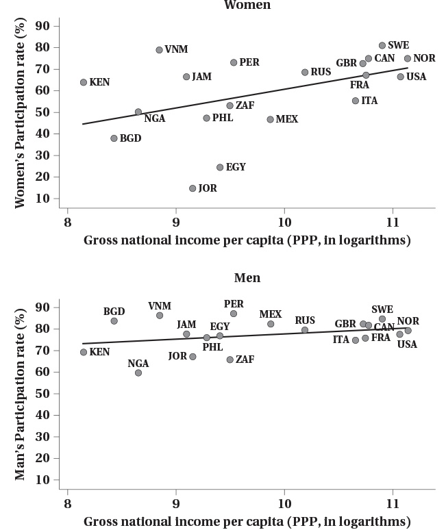

## Employment and Unemployment

-   People in the labour force are either employed or unemployed

-   **Employed (E)**: people who worked during the reference period

    -   Includes people normally employed but temporarily absent

-   **Unemployed (U)**: people who did not work during the reference period but

    -   were available for work and actively looked for work in the past four weeks
    -   were waiting to start a new job within the next four weeks
    -   on temporary layoff and expecting to be recalled to that job

-   The employment rate (ER) and unemployment rate (UR) are

$$ER = E/POP$$ $$UR = U/LF$$

## Employment and Unemployment

```{r echo=FALSE}

lfstats <- read_csv("lfstats.csv") %>% clean_names() %>% 
  filter(geo == "Canada",  labour_force_characteristics == "Employment rate", 
         gender %in%  c("Total - Gender", "Men+", "Women+") , age_group == "15 years and over") %>%
  mutate(
    group = recode(gender,
                   "Total - Gender" = "All",
                   "Men+" = "Men",
                   "Women+" = "Women"),
    group = factor(group, levels = c("All", "Men", "Women")) # legend order
  )
lfstats %>% ggplot(aes(x = ref_date, y = value, color = group)) + geom_line(size = 1.5) +
    theme_minimal(base_size = 16) +
  labs(x = "Year", y = "Percent Employed", title = "Employment Rate - Canada", caption = "Source: CANSIM Table 14-01-0327-02",
        color = NULL) +
  scale_y_continuous(breaks = breaks_pretty(n=10), limits = c(0, NA)) +
  scale_x_continuous(breaks = seq(1976, 2024, by = 4)) +
  guides(linetype = guide_legend(override.aes = list(linewidth = 1.5))) +
  theme(
    legend.position = c(0.85, 0.25),  # (x,y) in [0,1], relative to plot area
    legend.background = element_rect(fill = alpha("white", 0.7), color = NA)
  )

```

## Employment and Unemployment

```{r echo=FALSE}

lfstats <- read_csv("lfstats.csv") %>% clean_names() %>% 
  filter(geo == "Canada",  labour_force_characteristics == "Unemployment rate", 
         gender %in%  c("Total - Gender", "Men+", "Women+") , age_group == "15 years and over") %>%
  mutate(
    group = recode(gender,
                   "Total - Gender" = "All",
                   "Men+" = "Men",
                   "Women+" = "Women"),
    group = factor(group, levels = c("All", "Men", "Women")) # legend order
  )
lfstats %>% ggplot(aes(x = ref_date, y = value, color = group)) + geom_line(size = 1.5) +
    theme_minimal(base_size = 16) +
  labs(x = "Year", y = "Percent Unemployed", title = "Unemployment Rate - Canada", caption = "Source: CANSIM Table 14-01-0327-02",
        color = NULL) +
  scale_y_continuous(breaks = breaks_pretty(n=10), limits = c(0, NA)) +
  scale_x_continuous(breaks = seq(1976, 2024, by = 4)) +
  guides(linetype = guide_legend(override.aes = list(linewidth = 1.5))) +
  theme(
    legend.position = c(0.85, 0.25),  # (x,y) in [0,1], relative to plot area
    legend.background = element_rect(fill = alpha("white", 0.7), color = NA)
  )

```

## Labour Force Hierarchy

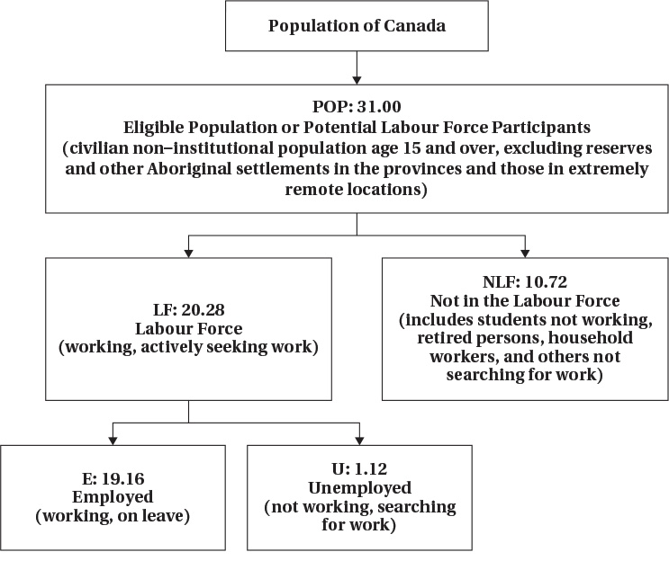

## Hours Worked

-   Individuals decide not only whether to work or not, but how intensively

-   Some people work full time, some work part time

    -   Work arrangements can be flexible

    -   "Gig" jobs and remote work have increased that flexibility

-   Recent data show

    -   Almost half of men work full time hours

    -   About 1/4 of women work full time hours

## Hours Worked

```{r echo = FALSE}
lfsapr <- read_csv("pub0425.csv") %>% clean_names() 

# Plot: side-by-side bars with percentages
ggplot(lfsapr %>%
         filter(!is.na(utothrs), utothrs >= 1, gender %in% c(1, 2)) %>%
         mutate(
           utothrs = utothrs/10,
           gender = recode(gender, "1" = "Men", "2" = "Women"),
           bin = case_when(
             utothrs >= 1  & utothrs <= 14 ~ "1–14",
             utothrs >= 15 & utothrs <= 29 ~ "15–29",
             utothrs >= 30 & utothrs <= 39 ~ "30–39",
             utothrs == 40                  ~ "40",
             utothrs >= 41 & utothrs <= 49 ~ "41–49",
             utothrs >= 50                  ~ "50+"
           )
         ) %>%
         filter(!is.na(bin)) %>%
         group_by(gender, bin) %>%
         summarise(weighted_n = sum(finalwt, na.rm = TRUE), .groups = "drop") %>%
         group_by(gender) %>%
         mutate(prop = weighted_n / sum(weighted_n)),
       aes(x = bin, y = prop, fill = gender)) +
  geom_col(position = position_dodge(width = 0.9)) +
  geom_text(
    aes(label = scales::percent(prop, accuracy = 0.1)),
    position = position_dodge(width = 0.9),
    vjust = -0.3, size = 4
  ) +
  scale_y_continuous(labels = percent_format(accuracy = 1), limits = c(0, NA)) +
  labs(
    x = "Usual weekly hours worked",
    y = "Share of workers",
    title = "Distribution of Usual Weekly Hours Worked — Men vs Women",
    caption = "Source: Labour Force Survey April 2025"
  ) +
  scale_fill_manual(values = c("Men" = "#1F77B4", "Women" = "#FF7F0E")) +
  theme_minimal(base_size = 15) +
  theme(
    legend.position = c(0.8, 0.8),
    legend.background = element_rect(fill = alpha("white", 0.7), color = NA),
    axis.text.x = element_text(angle = 0, hjust = 0.5)
  )

```

# Labour Supply Model

## Introduction

-   In this section we introduce a model we use throughout the course

-   The model helps us understand how individuals make decisions about work

-   Based on utility maximization as you saw in EC270

-   Individual choose between two goods

    -   Consumption of goods and services
    -   Leisure

-   Choices are constrained by time, wage rate, and non-labour income

-   There are a few wrinkles that make this market unique

## Preferences

-   Individuals have preferences over consumption (C) and leisure (L)

    -   People like consuming goods and services

    -   Also like having non-work time

        -   Includes fun activities but also non-work tasks like chores, education, etc.

-   The tradeoffs people are willing to make between C and L are represented by indifference curves

    -   At every point along the curve the individual is equally happy
    -   Curves further from the origin represent higher levels of utility

## Preferences

:::::: columns
:::: {.column width="50%"}
::: {layout="[[-1], [1], [-1]]"}
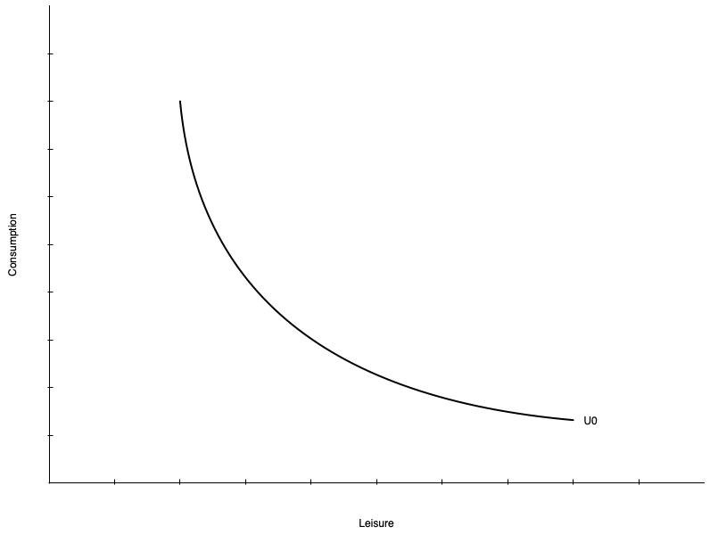
:::
::::

::: {.column width="50%"}
-   On the left is a single indifference curve

-   Any point represents equal utility ($U_{0}$)

-   **Marginal Rate of Substitution (MRS)**: the rate at which a person is willing to trade consumption for leisure while remaining equally happy

-   The MRS is the slope of the indifference curve at a point

-   Individuals have diminishing MRS

    -   Willing to give up less consumption for additional leisure the more leisure they already have

    -   Slope gets shallower with more leisure
:::
::::::

## Preferences

-   Indifference curves do not have to be smooth curves like the one shown

-   Could be straight lines

    -   Means the tradeoff between consumption and leisure is constant

    -   Willingness to trade away leisure for consumption does not depend on leisure

-   Could be "L" shaped

    -   Consumption and leisure must be consumed in fixed proportions

-   Mostly we will deal with smooth preferences

## Preferences

:::::: columns
:::: {.column width="50%"}
::: {layout="[[-1], [1], [-1]]"}
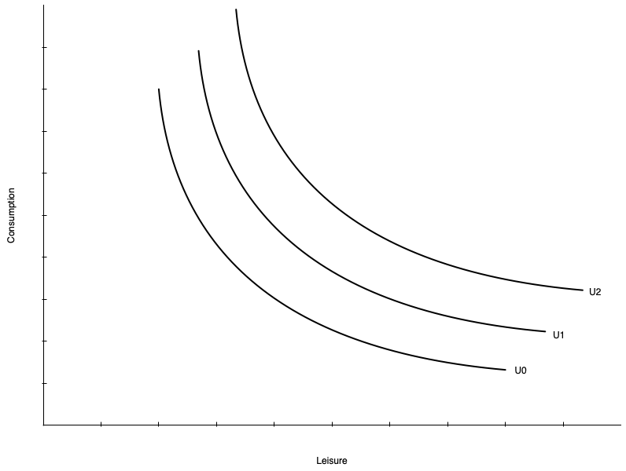
:::
::::

::: {.column width="50%"}
-   Utility increases with curves further from the origin

    -   $U_{2} > U_{1} > U_{0}$

-   
:::
::::::

## Constraints

-   Individuals do not choose consumption and leisure bundles on preference alone

-   They are constrained by their budget

-   The budget is determined by

    -   The wage rate

    -   Total number of hours available

    -   Non-labour income

-   Budget constraint is also called

    -   Potential income constraint

    -   Full income constraint

## Constraints

:::::: columns
:::: {.column width="50%"}
::: {layout="[[-1], [1], [-1]]"}
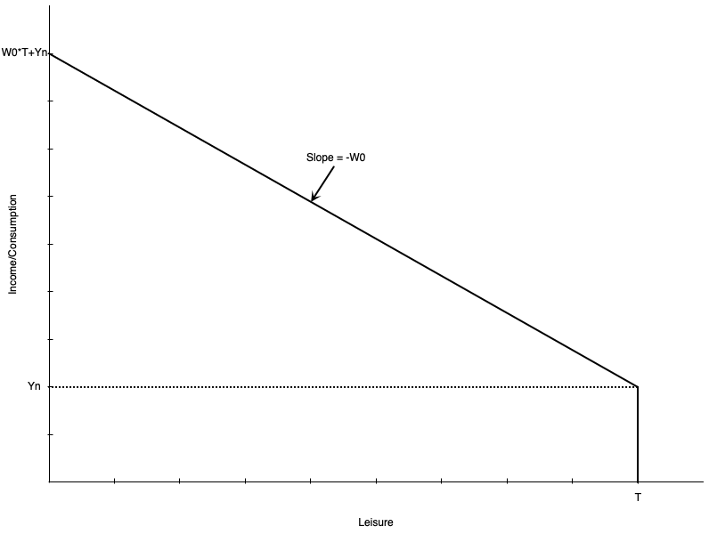
:::
::::

::: {.column width="50%"}
-   Graph shows a linear budget constraint

-   Assume no saving, so consumption = income

-   There are $T$ total hours to allocate to work or leisure

-   Individual earns $Y_{n}$ non-labour income

    -   Earned even with zero work hours (full leisure hours)

-   Each hour worked gets wage of $w$

-   Person working $T$ hours (no leisure) earns $WT+Y_{n}$ income

    -   Called "full income"
:::
::::::

## Constraints

-   Mathematically, the budget constraint is

$$C = w(T - L) + Y_{n}$$ - Consumption is equal to income from working $(w(T - L))$ plus non-labour income $(Y_{n})$

-   The slope of the budget constraint is $-w$

    -   The opportunity cost of leisure is the wage rate

    -   Each hour of leisure means one less hour worked, which means $w$ less income

-   Someone who works zero hours has $T$ leisure hours and $Y_{n}$ consumption

-   Someone who works $T$ hours has zero leisure hours and $wT + Y_{n}$ consumption

## Constraints

:::::: columns
:::: {.column width="50%"}
::: {layout="[[-1], [1], [-1]]"}
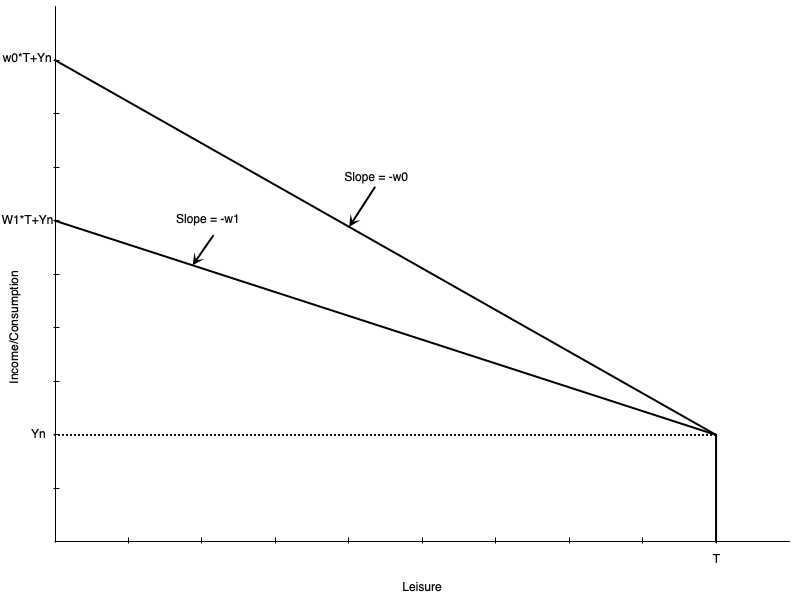
:::
::::

::: {.column width="50%"}
-   Slope is the negative of the wage rate $w$

-   A lower wage means shallower slope

    -   If $w_{1} < w_{0}$, the budget line swivels down

    -   They intersect at leisure = $T$ because there are no work hours

-   Lower wage also means full income is lower

    -   Working all hours leads to less total labour earnings
:::
::::::

## Constraints

:::::: columns
:::: {.column width="50%"}
::: {layout="[[-1], [1], [-1]]"}
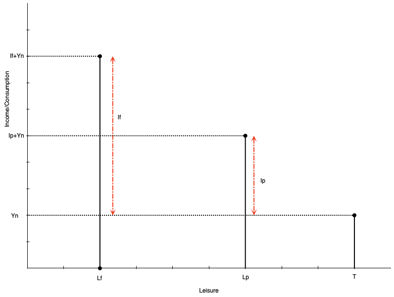
:::
::::

::: {.column width="50%"}
-   Often people cannot adjust their work hours freely
-   They make only be able to work full time or part time
-   Budget constraint is no longer a line, but a set of points
-   Suppose an individual chooses part time work
    -   Work hours are $h_{p} = T-L_{p}$
    -   Labour earnings are $I_{p} = w*h_{p}$
    -   Total consumption (and income) is $C_{p} = I_{p} + Y_{n}$
:::
::::::

## Constraints

:::::: columns
:::: {.column width="50%"}
::: {layout="[[-1], [1], [-1]]"}

:::
::::

::: {.column width="50%"}
-   A person working full time hours
    -   Work hours are $h_{f} = T-L_{f}$
    -   Labour earnings are $I_{f} = w*h_{f}$
    -   Total consumption (and income) is $C_{f} = I_{f} + Y_{n}$
-   In theory wage could also be different for full time work
:::
::::::

## Consumer Optimum

-   Work hours are chosen using the combination of preferences and constraints
-   The consumer optimum is the point that maximizes utility subject to the budget constraint
-   The optimum occurs where the budget constraint is tangent to an indifference curve
-   There are two possibilities for the optimum
    -   Non-participation: optimum occurs at the end of the budget constraint (full leisure)
    -   Participation: optimum occurs at an interior point (some leisure, some work)
-   Model also defines the **reservation wage** -Lowest wage rate at which a person will choose to work

## Consumer Optimum

:::::: columns
:::: {.column width="50%"}
::: {layout="[[-1], [1], [-1]]"}
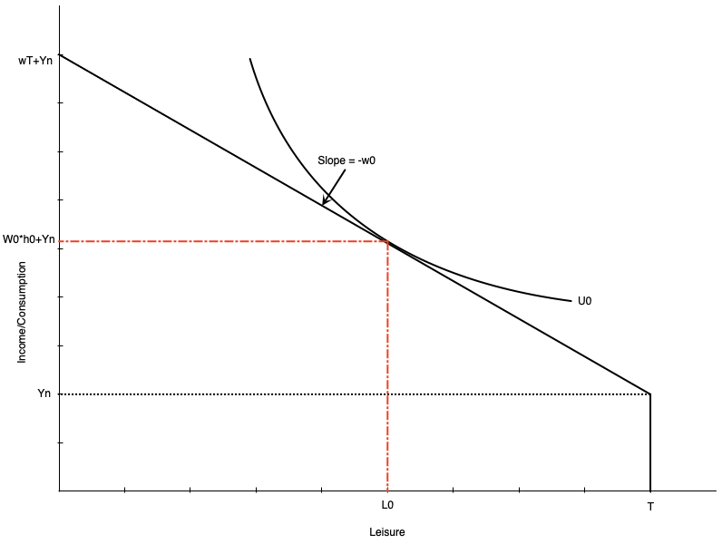
:::
::::

::: {.column width="50%"}
-   Graph shows an optimum with participation

-   Optimum is where indifference curve is tangent to budget constraint

-   At the optimum, MRS = wage rate

    -   Willingness to trade leisure for consumption (MRS) equals ability to trade them (wage)

-   Optimal work hours are $h_{0} = T - L_{0}$

-   Optimal consumption is $C_{0} = W_{0}h_{0}+Y_{n}$
:::
::::::

## Consumer Optimum

:::::: columns
:::: {.column width="50%"}
::: {layout="[[-1], [1], [-1]]"}
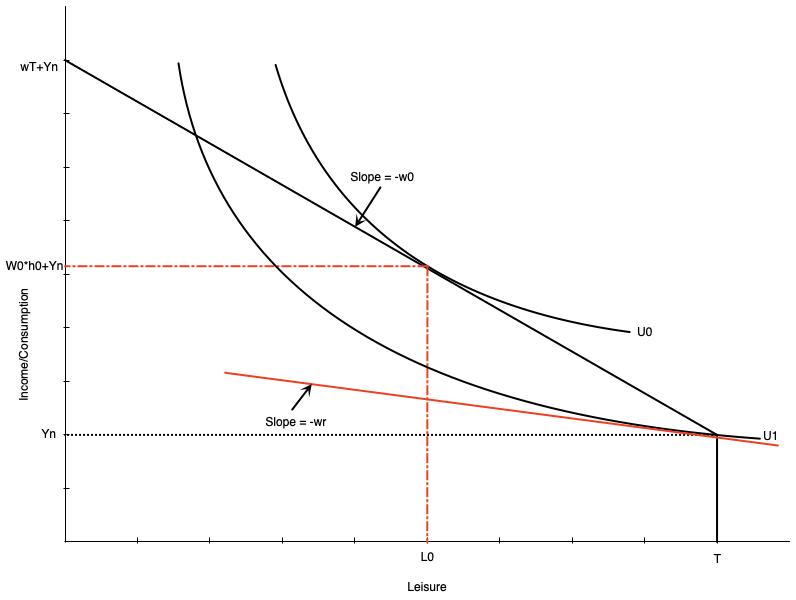
:::
::::

::: {.column width="50%"}
-   The reservation wage is the lowest wage at which a person will choose to work

-   It occurs where the budget constraint is tangent to the indifference curve at full leisure

    -   At that point, MRS = reservation wage

-   If the wage is any lower, the person will choose not to work

-   If it is any higher, they will work positive hours

-   The red line shows the hypothetical reservation wage

    -   In this case, it is $w_{r}$
:::
::::::

## Consumer Optimum

:::::: columns
:::: {.column width="50%"}
::: {layout="[[-1], [1], [-1]]"}
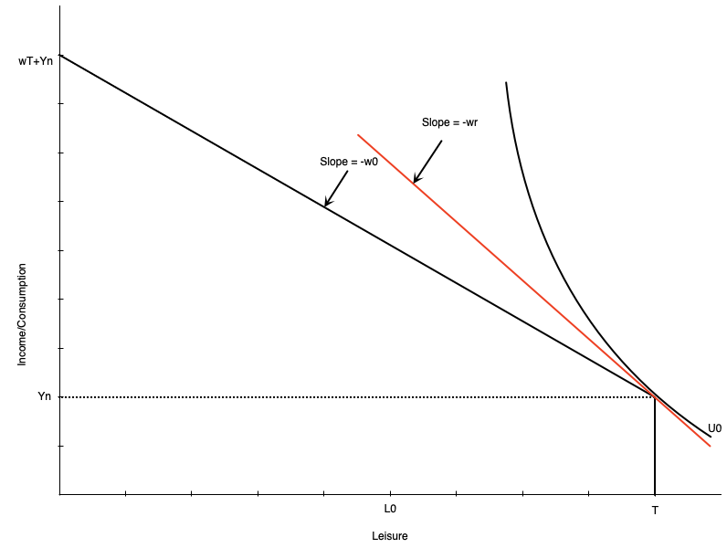
:::
::::

::: {.column width="50%"}
-   Graph to the left shows a non-participation optimum

-   The slope of the indifference curve is steeper than the budget constraint at full leisure

    -   The extra consumption you want from one less hour of leisure (MRS) is more than you can get from working an hour (wage)

-   So your optimal choice is to not work at all

-   Indifference curve touches the budget constraint at the kink

-   Notice the wage $w_{0}$ is lower than the reservation wage $w_{r}$
:::
::::::

# Comparative Statics

## Introduction

-   The model can be used to predict how changes in the environment affect work decisions

-   Changes could be to the wage or non-labour income

-   Often these arise because of policy changes

    -   Introduction or increase in welfare payment
    -   Wage subsidy
    -   Tax credits
    -   Employment insurance
    -   Child care

-   We can examine these change with our model

## Increase in Non-Labour Income

-   Suppose that individuals receive an increase in non-labour income

    -   Could be from a government transfer program

-   How does this affect optimal work hours?

-   Depends on whether leisure is a normal or inferior good

    -   Normal good: leisure increases when non-labour income increases

    -   Inferior good: leisure decreases when non-labour income increases

-   Generally economists think of leisure as normal

## Increase in Non-Labour Income

:::::: columns
:::: {.column width="50%"}
::: {layout="[[-1], [1], [-1]]"}
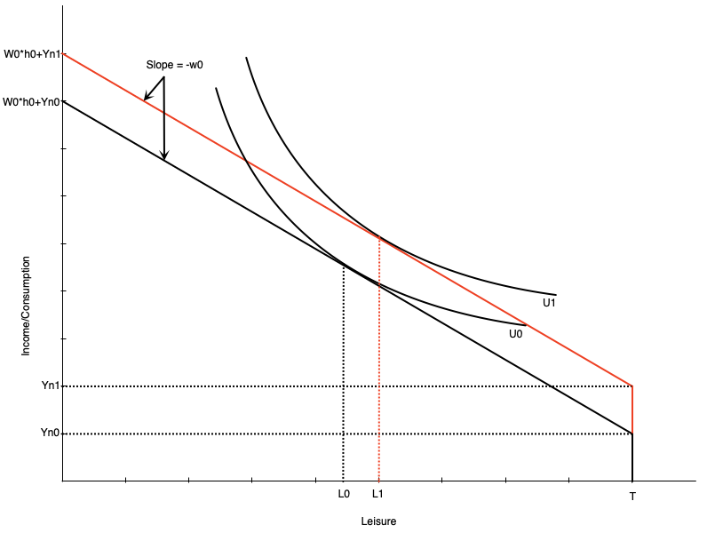
:::
::::

::: {.column width="50%"}
-   Graph shows an increase in non-labour income from $Y_{n0}$ to $Y_{n1}$

-   Budget line shifts up vertically but parallel

    -   No change in slope because wage is the same

-If leisure is a normal good, optimal leisure increases from $L_{0}$ to $L_{1}$

-   Means work hours decrease by the same amount

-   Consumption also increases

-   This illustrates a pure **income effect**

    -   Increases in income increase demand for normal goods
:::
::::::

## Increase in the Wage

:::::: columns
:::: {.column width="50%"}
::: {layout="[[-1], [1], [-1]]"}
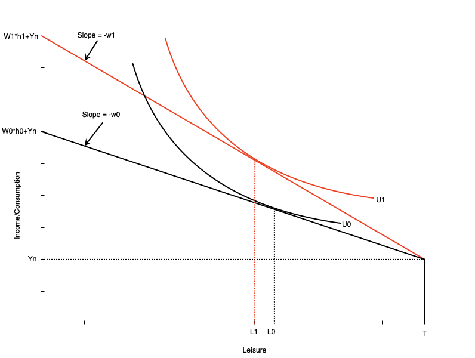
:::
::::

::: {.column width="50%"}
-   If the wage changes, the budget constraint pivots

-   In graph to the left, the wage increases from $w_{0}$ to $w_{1}$

-   The slope becomes steeper

-   Full income also increases because working all hours earns more

-   Graph is drawn such that leisure falls from $L_{0}$ to $L_{1}$ at the new wage rate

-   There are two effects underlying this change

    -   Substitution effect

    -   Income effect
:::
::::::

## Increase in the Wage

:::::: columns
:::: {.column width="50%"}
::: {layout="[[-1], [1], [-1]]"}
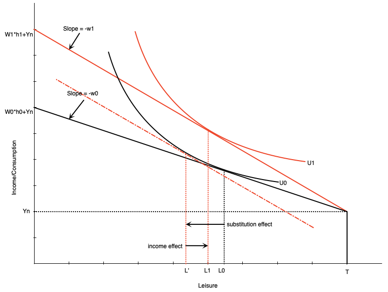
:::
::::

::: {.column width="50%"}
-   **Substitution Effect**: change in leisure when wage changes but utility is held constant

    -   When wage increases, leisure becomes more expensive

    -   People substitute away from leisure and towards consumption

    -   To measure this, draw a hypothetical budget line with the new slope but tangent to the original indifference curve

    -   Difference in leisure measures substitution effect
:::
::::::

## Increase in the Wage

:::::: columns
:::: {.column width="50%"}
::: {layout="[[-1], [1], [-1]]"}

:::
::::

::: {.column width="50%"}
-   **Income Effect**: change in leisure when income changes but wage is held constant

    -   When wage increases, workers become richer at same hours of work

    -   Want to consume more of all normal goods

    -   To measure this, move from hypothetical budget line to new budget line

    -   Difference in leisure measures income effect
:::
::::::

## Increase in the Wage

:::::: columns
:::: {.column width="50%"}
::: {layout="[[-1], [1], [-1]]"}

:::
::::

::: {.column width="50%"}
-   The income and substitution effects move in opposite directions

-   For a wage increase

    -   Substitution effect encourages more work (less leisure)

    -   Income effect encourages less work (more leisure)

-   The overall effect on work hours depends on which effect is stronger

-   Graph on the left shows a stronger substition effect
:::
::::::
