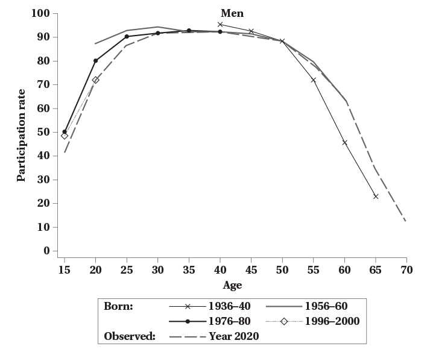
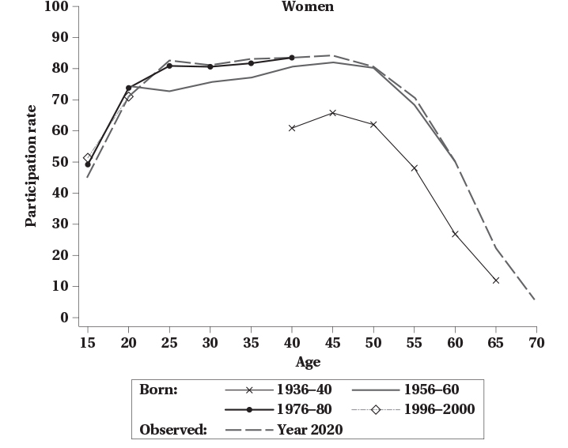
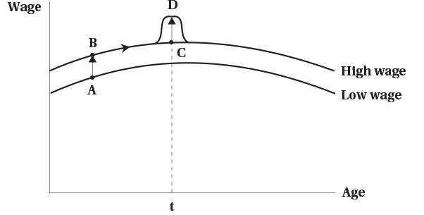

<h1>Labour Supply 3: Labour Supply Over the Life Cycle</h1>

<h2>EC306- Wages and Employment</h2>

<h2>Justin Smith</h2>

<h2>Wilfrid Laurier University</h2>

<h2>Fall 2025</h2>

{.absolute top="300" left="900" width="550"}

# Goals of This Section

## Goals of This Section

-   Show patterns of labour supply over a person's lifetime

-   Discuss issues comparing labour supply of people at different ages

-   Introduce lifetime labour supply model

-   Discuss household production

-   Analyze retirement decisions

# Life Cycle Labour Supply

## Introduction

-   Previous discussion focused on labour supply at a moment in time

    -   Labour supply changed immediately in response to changes in wages, non-labour income, or policies

-   In reality, people can plan work over their lifetime

    -   Participation is highest in prime working years

    -   Life events alter labour supply decisions now and in the future

        -   Marriage, children, education, health, retirement

-   A life cycle approach helps us understand these patterns

## Life Cycle Participation for Men

:::::: columns
:::: {.column width="50%"}
::: {layout="[[-1], [1], [-1]]"}

:::
::::

::: {.column width="50%"}
-   Graph follows labour supply of men born in different years

-   Participation rises quickly in early 20s, peaks in late 40s, then declines

-   There are differences for different birth cohorts

    -   At younger ages, younger cohorts participate a bit less

    -   At older ages, younger cohorts participate more
:::
::::::

## Life Cycle Participation for Women

:::::: columns
:::: {.column width="50%"}
::: {layout="[[-1], [1], [-1]]"}

:::
::::

::: {.column width="50%"}
-   Women follow similar lifetime pattern

-   Rates are shifted down a bit relative to men

-   Participation higher for younger cohorts at all ages

    -   Consistent with rising female labour force participation over time
:::
::::::

## Cohort Effects vs Age Effects

-   Previous graphs highlight a technical point

-   Each graph contains a line that looks at life cycle pattern in year 2020

    -   Participation of people in 2020 at different ages

-   Problem: people at different ages are born at different times

    -   20 year olds in 2020 born in 2000

    -   60 year olds in 2020 born in 1960

-   So when we look at participation by age in a single year, we are mixing age effects and cohort effects

    -   Age effects: how labour supply changes as people get older

    -   Cohort effects: how labour supply differs for people born at different times

## Cohort Effects vs Age Effects

-   Cohort effects can be significant

    -   In particular for women where it has been increasing for younger cohorts

-   It is not a good approach to look at participation by age in a single year and interpret as pure age effects

-   If pure age effects are of interest, better to look at participation by age for a single birth cohort

    -   This is done in the graphs on the previous two slides

-   Notice that the lines shift up and down for different birth cohorts

-   Pattern across age is similar but there are some differences

## Cohort Effects vs Age Effects

-   Practically, it is difficult to do this

-   Very few datasets have data on the same people over their entire life

    -   Hard to track people over time
    -   People die, move, refuse to respond
    -   Data that does track people are often restricted access

-   Another approach is to use **quasi-cohorts**

    -   Group people by birth year in cross-sectional (single year) data
    -   Look at how participation changes for these groups over time
    -   This is what the graphs on the previous two slides do

## Cohort Effects vs Age Effects

-   You can do this with the Canada Census

    -   Census is collected every 5 years

-   Each Census collects information on age and labour force status (among many other things)

-   Can follow a birth cohort across different Census years as they get older

|              |      |            |          |      |      |
|--------------|------|------------|----------|------|------|
|              |      | **Census** | **Year** |      |      |
| Birth Cohort | 1981 | 1986       | 1991     | 1996 | 2001 |
| 1950         | 31   | 36         | 41       | 46   | 51   |
| 1951         | 30   | 35         | 40       | 45   | 50   |
| 1952         | 29   | 34         | 39       | 44   | 49   |
| 1953         | 28   | 33         | 38       | 43   | 48   |
| 1954         | 27   | 32         | 37       | 42   | 47   |
| 1955         | 26   | 31         | 36       | 41   | 46   |

## Cohort Effects vs Age Effects

-   One caveat is that in each Census year, people in a birth cohort are different people

    -   Not following the exact same individuals over time

-   This is generally accepted as a reasonable approximation

## Cohort Effects vs Age Effects

::::: columns
::: {.column width="50%"}
| Born in 1975       |      |      |      |
|--------------------|------|------|------|
| Observed in        | 2000 | 2005 | 2010 |
| Age                | 25   | 30   | 35   |
| Participation Rate | 75%  | 80%  | 85%  |
| **Born in 1980**   |      |      |      |
| Observed in        | 2000 | 2005 | 2010 |
| Age                | 20   | 25   | 30   |
| Participation Rate | 75%  | 80%  | 85%  |
:::

::: {.column width="50%"}
-   To illustrate problem with following ages in single Census year, examine this table

-   Tracks birth cohorts across Census years

-   Shows age and participation rate

-   For each cohort participation rises 5 points per year

-   But looking at ages in a single Census year, they appear not to change
:::
:::::

## Cohort Effects vs Age Effects

-   Where do cohort effects come from? Why do we expect cohorts to be different?

-   People in part are defined by their generation

    -   Social attitudes change over time
    -   Economic conditions and policies change over time
    -   Generations experience different significant events (e.g. wars, disease)

-   We therefore expect cohorts to differ in their attitudes and behaviours

    -   Reserach has shown women born in early 1930s had higher labour supply than previous generations
    -   They were influenced by their mothers working during war
    -   Male children also more likely to be married to working women later in life

-   Important to separate these from effects of pure aging

# Dynamic Life Cycle Models

## Introduction

-   We now know that labour supply varies over the life cycle

-   The allocation of work over time can be modeled

-   Models examine the effects on labour supply of wage changes

    -   Wages can change at different ages
    -   They can change for a short time or permanently
    -   They can be anticipated or unanticipated

-   Different types of changes have different effects on labour supply

## Model

-   Individuals will still maximize utility over consumption and leisure subject to a budget constraint

-   The utility is a function of consumption and leisure over the lifetime

$$
u = U(C_1, C_2, \ldots, C_N, L_1, L_2, \ldots, L_N)
$$

-   Here $U(.)$ is a function

    -   e.g. could be logarithmic, cobb-douglas, etc.

-   To define the budget constraint, recognize that we can consume and work in each period

-   In theory, we can consume more than our income in a period by borrowing

    -   We can also save some income to consume later

-   We therefore need to be conscious of the interest rate on saving and borrowing

## Model

-   Consider a two period model

-   The budget constraint says that the present value of consumption equals the present value of income

$$
C_1 + \frac{C_2}{1+r} = W_1 H_1 + \frac{W_2 H_2}{1+r}
$$

-   $r$ is the interest rate for borrowing and saving

-   This is the present (period 1) value formulation of the lifetime budget constraint

-   You can also express it in future (period 2) value

$$
(1+r)C_1 + C_2 = (1+r)W_1 H_1 + W_2 H_2
$$

## Model

-   The ability to borrow and save means a person can consume more than their income in a period

-   For example, rearranging the future value of the budget we get

$$
C_2 = (1+r)(W_1 H_1 - C1) + W_2 H_2
$$

-   If $W_1 H_1 > C_1$, then the person saved some income in period 1 to consume in period 2

    -   That savings grows with interest, and they have $(1+r)(W_1 H_1 - C1)$ to spend in period 2

-   If $W_1 H_1 < C_1$, then the person borrowed to consume more than their income in period 1

    -   $(1+r)(W_1 H_1 - C1)$ is negative and it reduces their income in period 2

## Model

-   In our model, the choice is between consumption and leisure

-   To reexpress this in terms of leisure, note that $H_t = T - L_t$, so

$$
C_1 + \frac{C_2}{1+r} + W_1 L_1 + \frac{W_2 L_2}{1+r} = W_1 T + \frac{W_2 T}{1+r}
$$

-   You can consume two goods (consumption and leisure)

-   The price of consumption is 1 in both periods

-   The price of leisure is $W_1$ in period 1 and $W_2$ in period 2

-   You consume these out of "full income"

    -   Full income is the income you would have if you worked all available hours in both periods

-   Period 2 values are discounted by the interest rate

## Model

-   If you maximize utility subject to the budget constraints, you get a labour supply function

    -   Tells you optimal labour supply as a function of wages, interest rates, lifetime resources

-   Like previous models, we can examine effects of wage changes

- There are three types

    -   A permanent unanticipated change in the wage in all periods
    -   An anticipated future change in the wage
    -   A temporary unanticipated change in the wage in one period only

-   These lead to substitution and income effects

    -   More complicated because of the extra time dimension of the model

-   We can see these effects in graph form

## Permanent Wage Change

:::::: columns
:::: {.column width="50%"}
::: {layout="[[-1], [1], [-1]]"}

:::
::::

::: {.column width="50%"}
-   Consider first a permanent, unanticipated change in the wage

    - Increases wage in all periods
    - Shifts wage schedule up
    
- Higher wage has two effects

    - Income effect: higher wage means higher lifetime income, so person consumes more leisure (less work)
    - Substitution effect: higher wage means leisure is more expensive, so person consumes less leisure (more work)
    
- Labour supply effect is ambiguous

:::
::::::

## Anticipated Wage Change

:::::: columns
:::: {.column width="50%"}
::: {layout="[[-1], [1], [-1]]"}

:::
::::

::: {.column width="50%"}
-   An anticipated wage change moves person along their wage schedule

- There is no income effect in this case

  - Person optimized over their lifetime income
  - Lifetime income has not changed
  
- The substitution effect shifts leisure towards periods where wage is lower

  - If wage is higher in period 2, leisure is more expensive in period 2
  - Less leisure in period 2 and more in period 1
  - Person works more in period 2 and less in period 1

:::
::::::

## Temporary Unanticipated Wage Change

:::::: columns
:::: {.column width="50%"}
::: {layout="[[-1], [1], [-1]]"}

:::
::::

::: {.column width="50%"}
-   A temporary unanticipated wage change alters wage for one period (or a small number of them) only

    - e.g. bonus pay, overtime pay, short-term contract

- Creates a temporary blip upward in wage schedule

- Two effects

    - Small Income effect: slightly higher lifetime income, so person consumes more leisure (less work)
    - Substitution effect: leisure is more expensive in the period with the higher wage, so person consumes less leisure (more work)

:::
::::::

## Comparing Effects of Wage Changes

- Strongest effect on labour supply is the anticipated wage change

    -   Pure substitution effect
    - No offsetting income effect

- Next strongest is the temporary unanticipated wage change

    -   Substitution effect
    -   Small income effect
    -   Person works more in period with higher wage  
    
- Permanent unanticipated wage change has ambiguous effect

    -   Substitution effect
    -   Larger income effect
    -   Ambiguous effect on labour supply    

## Evidence on Life Cycle Labour Supply

- Interesting experiment on bike messengers in Zurich

- Messengers paid a percentage of daily revenues

- Can choose their own total work hours

- Researchers randomly assigned messengers to

    - 25% higher wage for one month in September of one year (group A)
    - Others to 25% higher wage for one month in November of the same year (group B)
    
- Each acted as control group for the other

- Both get same increase in lifetime income, so difference is substitution effect

- Showed messengers shift labour supply to periods with higher wage
